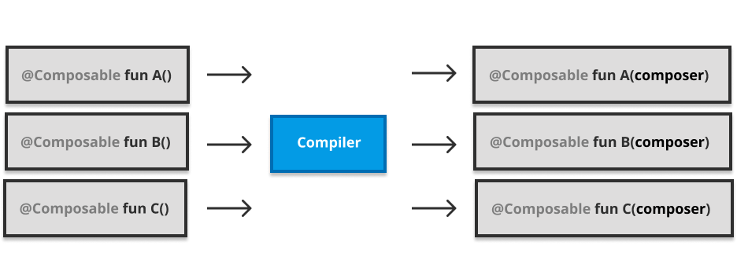

# 2. The Compose compiler

Jetpack Compose is comprised of a series of libraries, but this book is going to heavily focus on three specific ones: The Compose compiler, the Compose runtime, and Compose UI.

The Compose compiler and the runtime are the pillars of Jetpack Compose. Compose UI is not technically part of the Compose architecture, since the runtime and the compiler are designed to be generic and consumed by any client libraries that comply to their requirements. Compose UI only happens to be one of the available clients. There are also other client libraries in the works, like the ones for desktop and web by JetBrains. That said, going over Compose UI will help us to understand how Compose feeds the runtime in-memory representation of the Composable tree, and how it eventually materializes real elements from it.


*compose architecture*

In a first approach to Compose one might feel a bit confused about what’s the exact order of things. Up to this point in the book we’ve been told that the compiler and the runtime work together to unlock all the library features, but that probably still remains a bit too abstract if we are not familiar with it already. We’d likely welcome deeper explanations on what actions the Compose compiler takes to make our code comply with the runtime requirements, how the runtime works, when initial composition and further recompositions are triggered, how the in-memory representation of the tree is feeded, how that information is used for further recompositions… and much more. Grasping concepts like these can help us to grow an overall sense on how the library works and what to expect from it while we are coding.

Let’s go for it, and let’s start by understanding the compiler.

## A Kotlin compiler plugin

Jetpack Compose relies a bit on code generation. In the world of Kotlin and the JVM, the usual way to go for this is annotation processors via **kapt**, but Jetpack Compose is different. The Compose compiler is actually a Kotlin compiler plugin instead. This gives the library the ability to embed its compile time work within the Kotlin compilation phases, gaining access to more relevant information about the shape of code, and speeding up the overall process. While kapt needs to run prior to compilation, a compiler plugin is directly **inlined in the compilation process**.

Being a Kotlin compiler plugin also gives the chance to report diagnostics in the frontent phase of the compiler, providing a very fast feedback loop. However, these diagnostics will not get reported in the IDE, since IDEA is not directly integrated with the plugin. Any IDEA-level inspections we can find in Compose today have been added via a separate IDEA plugin which doesn’t share any code with the Compose compiler plugin. That said, frontend diagnostics will be reported as soon as we hit the compile button. Improving the feedback loop is the ultimate benefit of static analysis in the frontend phase of a Kotlin compiler, and the Jetpack Compose compiler makes good use of that.

Another big advantage of Kotlin compiler plugins is that they can tweak the existing sources at will (not only add new code, like annotation processors do). They are able to modify the output IR for those elements before it gets lowered to more atomic terms that then can be translated to primitives supported by the target platforms –remember Kotlin is multiplatform–. We will dive a bit more into this in this chapter, but this will give the Compose compiler the ability to **transform the Composable functions** as the runtime requires.

Compiler plugins have a bright future in Kotlin. Many known annotation processors out there will likely be migrated gradually to become compiler plugins or “lightweight” compiler plugins via KSP (Kotlin Symbol Processing library. See the blockquote below).

If you are particularly interested in Kotlin compiler plugins I would highly recommend checking [KSP (Kotlin Symbol Processing)](https://github.com/google/ksp), a library that Google is proposing as a replacement for Kapt. KSP proposes a normalized DSL for “writing lightweight compiler plugins” that any libraries can rely on for metaprogramming. Make sure to give a read to the [“Why KSP” section](https://github.com/google/ksp/blob/main/docs/why-ksp.md) in the KSP repository.

Also, note that the Jetpack Compose compiler relies a lot on IR transformation and that might be dangerous if used as a widespread practice around meta-programming. If all annotation processors out there were translated to compiler plugins we might might end up with too many IR transforms, and something like that might destabilize the language. Tweaking/Augmenting the language always comes with a risk. That is why KSP is probably a better pick, overall.

## Compose annotations

Back to the order of things. The first thing we need to look at is how we annotate our code so the compiler can scan for the required elements and do its magic. Let’s start by learning about the Compose annotations available.

Even if compiler plugins can do quite more than annotation processors, there are some things that both have in common. One example of this is their frontend phase, frequently used for static analysis and validation.

The Compose compiler utilizes hooks/extension points in the kotlin compiler’s frontend to verify that the constraints it would like to enforce are met and that the type system is properly treating `@Composable` functions, declarations, or expressions, different from non-Composable ones.

Apart from that, Compose also provides other complementary annotations meant to unlock additional checks and diverse runtime optimizations or “shortcuts” under some certain circumstances. All the annotations available are provided by the Compose runtime library.

Let’s start by making a deep dive into the most relevant annotations.

All the Jetpack Compose annotations are provided by the Compose runtime, since it is both the compiler and the runtime the modules making good use of those.

### @Composable

This annotation was already covered in depth in chapter 1. That said, it likely requires a standalone section since it is clearly the most important one. That is why it will be the first on my list.

The biggest difference between the Compose compiler and an annotation processor is that Compose effectively **changes** the declaration or expression that is annotated. Most annotation processors can’t do this, they have to produce additional / sibling declarations. That is why the Compose compiler uses IR transforms. The `@Composable` annotation actually **changes the type** of the thing, and the compiler plugin is used to enforce all kinds of rules in the frontend to ensure that Composable types aren’t treated the same as their non-composable-annotated equivalents.

Changing the type of the declaration or expression via `@Composable` gives it a “memory”. That is the ability to call `remember` and utilize the Composer/slot table. It also gives it a lifecycle that effects launched within its body will be able to comply with. –E.g: spanning a job across recompositions.– Composable functions will also get assigned an identity that they will preserve, and will have a position in the resulting tree, meaning that they can emit nodes into the Composition and address `CompositionLocal`s.

Small recap: A Composable function represents mapping from data to a node that is emitted to the tree upon execution. This node can be a UI node, or a node of any other nature, depending on the library we are using to consume the Compose runtime. The Jetpack Compose runtime works with **generic types of nodes** not tied to any specific use case or semantics. We will cover that topic in detail towards the end of this book, when our understanding of Compose is more diverse and much richer.

### @ComposeCompilerApi

This annotation is used by Compose to flag some parts of it that are only meant to be used by the compiler, with the only purpose of informing potential users about this fact, and to let them know that it should be used with caution.

### @InternalComposeApi

Some apis are flagged as internal in Compose since they are expected to vary internally even if the public api surface remains unchanged and frozen towards a stable release. This annotation has a wider scope than the language `internal` keyword, since it allows usage across modules, which is a concept that Kotlin does not support.

### @DisallowComposableCalls

Used to prevent composable calls from happening inside of a function. This can be useful for `inline` lambda parameters of Composable functions that cannot safely have composable calls in them. It is best used on lambdas which will **not** be called on every recomposition.

An example of this can be found in the `remember` function, part of the Compose runtime. This Composable function remembers the value produced by the `calculation` block. This block is only evaluated during the initial composition, and any further recompositions will always return the already produced value.

```kotlin
1 @Composable
2 inline fun &lt;T&gt; remember(calculation: @DisallowComposableCalls () -&gt; T): T =
3   currentComposer.cache(false, calculation)
```
*Composables.kt*

Composable calls are forbidden within the `calculation` lambda thanks to this annotation. If those were allowed otherwise, they would take space in the slot table when invoked (emitting), and that would then be disposed of after the first composition, since the lambda isn’t invoked anymore.

This annotation is best used on inline lambdas that are called conditionally as an implementation detail, but should not be “alive” like composables are. This is only needed because inline lambdas are special in that they “inherit” the composable abilities of their parent calling context. For example, the lambda of a `forEach` call is not marked as `@Composable`, but you can call composable functions if the `forEach` itself is called within a composable function. This is desired in the case of `forEach` and many other inline APIs, but it is **not** desirable in some other cases like `remember`, which is where this annotation comes in.

Also note that this annotation is “contagious” in the sense that if you invoke an inline lambda inside of an inline lambda marked as `@DisallowComposableCalls`, the compiler will require that you mark that lambda as `@DisallowComposableCalls` as well.

As you probably guessed, this is likely an annotation you might not ever use in any client projects, but could become more relevant if you are using Jetpack Compose for a different use case than Compose UI. In that case you’ll likely need to write your own client library for the runtime, and that will require you to comply with the runtime constraints.

### @ReadOnlyComposable

When applied over a Composable function it means we know that the body of this Composable will not write to the composition ever, only read from it. That also must remain true for all nested Composable calls in the body. This allows the runtime to avoid generating code that will not be needed if the Composable can live up to that assumption.

For any Composable that writes to the composition inside, the compiler generates a “group” that wraps its body, so the whole group is emitted at runtime instead. These emitted groups provide the required information about the Composable to the composition, so it knows how to cleanup any written data later when a recomposition needs to override it with the data of a different Composable, or how to move that data around by preserving the identity of the Composable. There are different types of groups that can be generated: E.g: restartable groups, movable groups… etc.

For more context on what exactly a “group” is, imagine a couple of pointers at the start and end of a given span of selected text. All groups have a source position key, which is used to store the group, and therefore what unlocks positional memoization. That key is also how it knows different identity between `if` or `else` branches of conditional logics like:

```kotlin
1 if (condition) {
2   Text(&quot;Hello&quot;)
3 } else {
4   Text(&quot;World&quot;)
5 }
```
*ConditionalTexts.kt*

These are both `Text`, but they have different identity since they represent different ideas to the caller. Movable groups also have a semantic identity key, so they can reorder within their parent group.

When our composable does not write to the composition, generating those groups does not provide any value, since its data is not going to be replaced or moved around. This annotation helps to avoid it.

Some examples of read only Composables within the Compose libraries could be many `CompositionLocal` defaults or utilities that delegate on those, like the Material `Colors`, `Typography`, the `isSystemInDarkTheme()` function, the `LocalContext`, any calls to obtain application `resources` of any type –since they rely on the `LocalContext`–, or the `LocalConfiguration`. Overall, it is about things that are only set once when running our program and are expected to stay the same and be available to be read from Composables on the tree.

### @NonRestartableComposable

When applied on a function or property getter, it basically makes it be a non-restartable Composable. (Note that not all Composables are restartable by default either, since inline Composables or Composables with non-`Unit` return types are not restartable).

When added, the compiler does not generate the required boilerplate needed to allow the function to recompose or be skipped during recomposition. Please keep in mind that this has to be used very sparingly, since it might only make sense for very small functions that are likely getting recomposed (restarted) by another Composable function that calls them, since they might contain very little logic so it doesn’t make much sense for them to self invalidate. Their invalidation / recomposition will be essentially driven by their parent/enclosing Composable, in other words.

This annotation should rarely/never be needed for “correctness”, but can be used as a very slight performance optimization if you know that this behavior will yield better performance, which is sometimes the case.

### @StableMarker

The Compose runtime also provides some annotations to denote the stability of a type. Those are the `@StableMarker` meta-annotation, and the `@Immutable` and `@Stable` annotations. Let’s start with the `@StableMarker` one.

`@StableMarker` is a meta-annotation that annotates other annotations like `@Immutable ` and `@Stable`. This might sound a bit redundant, but it is meant for reusability, so the implications it has also apply over all the annotations annotated with it.

`@StableMarker` implies the following requirements related to data stability for the ultimately annotated type:

- The result of calls to `equals` will always be the same for the same two instances.
- Composition is always notified when a public property of the annotated type changes.
- All the public properties of the annotated type are also stable.

Any types annotated with `@Immutable` or `@Stable` will also need to imply these requirements, since both annotations are flagged as a `@StableMarker`, or in other words, as markers for stability.

Note how these are promises we give to the compiler so it can make some assumptions when processing the sources, but **they are not validated at compile time**. That means it is up to you, the developer, to decide when all the requirements are met.

That said, the Compose compiler will do its best to infer when certain types meet the requirements stated above and treat the types as stable without being annotated as such. In many cases this is preferred as it is guaranteed to be correct, however, there are two cases when annotating them directly is important:

- When it’s a required contract/expectation of an interface or abstract class. This annotation becomes not only a promise to the compiler but a **requirement** to the implementing declaration (and unfortunately, one that is not validated in any way).
- When the implementation is mutable, but is implemented in a way where the mutability is safe under the assumptions of stability. The most common example of this is if the type is mutable because it has an internal cache of some sort, but the corresponding public API of the type is independent of the state of the cache.

Class stability inference will be explained later in this chapter with much deeper detail.

### @Immutable

This annotation is applied over a class as a strict promise for the compiler about all the publicly accessible class properties and fields remaining unchanged after creation. Note that this is **a stronger promise** than the language `val` keyword, since `val` only ensures that the property can’t be reassigned via setter, but it can point to a mutable data structure for example, making our data mutable even if it only has `val` properties. That would break the expectations of the Compose runtime. In other words, this annotation is needed by Compose essentially because the Kotlin language does not provide a mechanism (a keyword or something) to ensure when some data structure is immutable.

Based on the assumption that the value reads from the type will never change after initialized, the runtime can apply optimizations to the smart recomposition and skipping recomposition features.

One good example of a class that could safely be flagged as `@Immutable` would be a `data class` with `val` properties only, where none of them have custom getters –that would otherwise get computed on every call and potentially return different results every time, making it become a non-stable api to read from– and all of them are either primitive types, or types also flagged as `@Immutable`.

`@Immutable` is also a `@StableMarker` as explained above, so it also inherits all the implications from it. A type that is considered immutable always obbeys the implications stated for a `@StableMarker`, since its public values will never change. `@Immutable` annotation exists to flag immutable types as stable.

An extra pointer regarding last paragraph: It is worth noting that immutable types don’t notify composition of their values changing, which is one of the requirements listed in `@StableMarker`, but they **don’t really have to**, because their values don’t change, so it satisfies the constraint anyway.

### @Stable

This one might be a bit of a lighter promise than `@Immutable`. It has different meaning depending on what language element it is applied to.

When this annotation is applied to a type, it means the type **is mutable** –(We’d use `@Immutable` otherwise)– and it will only have the implications inherited by `@StableMarker`. Feel free to read them once again to refresh your memory.

When `@Stable` annotation is applied to a function or a property instead, it tells the compiler that the function will always return the same result for the same inputs (pure). This is only possible when the parameters of the function are also `@Stable`, `@Immutable` or primitive types (those are considered stable).

There is a nice example of how relevant this is for the runtime in docs: *When all types passed as parameters to a Composable function are marked as stable then the parameter values are compared for equality based on positional memoization and the call is skipped if all the values are the equal to the previous call.*

An example of a type that could be flagged as `@Stable` is an object whose public properties do not change but cannot be considered immutable. For example, it has private mutable state, or it uses property delegation to a MutableState object, but is otherwise immutable in terms of how it is used from the outside.

One more time, the implications of this annotation are used by the compiler and the runtime to make assumptions over how our data will evolve (or not evolve) and take shortcuts where required. And once again, this annotation should never be used unless you are completely sure its implications are fulfilled. Otherwise we’d be giving incorrect information to the compiler and that would easily lead to runtime errors. This is why all these annotations are recommended to be used sparingly.

Something interesting to highlight is that even if both `@Immutable` and `@Stable` annotations are different promises with different meaning, today the Jetpack Compose compiler **treats both the same way**: To enable and optimize smart recomposition and skipping recompositions. Still both exist to leave the door open for different semantics to impose a differentiation that the compiler and the runtime might want to leverage in the future.

## Registering Compiler extensions

Once we have peeked into the most relevant available annotations **provided by the runtime**, it’s time to understand how the Compose compiler plugin works and how it makes use of those annotations.

The first thing the Compose compiler plugin does is registering itself into the Kotlin compiler pipeline using a `ComponentRegistrar`, which is the mechanism that the Kotlin compiler provides for this matter. The `ComposeComponentRegistrar` registers a series of compiler extensions for different purposes. These extensions will be in charge of easing the use of the library and generating the required code for the runtime. All the registered extensions will run along with the Kotlin compiler.

The Compose compiler also registers a few extensions depending on the compiler flags enabled. Developers using Jetpack Compose have the chance to enable a few specific compiler flags that allow them to enable features like live literals, including source information in the generated code so Android Studio and other tools can inspect the composition, optimizations for remember functions, suppressing Kotlin version compatibility checks, and/or generating decoy methods in the IR transformation.

If we are interested on digging deeper on how compiler extensions are registered by the compiler plugin, or other further explorations, remember that we can always browse the sources on [cs.android.com](https://cs.android.com/androidx/platform/frameworks/support/+/androidx-main:compose/compiler/compiler-hosted/src/main/java/androidx/compose/compiler/plugins/kotlin/ComposePlugin.kt).

## Kotlin Compiler version

The Compose compiler requires a very specific version of Kotlin, so it checks whether the Kotlin compiler version used matches the required one. This is the first check happening since it is a big blocker if not fulfilled.

There is the chance to bypass this check by using the `suppressKotlinVersionCompatibilityCheck` compiler argument, but that is at our own risk, since then we become able to run Compose with any version of Kotlin, which could easily lead to important inconsistencies. Even more if we think about the evolution of the Kotlin compiler backends in latest Kotlin versions. This paremeter was probably added to allow running and testing Compose against experimental Kotlin releases and the like.

## Static analysis

Following the standard behavior of an average compiler plugin, the first thing that happens is **linting**. Static analysis is done by scanning the sources searching for any of the library annotations and then performing some important checks to make sure they are used correctly. And by correctly I mean the way the runtime expects. Here, relevant warnings or errors are reported via the context trace, which compiler plugins have access to. This integrates well with **idea**, since it is already prepared to display those warnings or errors inline while the developer is still typing. As mentioned earlier, all these validations take place in the frontend phase of the compiler, helping Compose to provide the fastest possible feedback loop for developers.

Let’s have a look to some of the most important static checks performed.

## Static Checkers

Some of the registered extensions come in the form of static checkers that will guide developers while coding. Checkers for calls, types and declarations are registered as extensions by Jetpack Compose. They will ensure the correct use of the library, and are obviosuly opinionated towards the problem the library wants to solve. Things like requirements for Composable functions like the ones we learned in chapter 1 are validated here and reported when violated.

In the world of Kotlin compilers there are different types of analyzers available depending on the element we want to check. There are checkers for class instantiation, types, function calls, deprecated calls, contracts, capturing in closure, infix calls, coroutine calls, operator calls and many more that allow compiler plugins to analyze all the corresponding elements from the input sources and report information, warnings, or errors where needed.

Given all registered checkers run in the frontend phase of the Kotlin compiler, they are expected to be very fast and not contain very cpu consuming operations. That is a responsibility of the developer, so keeping always in mind that these checks will run while the developer types and that we do not want to create a janky user experience is key. We want to implement lightweight checkers.

## Call checks

One of the different kinds of checkers registered by Compose are the ones used to validate calls. The Compose compiler has static call checks in place for validating composable function calls in many different contexts, like when they are done under the scope of `@DisallowComposableCalls` or `@ReadOnlyComposable `.

A Call checker is a compiler extension used to perform static analysis on all calls across our codebase, so it provides a `check` function that is recursively called for visiting all the PSI elements that are considered calls in our sources. Or in other words: All nodes on the PSI tree. It’s an implementation of the visitor pattern.

Some of these checks require a wider context than the current language element they are visiting, since they might need to know things like from where the Composable is called, for example. This means that analyzing a single PSI node is not enough. Gathering such information requires recording smaller bits of information from different elements visited, like a breadcumb to build a story as a whole, and perform more complex validations on further passes. To do this, the compiler can record that information conveniently in the context **trace**. This allows to widen the scope for the checks in place, and be able to look for enclosing lambda expressions, try / catch blocks, or similar things that might be relevant.

Here is an example of a compiler call that records relevant information to the trace and also uses it to report an error when a Composable call is done within a context flagged with `@DisallowComposableCalls`:

```kotlin
 1 if (arg?.type?.hasDisallowComposableCallsAnnotation() == true) {
 2   context.trace.record(
 3     ComposeWritableSlices.LAMBDA_CAPABLE_OF_COMPOSER_CAPTURE,
 4     descriptor, // reference to the function literal
 5     false
 6   )
 7   context.trace.report(
 8     ComposeErrors.CAPTURED_COMPOSABLE_INVOCATION.on(
 9       reportOn,
10       arg,
11       arg.containingDeclaration
12     )
13   )
14   return
15 }
```
*ContextTraceExamples.kt*

The context and therefore the context trace are available from every call to the `check` function, and indeed it is the same trace we can also use to report errors, warnings or information messages. We can understand the trace as a mutable structure we can fill up with relevant information to carry across the overall analysis.

Other checks are simpler and only require the information available on the current element visited, so they perform their action and return. On every `check` call, the plugin will match the element type for the current node, and depending on it, it simply performs a check and returns –if everything is correct–, reports an error –if needed–, records relevant information to the context trace, or recurses again to the parent of this node to keep visiting more nodes and gather more information. Different checks for different annotations are performed along the way.

One thing that the Compose compiler checks is that Composables are not called from disallowed places, like from within a `try/catch` block (that is not supported), from a function not annotated as Composable also, or from lambdas annotated with `@DisallowComposableCalls`. –Remember that annotation was used to avoid composable annotations within inline lambdas.–

For each composable call, the compiler visits up the PSI tree checking its callers, the callers of its callers, and so on, to confirm that all the requirements for this call are fulfilled. All scenarios are taken into account, since parents can be lambda expressions, functions, properties, property accessors, try/catch blocks, classes, files, and more.

The PSI models the structure of the language for the frontend compiler phases, hence we must keep in mind that its way to understand code is completely syntatical and static.

It is also important for these checks to take `inline` functions into account, since it must be possible to call a Composable function from an inline lambda **as long as the callers of the inline lambda are also Composable**. The compiler checks that any inline lambdas calling Composable functions are also enclosed by a Composable function at some level up the call stack.

Another call check performed is the one detecting the potentially missing Composable annotations where they would be required or expected, so it can conveniently ask the developer to add those. –E.g: If a Composable function is being called within a lambda, compiler will friendly suggest to also add the Composable annotation to that lambda.– Static analysis checks exist to guide the developer while writing code, so it is not all about forbidding, sometimes they can infer and suggest what is needed or tell us how to improve our code.

There are also static call checks in place for Composable functions annotated as `@ReadOnlyComposable`. Those can only call other read only Composables, since otherwise we would be breaking the contract for the optimization, where a read only composable can only read from the composition, never write to it. Given this must be fulfilled at all depth levels within the Composable, the visitor pattern will come handy.

Another check we can find is the one to disallow the use of Composable function references, since that is not supported by Jetpack Compose at this point.

## Type checks

Sometimes we annotate types as Composable, not only functions. For that, the Compose compiler has a check related to type inference, so it can report when a type annotated with `@Composable` was expected but a non-annotated type was found instead. Similar to the check for function calls mentioned above. The error will print the inferred and expected types along with their annotations to make the difference more obvious.

## Declaration checks

Checks for call sites and types are needed, but not enough. Declaration sites are also part of any Compose codebase. Things like properties, property accessors, function declarations or function parameters need to be analyzed.

Properties, property getters and functions can be overridden, even when they are annotated as Composable. The Composer compiler has a check in place to ensure that any overrides of any of those KtElements is also annotated as Composable to keep coherence.

Another declaration check available is the one to ensure that Composable functions are not `suspend`, since that is not supported. As explained in chapter 1, `suspend` has a different meaning than `@Composable`, and even if both could be understood as language primitives somehow, they are designed to represent completely different things. Both concepts are not supported together as of today.

Things like Composable `main` functions or backing fields on Composable properties are also forbidden via declaration checks.

## Diagnostic suppression

Compiler plugins can register diagnostic suppressors as extensions so they can basically mute diagnostics for some specific circumstances –e.g: errors notified by static checks–. This is usual when compiler plugins generate or support code that the Kotlin compiler wouldn’t normally accept, so that it can bypass the corresponding checks and make it work.

Compose registers a `ComposeDiagnosticSuppressor` to bypass some language restrictions that would otherwise fail compilation, so that can unleash some specific use cases.

One of these restrictions goes for inline lambdas annotated with “non-source annotations” on call sites. That is annotations with retention `BINARY` or `RUNTIME`. Those annotations survive until the output binaries, not like `SOURCE` annotations. Given inline lambdas are effectively inlined into their callers at compile time, they’re not gonna be stored anywhere, so there will not be anything to annotate anymore at that point. That is why Kotlin forbids this and reports the following error:

*“The lambda expression here is an inlined argument so this annotation cannot be stored anywhere.”*.

Here is an example on a piece of code that would trigger the error using plain Kotlin:

```kotlin
1 @Target(AnnotationTarget.FUNCTION)
2 annotation class FunAnn
3 
4 inline fun myFun(a: Int, f: (Int) -&gt; String): String = f(a)
5 
6 fun main() {
7   myFun(1) @FunAnn { it.toString() } // Call site annotation
8 }
```
*AnnotatedInlineLambda.kt*

The Compose compiler suppresses this check only for cases where the annotation used is `@Composable`, so we can write code like the following:

```kotlin
 1 @Composable
 2 inline fun MyComposable(@StringRes nameResId: Int, resolver: (Int) -&gt; String) {
 3   val name = resolver(nameResId)
 4   Text(name)
 5 }
 6 
 7 @Composable
 8 fun Screen() {
 9   MyComposable(nameResId = R.string.app_name) @Composable {
10     LocalContext.current.resources.getString(it)
11   }
12 }
```
*AnnotatedComposableInlineLambda.kt*

This allows to annotate our lambda parameters as `@Composable` on call sites, so we don’t necessarily have to do it on the function declaration. This allows the function to have a more flexible contract.

Another language restriction that gets bypassed with the suppressor is related to allowing named arguments in places the Kotlin compiler would not support, but only in case the function they belong to is annotated as `@Composable`.

One example is function types. Kotlin does not allow named arguments on those, but Compose makes it possible if the function is annotated as Composable:

```kotlin
 1 interface FileReaderScope {
 2   fun onFileOpen(): Unit
 3   fun onFileClosed(): Unit
 4   fun onLineRead(line: String): Unit
 5 }
 6 
 7 object Scope : FileReaderScope {
 8   override fun onFileOpen() = TODO()
 9   override fun onFileClosed() = TODO()
10   override fun onLineRead(line: String) = TODO()
11 }
12 
13 @Composable
14 fun FileReader(path: String, content: @Composable FileReaderScope.(path: String) -&gt; \
15 Unit) {
16   Column {
17     //...
18     Scope.content(path = path)
19   }
20 }
```
*NamedParamsOnFunctionTypes.kt*

If we remove the `@Composable` annotation we’ll get an error like:

*“Named arguments are not allowed for function types.”*

Same requirement is suppressed in other cases like members of expected classes. Remember Jetpack Compose aims to be multiplatform, so the runtime should definitely accept `expect` functions and properties flagged as Composable.

## Runtime version check

We already have all the static checkers and the diagnostic suppressor installed. We can move on to more interesting things. The first thing happening right before code generation is a check for the Compose runtime version used. The Compose compiler requires a minimum version of the runtime so it has a check in place to ensure that the runtime is not outdated. It is able to detect both when the runtime is missing and when it is outdated.

A single Compose compiler version can support multiple runtime versions as long as they are higher than the minimum supported one.

This is the second version check in place. There is one for the Kotlin compiler version, and then this other one for the Jetpack Compose runtime.

## Code generation

Finally, it’s time for the Compiler to move on to the code generation phase. That is another thing annotation processors and compiler plugins have in common, since both are frequently used to synthesize convenient code that our runtime libraries will consume.

## The Kotlin IR

As explained previously, compiler plugins have the ability to modify the sources, not only generate new code, since they have access to the **intermediate representation** of the language (IR) before it yields the ultimate code for the target platform/s. That means the compiler plugin can sneak in and replace parameters, add new ones, reshape the structure of code before “committing” it. This takes place in the backend phases of the Kotlin compiler. And as you probably guessed, this is what Compose does for “injecting” the implicit extra parameter, the `Composer`, to each Composable call.

Compiler plugins have the ability to generate code in different formats. If we were only targeting the JVM we could think of generating Java compatible bytecode, but following the latest plans and refactors from the Kotlin team towards stabilizing all the IR backends and normalizing them into a single one for all platforms, it makes much more sense to generate IR. Remember that the IR exists as a representation of the language elements that **remains agnostic of the target platform** –an “intermediate representation”–. That means generating IR will potentially make Jetpack Compose generated code multiplaform.

The Compose compiler plugin generates IR by registering an implementation of the `IrGenerationExtension`, which is an extension provided by the Kotlin compiler common IR backend.

If you want to learn Kotlin IR in depth I highly recommend to check [these series](https://blog.bnorm.dev/writing-your-second-compiler-plugin-part-2) by Brian Norman that covers the Kotlin IR, and the compiler plugin creation topic, overall. It helped me to learn a lot of interesting things. Learning IR in depth is necessarily out of the scope of this book.

## Lowering

The term “lowering” refers to the translation compilers can do from higher level or more advanced programming concepts to a combination of lower level more atomic ones. This is pretty common in Kotlin, where we have an intermediate representation (IR) of the language that is able to express pretty advanced concepts that then need to get translated to lower level atomics before transforming them to JVM byte code, Javascript, LLVM’s IR, or whatever platform we target. The Kotlin compiler has a lowering phase for this matter. Lowering can also be understood as a form of normalization.

The Compose compiler needs to lower some of the concepts the library supports, so they are normalized to a representation that the runtime can understand. The process of lowering is the actual code generation phase for the Compose compiler plugin. This is where it visits all the elements from the IR tree and tweaks the IR at will for those required based on the runtime needs.

Here is a brief summary of a few meaningful examples of things happening during the lowering phase that we are covering in this section:

- Inferring class stability and adding the required metadata to understand it at runtime.
- Transforming live literal expressions so they access a mutable state instance instead so it is possible for the runtime to reflect changes in the source code without recompiling (live literals feature).
- Injecting the implicit `Composer` parameter on all Composable functions and forwarding it to all Composable calls.
- Wrapping Composable function bodies for things like:
  - Generating different types of groups for control-flow (replaceable groups, movable groups…).
  - Implementing default argument support, so they can be executed within the scope of the generated group of the function –instead of relying on Kotlin default param support–.
  - Teach the function to skip recompositions.
  - Propagating relevant information regarding state changes down the tree so they can automatically recompose when they change.

Let’s learn all kinds of lowering applied by the Jetpack Compose compiler plugin.

## Inferring class stability

Smart recomposition means skipping recomposition of Composables when their inputs have not changed **and those inputs are considered stable**. Stability is a very relevant concept in this sense, since it means that the Compose runtime can safely read and compare those inputs to skip recomposition when needed. The ultimate goal of stability is to help the runtime.

Following this line of thought, let’s recap over the properties that a stable type must fulfill:

- Calls to `equals` for two instances always return the same result for the same two instances. That means comparison is coherent, so the runtime can rely on it.
- Composition is always notified when a public property of the type changes. Otherwise, we could end up with desynchronization between the input of our Composable and the latest state they reflect when materialized. To make sure this doesn’t happen, recomposition is always triggered for cases like this one. **Smart recomposition can’t rely on this input**.
- All public properties have primitive types or types that are also considered stable.

All primitive types are considered stable by default, but also `String`, and all the function types. That is because they’re immutable by definition. Since immutable types do not change they do not need to notify the composition either.

We also learned that there are types that are not immutable but can be assumed as stable by Compose –they can be annotated with `@Stable`–. One example of this is `MutableState`, since Compose is notified every time it changes, hence it’s safe to rely on it for smart recomposition.

For custom types that we create in our code, we can determine if they comply with the properties listed above, and flag them manually as stable using the `@Immutable` or `@Stable` annotations conveniently. But relying on developers to keep that contract fulfilled can be quite risky and hard to maintain over time. Inferring class stability automatically would be desirable instead.

Compose does this. The algorithm to infer stability is in constant evolution, but it goes along the lines of visiting every class and synthetizing an annotation called `@StabilityInferred` for it. It also adds a synthetic `static final int $stable` value that encodes the relevant stability information for the class. This value will help the compiler to generate extra machinery in later steps to determine the stability of the class at runtime, so Compose can determine if our Composable functions that depend on this class need to recompose or not.

Truth be told, it’s not literally every class, but only every eligible class. That is every public class that is not an enum, an enum entry, an interface, an annotation, an anonymous object, an `expect` element, an inner class, a companion, or `inline`. Also not if it’s already flagged as stable with the annotations mentioned above, as you probably guessed. So, overall, it’s just classes, data classes, and the like that have not been annotated as stable already. It makes sense, given that is what we’ll use to model the inputs of our Composable functions.

To infer the stability of a class, Compose has different things into account. A type is inferred stable when all of the fields of the class are readonly and stable. Referring to “field” as in terms of the resulting JVM bytecode. Classes like `class Foo`, or `class Foo(val value: Int)` will be inferred as stable, since they have no fields or stable fields only. Then things like `class Foo(var value: Int)` will be inferred as unstable right away.

But things like the class generic type parameters might also affect class stability, e.g:

```kotlin
1 class Foo&lt;T&gt;(val value: T)
```
*FooWithTypeParams.kt*

In this case, `T` is used for one of the class parameters and therefore stability of `Foo` will rely on stability of the type passed for `T`. But given `T` is not a reified type, it will be unknown until the runtime. Therefore, it needs to exist some machinery to determine stability of a class at runtime, once the type passed for `T` is known. To solve this, the Compose compiler calculates and puts a bitmask into the `StabilityInferred` annotation that indicates that calculating the stability of this class at runtime should depend on the stability of the corresponding type parameter/s.

But having generic types does not necessarily mean unstable. The compiler knows that for example, code like: `class Foo<T>(val a: Int, b: T) { val c: Int = b.hashCode() }` is stable since hashCode is expected to always return the same result for the same instance. It’s part of the contract.

For classes that are composed of other classes, like `class Foo(val bar: Bar, val bazz: Bazz)`, stability is inferred as the combination of the stability of all the arguments. This is resolved recursively.

Things like internal mutable state also make a class unstable. One example of this could be the following:

```kotlin
1 class Counter {
2  private var count: Int = 0
3  fun getCount(): Int = count
4  fun increment() { count++ }
5 }
```
*Counter.kt*

This state mutates over time even if it’s mutated internally by the class itself. That means the runtime can’t really trust on it being consistent.

Overall the Compose compiler considers a type stable only when it can prove it. E.g: an interface is assumed to be unstable, because Compose doesn’t know how it’s going to be implemented.

```kotlin
1 @Composable
2 fun &lt;T&gt; MyListOfItems(items: List&lt;T&gt;) {
3   // ...
4 }
```
*MyListOfItems.kt*

In this example we get a `List` as an argument, which can be implemented in mutable ways –see: `ArrayList`–. It is not safe for the compiler to assume we’ll be using immutable implementations only, and inferring that is not that easy, so it will assume it’s unstable.

Another example is types with mutable public properties whose implementation could be immutable. Those are also considered not stable by default, since the compiler is not able to infer that much.

This is a bit of a con, since many times those things could be implemented to be immutable and for what is worth for the Compose runtime that should be enough. For that reason, if a model that we are using as input for our Composable functions is considered unstable by Compose, we can still flag it as `@Stable` explicitly if we have more information in our hand and its under our control. The official docs give this example, which is pretty meaninful:

```kotlin
1 // Marking the type as stable to favor skipping and smart recompositions.
2 @Stable
3 interface UiState&lt;T : Result&lt;T&gt;&gt; {
4     val value: T?
5     val exception: Throwable?
6 
7     val hasError: Boolean
8         get() = exception != null
9 }
```
*UiState.kt*

There are more cases covered by the class stability inference algorithm. For all the cases covered by this feature I definitely suggest you to [read the library tests](https://cs.android.com/androidx/platform/frameworks/support/+/androidx-main:compose/compiler/compiler-hosted/integration-tests/src/test/java/androidx/compose/compiler/plugins/kotlin/ClassStabilityTransformTests.kt) for the `ClassStabilityTransform`.

Keep in mind internals of how stability is inferred by the compiler can likely vary and get improved over time. The good point is that it will always be transparent for the library users.

## Enabling live literals

**Disclaimer:** This section is quite close to implementation details and is in constant evolution. It might change again multiple times in the future and evolve in different ways as more efficient implementations are figured out.

One of the flags we can pass to the compiler is the live literals one. Over time there have been two implementations of this feature, so you can enable either one or the other using the `liveLiterals` (v1) or `liveLiteralsEnabled` (v2) flags.

Live literals is this feature where the Compose tools are able to reflect changes live in the preview without the need for recompilation. What the compose compiler does is replacing those expressions by new versions of them that read their values from a `MutableState` instead. That allows the runtime to be notified about changes instantly, without the need for recompiling the project. As the library kdocs expose:

*“This transformation is intended to improve developer experience and should never be enabled in a release build as it will significantly slow down performance-conscious code”*

The Compose compiler will generate unique ids for each single constant expression in our codebase, then it transforms all those constants into property getters that read from some `MutableState` that is held into a generated singleton class per file. At runtime, there are apis to obtain the value for those constants using the generated key.

Here is an example extracted from the library kdocs. Let’s say we start with this Composable:

```kotlin
1 @Composable
2 fun Foo() {
3   print(&quot;Hello World&quot;)
4 }
```
*LiveLiterals1.kt*

Will get transformed to the following.

```kotlin
 1 // file: Foo.kt
 2 @Composable
 3 fun Foo() {
 4     print(LiveLiterals$FooKt.`getString$arg-0$call-print$fun-Foo`())
 5 }
 6 
 7 object LiveLiterals$FooKt {
 8     var `String$arg-0$call-print$fun-Foo`: String = &quot;Hello World&quot;
 9     var `State$String$arg-0$call-print$fun-Foo`: MutableState&lt;String&gt;? = null
10     fun `getString$arg-0$call-print$fun-Foo`(): String {
11         
12         val field = this.`String$arg-0$call-print$fun-Foo`
13         
14         val state = if (field == null) {
15             val tmp = liveLiteral(
16                 &quot;String$arg-0$call-print$fun-Foo&quot;,
17                 this.`String$arg-0$call-print$fun-Foo`
18             )
19             this.`String$arg-0$call-print$fun-Foo` = tmp
20             tmp
21         } else field
22         
23         return field.value
24     }
25 }
```
*LiveLiterals2.kt*

We can see how the constant is replaced by a getter that reads from the `MutableState` held into the generated singleton for the corresponding file.

## Compose lambda memoization

This step generates convenient IR to teach the runtime how to optimize the execution of lambdas passed to Composable functions. This work is done for two types of lambdas:

- **Non-composable lambdas:** The compiler generates IR for memoizing these by wrapping each lambda into a `remember` call. Think of a callback we pass to a Composable function, for example. Here, `remember` allows to appeal to the slot table to store and read these lambdas later.
- **Composable lambdas:** The compiler generates IR to wrap them and add relevant information to teach the runtime how to store and read the expression to/from the Composition. This has the same final goal than using `remember`, but it is not using it. An example of this can be the content Composable lambdas we pass to our Compose UI nodes when calling them.

### Non-composable lambdas

This action optimizes lambda calls passed to Composable functions so they can be reused. Kotlin already optimizes lambdas when they don’t capture any values by modeling them as singletons, so there is a single reusable instance for the complete program. That said, this optimization is not possible when lambdas capture values, since those values might vary per call making it unique, and therefore a different instance per lambda will be needed. Compose is smarter for this specific case. Let’s explore this using an example:

```kotlin
1 @Composable
2 fun NamePlate(name: String, onClick: () -&gt; Unit) {
3   // ...
4   // onClick()
5   // ...
6 }
```
*NamePlateClickLambda.kt*

Here, `onClick` is a standard Kotlin lambda that is passed to a Composable function. If the lambda we pass to it from the call site captures any values, Compose has the ability to teach the runtime how to memoize it. That basically means wrapping it into a call to `remember`. This is done via the generated IR. This call will remember the lambda expression based on the values it captures, **as long as these values are stable**. This allows the runtime to reuse lambdas that already exist instead of creating new ones, as long as the values they capture match (input parameters included).

The reason to require the captured values to be stable is that they will be used as condition arguments for the `remember` call, so they must be reliable for comparison.

Note that memoized lambdas **cannot be inline**, since otherwise there would be nothing to remember after they are inlined on their callers at compile time.

This optimization only makes sense for lambdas that capture. If they don’t, Kotlin’s default optimization –representing those as singletons– is sufficient.

As explained above, memoization is done based on the lambda captured values. When generating the IR for the expression, the compiler will prepend a call to `remember` with the return type matching the type of the memoized expression, then it will add the generic type argument to the call –`remember<T>...`– to match the expression return type. Right after, it will add all the values captured by the lambda as condition arguments –`remember<T>(arg1, arg2...)`– so they can be used for comparison, and finally, the lambda for the expression –`remember<T>(arg1, arg2..., expression)` so it can work as a trailing lambda–.

Using the captured values as condition arguments will ensure that they are used as keys for remembering the result of the expression, so it will be invalidated whenever those vary.

**Automatically remembering** lambdas passed to Composable functions unlocks reusability when recomposition takes place.

### Composable Lambdas

The Compose compiler is also able to memoize Composable lambdas. Implementation details just happen to be different for this case given the “special” way Composable lambdas are implemented. But the ultimate goal is the same: Store and read these lambdas to/from the slot table.

Here is an example of a Composable lambda that will get memoized:

```kotlin
1 @Composable
2 fun Container(content: @Composable () -&gt; Unit) {
3   // ...
4   // content()
5   // ...
6 }
```
*Container.kt*

To do it, the IR of the lambda expression is tweaked so it calls a **composable factory function** with some specific parameters first: `composableLambda(...)`.

The first parameter added will be the current `$composer`, so it is forwarded as expected. `composableLambda($composer, ...)`.

Then it will add the `key` parameter, obtained from a combination of the `hashcode` from the fully qualified name of the Composable lambda, and **the expression start offset**, which is essentially where it is located in the file, to make sure the key is unique –positional memoization–. `composableLambda($composer, $key, ...)`.

After the key, a boolean parameter `shouldBeTracked` is added. This parameter determines whether this Composable lambda call needs to be tracked or not. When lambdas have no captures, Kotlin turns them into singleton instances, because they will never change. That also means they do not need to be tracked by Compose. `composableLambda($composer, $key, $shouldBeTracked, ...)`.

An optional parameter about the arity of the expression can also be added, only needed when it has more than 22 parameters (magic number). `composableLambda($composer, $key, $shouldBeTracked, $arity, ...)`.

Finally, it adds the lambda expression itself as the final parameter of the wrapper (the block, as a trailing lambda). `composableLambda($composer, $key, $shouldBeTracked, $arity, expression)`.

The purpose of the Composable factory function is straightforward: **Adding a replaceable group to the composition to store the lambda expression using the generated key**. This where Compose teaches the runtime how to store and retrieve the Composable expression.

On top of this wrapping, Compose can also optimize Composable lambdas that do not capture values, the same way Kotlin does: by representing those using singletons. For this, it generates a synthetic “ComposableSingletons” `internal object` per file where Composable lambdas were found. This object will retain (memoize) static references to those Composable lambdas and also include getters for those so they can be retrieved later.

Composable lambdas have a final optimization provided by the way they are implemented: Similarly to `MutableState`. We can think of a Composable lambda like `@Composable (A, B) -> C` as being equivalently implemented as `State<@Composable (A, B) -> C`. Callsites where the lambda is invoked (`lambda(a, b)`) can then be replaced with the equivalent `lambda.value.invoke(a, b)`.

This is an optimization. It creates a snapshotted state object for all Composable lambdas, which allows Compose to more intelligently recompose sub-hierarchies based on lambdas changing. This was originally called “donut-hole skipping”, because it allows for a lambda to be updated “high” in the tree, and for compose to only need to recompose at the very “low” portion of the tree where this value is actually read. This ends up being a good tradeoff for lambdas in particular since their natural usage results in the instance being passed around a lot and often into “lower” portions of the hierarchy without ever actually “reading” their value (invoking them).

## Injecting the Composer

This is the step where the Compose compiler replaces all Composable functions by new versions of them with an extra `Composer` synthetic parameter added. This parameter is also forwarded to every Composable call in code to ensure it is always available at any point of the tree. That also includes calls to Composable lambdas.

This also requires some type remapping work, since the function type varies when the compiler plugin adds extra parameters to it.


*Composer injection*

This effectively makes the `Composer` available for any subtree, providing all the information required to materialize the Composable tree and keep it updated.

Here is an example of it.

```kotlin
 1 fun NamePlate(name: String, lastname: String, $composer: Composer) {
 2   $composer.start(123)
 3   Column(modifier = Modifier.padding(16.dp), $composer) {
 4     Text(
 5       text = name,
 6       $composer
 7     )
 8     Text(
 9       text = lastname,
10       style = MaterialTheme.typography.subtitle1,
11       $composer
12     )
13   }
14   $composer.end()
15 }
```
*NamePlate.kt*

Inline lambdas that are not Composable are intentionally not transformed, since they’ll disappear at compile time when they’re inlined on their callers. Also, `expect` functions are not transformed either. Those functions are resolved to the `actual` ones on type resolution, meaning it’s the latter the ones that would be transformed in any case.

## Comparison propagation

We have learned about how the compiler injects the `$composer` extra parameter and forwards it to all composable calls. There is some extra pieces of metadata that are also generated and added to every Composable. One of them is the `$changed` parameter. This parameter is used to bring clues about whether the input parameters of the current Composable might have changed since the previous composition. This allows to skip recompositions.

```kotlin
1 @Composable
2 fun Header(text: String, $composer: Composer&lt;*&gt;, $changed: Int)
```
*SyntheticChangedParam1.kt*

This parameter is synthesized as a combination of bits that represent this condition for **each one** of the function input parameters –There’s a single `$changed` param that encodes this condition for every `n` input params (10 or so), which is limited by the amount of bits used. If the composable happens to have more params, 2 or more flags are added–. The reason for using bits is that processors are very good at bit processing by design.

Carrying this information allows certain optimizations for the runtime:

- It can skip `equals` comparisons to check whether an input parameter has changed from its latest stored value –from previous compositions–. This happens for cases where the input parameter is known to be static. The `$changed` bitmask provides this information. Let’s say this parameter is a `String` literal like in the snippet above, a constant, or something similar. The bits on this flag will tell the runtime that the value is **known at compile time**, hence it will never change at runtime, and therefore the runtime can **avoid comparing it** ever.
- There are also cases where the parameter will have **always** either not changed since the last composition, or if changed, its comparison is guaranteed to have been done already by a parent Composable in the tree. That means there is no need to recompare it. In this case, the state of the parameter is considered “certain”.
- For any other cases, the state is considered “uncertain”, so the runtime can just go ahead, compare it –using `equals`–, and store it in the slot table, so that we can always find the latest result later on. The bit value for this case is `0`, which is the default case. When `0` is passed for the `$changed` parameter we are telling the runtime to do all the work (not take any shortcuts).

Here is an example of how a Composable function body looks after injecting the `$changed` param and the required logic to handle it:

```kotlin
 1 @Composable 
 2 fun Header(text: String, $composer: Composer&lt;*&gt;, $changed: Int) {
 3   var $dirty = $changed
 4   if ($changed and 0b0110 === 0) {
 5     $dirty = $dirty or if ($composer.changed(text)) 0b0010 else 0b0100
 6   }
 7   if ($dirty and 0b1011 xor 0b1010 !== 0 || !$composer.skipping) {
 8     f(text) // executes body
 9   } else {
10     $composer.skipToGroupEnd()
11   }
12 }
```
*SyntheticChangedParam2.kt*

There is some bit dance in there, but trying to stay agnostic of low level details, we can see how a local variable `$dirty` is used. This variable stores whether the param changed or not, and that is determined by both the `$changed` param bitmask and in case it is needed, the value previously stored in the slot table. If the value is considered “dirty” (has changed), the function body gets called (recomposed). Otherwise the Composable will skip recomposition.

Given recomposition can happen lots of times, carrying information about how the input state evolves can potentially save quite a bit of computation time and also lots of space. Often times parameters are passed through many composable functions and Compose does not want to store and compare them each time, as each time it does, it will take up slot-table space.

The same way that our Composable gets the `$changed` parameter passed by the caller, this Composable also has the responsibility to forward any information it has about any parameters passed down the tree. This is called “comparison propagation”. This is information we have available in the body –during composition–, so if we already know that an input has changed, is static, or whatever, we can forward that information to the `$changed` parameter of any child Composable that happens to reuse that parameter.

The `changed` parameter also encodes information about whether or not the argument passed into the function is known to be stable or unstable. this allows for a function accepting a broader type (say `List<T>`) to skip if the parameter is stable based on the input argument being something inferred as such (like say the expression `listOf(1, 2)`).

If you want to go more in depth about this, there are [some nice videos](https://www.youtube.com/watch?v=bg0R9-AUXQM&ab_channel=LelandRichardson) explaining the foundations of this plus stability inference by Leland Richardson that you could want to watch.

## Default parameters

Another extra piece of metadata that is added to each Composable function at compile time is/are the `$default` parameter/s.

The default argument support by Kotlin is not usable for arguments of Composable functions, since Composable functions have the need to execute the default expressions for their arguments inside the scope (generated group) of the function. To do this Compose provides an alternative implementation of the default argument resolution mechanism.

Compose represents default arguments using a `$default` bitmask parameter that maps each parameter index to a bit on the mask. Kind of like what its done for the `$changed` parameter/s. There is also one `$default` param every `n` input parameters with default values. This bitmask provides information about whether the parameters have a value provided at the call site or not, to determine if the default expression must be used.

I’ve extracted this example from the library docs that shows very clearly how a Composable function looks before and after the `$default` bitmask is injected, plus the code to read it and use the default parameter value if required.

```kotlin
 1 // Before compiler (sources)
 2 @Composable fun A(x: Int = 0) {
 3   f(x)
 4 }
 5 
 6 // After compiler
 7 @Composable fun A(x: Int, $changed: Int, $default: Int) {
 8   // ...
 9   val x = if ($default and 0b1 != 0) 0 else x
10   f(x)
11   // ...
12 }
```
*DefaultParam.kt*

Once again there is some bit dance, but the comparison simply checks the `$default` bitmask to default to `0` or keep the value passed for `x`.

## Control flow group generation

The Compose compiler also inserts a **group** on the body of each Composable function. There are different types of groups that can be generated depending on the control flow structures found within the body:

- Replaceable groups.
- Movable groups.
- Restartable groups.

Composable functions end up emitting groups at runtime, and those groups wrap all the relevant information about the current state of the Composable call. This allows the Composition to know how to cleanup any written data when the group needs to be replaced (replaceable groups), move the data around by preserving the identity of the Composable all the time (movable groups), or restart the function during recomposition (restartable groups).

At the end of the day, the runtime needs to know how to deal with control-flow based on the information that the Composition has stored in memory.

Groups also carry information about the position of the call in the sources. They wrap a span of text in the sources and have a key generated using the position of the call as one of its factors. That allows to store the group, and unlocks positional memoization.

### Replaceable groups

A few sections ago we explained that the body of a Composable lambda is automatically wrapped by inserting a call to a Composable function factory that gets passed information like the `$composer`, the generated `$key`, and the actual Composable lambda expression, among other things.

This is how that factory function looks in code:

```kotlin
 1 fun composableLambda(
 2     composer: Composer,
 3     key: Int,
 4     tracked: Boolean,
 5     block: Any
 6 ): ComposableLambda {
 7     composer.startReplaceableGroup(key)
 8     val slot = composer.rememberedValue()
 9     val result = if (slot === Composer.Empty) {
10         val value = ComposableLambdaImpl(key, tracked)
11         composer.updateRememberedValue(value)
12         value
13     } else {
14         slot as ComposableLambdaImpl
15     }
16     result.update(block)
17     composer.endReplaceableGroup()
18     return result
19 }
```
*ReplaceableGroup.kt*

This factory function is called for Composable lambdas, like the ones used for the content of our Composable functions. If we look at it carefully, we’ll notice that it starts a replaceable group with the key first, and closes the group at the end, wrapping all the text span in the middle. In between the start and end calls, it updates the composition with the relevant information. For this specific case, that is the lambda expression we are wrapping.

That is for Composable lambdas, but it happens the same way for other Composable calls. Here is an example of how the code for an average Composable function is transformed when it is flagged as non-restartable:

```kotlin
 1 // Before compiler (sources)
 2 @NonRestartableComposable
 3 @Composable
 4 fun Foo(x: Int) {
 5   Wat()
 6 
 7 // After compiler
 8 @NonRestartableComposable
 9 @Composable
10 fun Foo(x: Int, %composer: Composer?, %changed: Int) {
11   %composer.startReplaceableGroup(&lt;&gt;)
12   Wat(%composer, 0)
13   %composer.endReplaceableGroup()
14 }
```
*ReplaceableGroup2.kt*

The Composable call will also emit a replaceable group that will be stored in the Composition.

Groups are like a tree. Each group can contain any number of children groups. If that call to `Wat` is also a Composable, the compiler will also insert a group for it.

Some section ago we used the following example to showcase how identity can be preserved also based in position of a Composable call, so the runtime can understand these two calls to `Text` as different:

```kotlin
1 if (condition) {
2   Text(&quot;Hello&quot;)
3 } else {
4   Text(&quot;World&quot;)
5 }
```
*ConditionalTexts.kt*

A Composable function that does some conditional logic like this will also emit a replaceable group, so it stores a group that can be replaced later on when the condition toggles.

### Movable groups

These are groups that can be reordered without losing identity. Those are only required for the body of `key` calls at this point. Recapping a bit on an example we used in previous chapter:

```kotlin
 1 @Composable
 2 fun TalksScreen(talks: List&lt;Talk&gt;) {
 3   Column {
 4     for (talk in talks) {
 5       key(talk.id) { // Unique key
 6         Talk(talk)
 7       }
 8     }
 9   }
10 }
```
*MovableGroup.kt*

Wrapping our `Talk` into the `key` composable ensures it is given a unique identity without exception. When we wrap Composables with `key`, a movable group is generated. That will help to reorder any of the calls without risk of losing the items’ identity.

Here is an example of how a Composable using `key` is transformed:

```kotlin
 1 // Before compiler (sources)
 2 @Composable
 3 fun Test(value: Int) {
 4   key(value) {
 5     Wrapper {
 6       Leaf(&quot;Value ${&#39;$&#39;}value&quot;)
 7     }
 8   }
 9 }
10 
11 // After
12 @Composable
13 fun Test(value: Int, %composer: Composer?, %changed: Int) {
14   // ...
15   %composer.startMovableGroup(&lt;&gt;, value)
16   Wrapper(composableLambda(%composer, &lt;&gt;, true) { %composer: Composer?, %changed: In\
17 t -&gt;
18     Leaf(&quot;Value %value&quot;, %composer, 0)
19   }, %composer, 0b0110)
20   %composer.endMovableGroup()
21   // ...
22 }
```
*MovableGroup2.kt*

### Restartable groups

Restartable groups are the most interesting ones probably. Those are inserted only for restartable Composable functions. They also wrap the corresponding Composable call, but on top of it, they expand the `end` call a bit so it returns a nullable value. This value will be `null` only when the body of the Composable call doesn’t read any states that might vary, hence **recomposition will never be required**. In that sense, there is no need to teach the runtime how to recompose this Composable. Otherwise, if it returns a non-null value, the compiler generates a lambda that teaches the runtime how to “restart” (re-execute) the Composable and therefore update the Composition.

This is how it looks in code:

```kotlin
 1 // Before compiler (sources)
 2 @Composable fun A(x: Int) {
 3   f(x)
 4 }
 5 
 6 // After compiler
 7 @Composable
 8 fun A(x: Int, $composer: Composer&lt;*&gt;, $changed: Int) {
 9   $composer.startRestartGroup()
10   // ...
11   f(x)
12   $composer.endRestartGroup()?.updateScope { next -&gt; 
13     A(x, next, $changed or 0b1) 
14   }
15 }
```
*RestartableGroup.kt*

See how the update scope for recomposition contains a new call to the same Composable.

This is the type of group generated for all Composable functions that read from a state.

Before wrapping this section I want to add some extra reasoning applied by the Compiler to executable blocks found in order to generate the different types of groups. This was extracted from the official docs:

- If a block executes exactly 1 time always, no groups are needed.
- If a set of blocks are such that exactly one of them is executed at once (for example, the result blocks of an if statement, or a when clause), then we insert a replaceable group around each block. We have conditional logic.
- A movable group is only needed for the content lambda of `key` calls.

## Klib and decoy generation

There is specific support for `.klib` (multiplatform) and Kotlin/JS added to the Compose compiler. It was needed due to how the IR for dependencies is deserialized in JS, since it will not be able to match the type signatures once the IR is transformed –remember Compose adds extra synthetic parameters to Composable function declarations and Composable function calls–.

For this matter, Compose avoids replacing the IR for functions in Kotlin/JS –as it does for JVM– and creates copies instead. It will keep the original function declaration around to have a connection between each function in the Kotlin metadata and its IR, and all references in code can still resolve just fine, and then the IR for the copy will be tweaked by Compose as required. To differentiate both at runtime a `$composable ` suffix will be added to the name.

```kotlin
 1 // Before compiler (sources)
 2 @Composable
 3 fun Counter() {
 4   ...
 5 }
 6 
 7 // Transformed
 8 @Decoy(...)
 9 fun Counter() { // signature is kept the same
10   illegalDecoyCallException(&quot;Counter&quot;)
11 }
12 
13 @DecoyImplementation(...)
14 fun Counter$composable( // signature is changed
15     $composer: Composer,
16     $changed: Int
17 ) {
18   ...transformed code...
19 }
```
*KlibAndDecoys.kt*

If you want to dig more into this support for `.klib` and `Kotlin/JS` I recommend reading [this awesome post by Andrei Shikov](https://dev.to/shikasd/kotlin-compiler-plugins-and-binaries-on-multiplatform-139e).