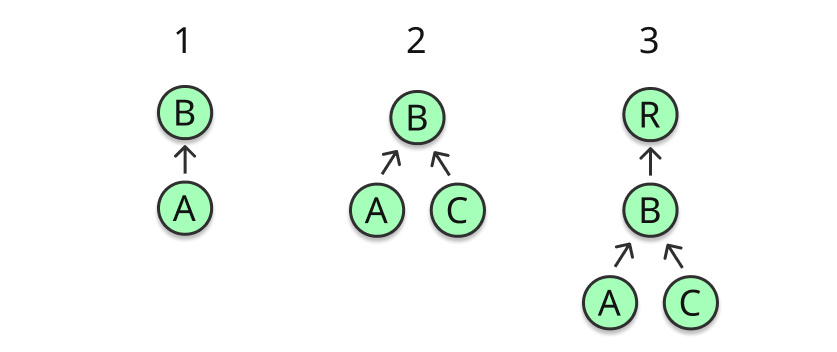

# 3. The Compose runtime

Not long ago [I tweeted a summary about how the Compose architecture works internally](https://twitter.com/JorgeCastilloPr/status/1390928660862017539), covering the communication between the UI, the compiler, and the runtime.


*Compose architecture tweet*

This Twitter thread can work great as an intro for this chapter, since it gave a birdeye perspective over some of the most important points we need to understand. This particular chapter is focused on the Jetpack Compose runtime, but it will reinforce our mental mapping about how the different parts of Compose communicate and work together. If you feel curious, I’d recommend reading the Twitter thread before moving on.

This thread explained how Composable functions **emit** changes to the Composition, so the Composition can be updated with all the relevant information, and how that takes place via the current injected `$composer` instance thanks to the compiler (see chapter 2). The call to obtain the current `Composer` instance and the Composition itself are part of the Jetpack Compose runtime.

The thread intentionally stayed a bit over the surface, since Twitter is probably not be the best place to dive deep into a topic like this one. This book is a very good chance to do it.

So far we have referenced the state maintained in memory by the runtime as “the Composition”. That is an intentionally superficial concept. Let’s start by learning about the data structures used to store and update the Composition state.

## The slot table and the list of changes

I’ve spotted some confusion floating around about the difference between these two data structures, probably due to the current lack of literature about Compose internals. As of today, I consider it necessary to clarify this first.

The slot table is an optimized in-memory structure that the runtime uses to store the **current state of the Composition**. It is filled with data during initial composition, and gets updated with every recomposition. We can think of it as a trace of all the Composable function calls, including their location in sources, parameters, remembered values, `CompositionLocal`s, and more. Everything that has happened during composition is there. All this information is used later by the `Composer` to produce the next list of changes, since any changes to the tree will always depend on the current state of the Composition.

While the slot table records the state, the change list is what makes the actual changes to the node tree. It can be understood as a patch file that once applied, it updates the tree. All the changes to make need to be recorded, and then applied. Applying the changes on the list is a responsibility of the `Applier`, which is an abstraction that the runtime relies on to ultimately materialize the tree. We will get back to all this in deep detail later.

Finally, the `Recomposer` coordinates all this, deciding when and on what thread to recompose, and when and on what thread to apply the changes. Also more on this later.

## The slot table in depth

Let’s learn how the state of the Composition is stored. The slot table is a data structure optimized for rapid linear access. It is based on the idea of a “gap buffer”, very common in text editors. It stores the data in two linear arrays for that reason. One of these arrays keeps the information about the **groups** available in the Composition, the other one stores the **slots** that belong to each group.

```kotlin
1 var groups = IntArray(0)
2   private set
3   
4 var slots = Array&lt;Any?&gt;(0) { null }
5   private set
```
*LinearStructures.kt*

In chapter 2 we learned how the compiler wraps Composable functions bodies to make them emit groups instead. Those groups will give identity to the Composable once it is stored in memory (unique key), so that it can be identified later. Groups wrap all the relevant information for the Composable call and its children, and provide information about how to treat the Composable (as a group). Groups can have a different type depending on the control flow patterns found inside the Composable body: Restartable groups, moveable groups, replaceable groups, reusable groups…

The groups array uses `Int` values since it will only store “group fields”, which represent meta-data for the groups. Parent and child groups are stored in the form of group fields. Given it’s a linear data structure, the group fields of a parent group will always come first, and the group fields of all its children will follow. This is a linear way to model a group tree, and it favors a linear scan of the children. Random access is expensive unless it is done through a group anchor. `Anchors` are like pointers that exist for this reason.

In the other hand, the slots array stores the relevant data for each one of those groups. It stores values of any type (`Any?`), since it is meant to store any type of information. This is where the actual Composition data is stored. Each group stored in the `groups` array describes how to find and interpret its slots in the `slots` array, since a group is always linked to a range of slots.

The slot table relies on a gap to read and write. Think of it as a range of positions from the table. This gap moves around and determines where the data is read from and written to the arrays when the time comes. The gap has a pointer to indicate where to start writing, and can shift its start and end positions, so the data in the table can also be overwritten.


*Slot table image*

Imagine some conditional logic like this one:

```kotlin
1 @Composable
2 @NonRestartableComposable
3 fun ConditionalText() {
4   if (a) {
5     Text(a)
6   } else {
7     Text(b)
8   }
9 }
```
*ConditionalNonRestartable.kt*

Given this Composable is flagged as **non-restartable**, a replaceable group will be inserted (instead of a restartable one). The group will store data in the table for the current “active” child. That will be `Text(a)`, in case `a` is `true`. When the condition toggles, the gap will move back to the start position of the group, and it will start writing from there, overriding all those slots with the data for `Text(b)`.

To read from and write to the table, we have `SlotReader` and `SlotWriter`. The slot table can have multiple active readers but **a single active writer**. After each read or write operation, the corresponding reader or writer gets closed. Any number of readers can be open, but the table can only be read **while it’s not being written**, for safety. The `SlotTable` remains invalid until the active writer is closed, since it will be modifying groups and slots directly and that could lead to race conditions if we try to read from it at the same time.

A reader works as a **visitor**. It keeps track of the current group being read from the groups array, its beginning and end positions, its parent (stored right before), the current slot from the group being read, the amount of slots the group has… etc. The reader can reposition, skip groups, read the value from the current slot, read values from specific indexes, and other things of the like. In other words, it is used to read information about the groups and their slots from the arrays.

The writer, in the other hand, is used for writting groups and slots to the arrays. As explained above, it can write data of any type –`Any?`– to the table. The `SlotWriter` relies on the **gaps** mentioned above for groups and slots, so it uses them to determine where to write (positions) within the arrays.

Think of a gap as a **slidable and resizable span of positions** for a linear array. The writer keeps track of the start and end positions, and length of each gap. It can move the gap around by updating its start and end positions.

The writer is able to add, replace, move and remove groups and slots. Think of adding a new Composable node to the tree, or Composables under conditional logics that might need to be replaced when condition toggles, for instance.

The writer can skip groups and slots, advance by a given amount of positions, seek to a position determined by an `Anchor`, and many other similar operations.

It keeps track of a list of `Anchors` pointing to specific indexes for rapid access through the table. Position of each group –also called group index– in the table is also tracked via an `Anchor`. The `Anchor` is updated when groups are moved, replaced, inserted, or removed before the position the `Anchor` is pointing to.

The slot table also works as an iterator of composition groups, so it can provide information about them to the tools so those are able to inspect and present details of the Composition.

Now it’s about time to learn about the change list.

For more details about the slot table, I recommend reading [this post by Leland Richardson](https://medium.com/androiddevelopers/under-the-hood-of-jetpack-compose-part-2-of-2-37b2c20c6cdd) from the Jetpack Compose team.

## The list of changes

We have learned about the slot table, how it allows the runtime to keep track of the current state of the Composition. Right, but what is the exact role of the list of changes then? when is it produced? what does it model? when are those changes applied, and for what reason?. We still have quite a few things to clarify. This section will be adding another piece to the puzzle. Let’s try to put things in order.

Every time a composition (or recomposition) takes place, the Composable functions from our sources are executed and **emit**. “Emitting”, we have used that word many times already. Emitting means creating **deferred changes** to update the slot table, and ultimately also the materialized tree. Those changes are stored as a list. Generating this fresh list of changes is based on what is already stored in the slot table. Remember: Any changes to the tree must depend on the current state of the Composition.

An example of this can be moving a node. Imagine reordering the Composables of a list. We need to check where that node was placed before in the table, remove all those slots, and write them again but starting from a new position.

In other words, every time a Composable emits it is looking at the slot table, creating a deferred change according to the needs and the current information available, and adding it to a list with all the changes. Later, when Composition is finished, it will be time for materialization, and those **recorded** changes will effectively execute. That is when they effectively update the slot table with the most fresh available information of the Composition. This process is what makes the emitting process very fast: It simply creates a deferred action that will be waiting to be run.

Following this, we can see how change list is what ultimately makes the changes to the table. Right after that, it will notify the Applier to update the materialized node tree.

As we said above, the `Recomposer` orchestrates this process and decides what thread to compose or recompose on, and what thread to use for applying the changes from the list. The latter will also be the default context used by `LaunchedEffect` to run effects.

And with this, we have a clearer view on how changes are recorded, deferred, and ultimately executed, and also how all the state is stored in the slot talbe. Now it is a good time to learn about the `Composer`.

## The Composer

The injected `$composer` is what connects the Composable functions we write to the Compose runtime.

## Feeding the Composer

Let’s explore how nodes are added to the in memory representation of the tree. We can use the `Layout` Composable to drive the example. `Layout` is the plumbings of all the UI components provided by Compose UI. This is how it looks in code:

```kotlin
 1 @Suppress(&quot;ComposableLambdaParameterPosition&quot;)
 2 @Composable inline fun Layout(
 3   content: @Composable () -&gt; Unit,
 4   modifier: Modifier = Modifier,
 5   measurePolicy: MeasurePolicy
 6 ) {
 7   val density = LocalDensity.current
 8   val layoutDirection = LocalLayoutDirection.current
 9   ReusableComposeNode&lt;ComposeUiNode, Applier&lt;Any&gt;&gt;(
10     factory = ComposeUiNode.Constructor,
11       update = {
12         set(measurePolicy, ComposeUiNode.SetMeasurePolicy)
13         set(density, ComposeUiNode.SetDensity)
14         set(layoutDirection, ComposeUiNode.SetLayoutDirection)
15       },
16       skippableUpdate = materializerOf(modifier),
17       content = content
18   )
19 }
```
*Layout.kt*

`Layout` uses `ReusableComposeNode` to emit a `LayoutNode` into the composition. But even if this might sound like creating and adding the node right away, what it really does is **teaching the runtime** how to create, initialize and insert the node at the current location in the Composition **when the time comes**. Here is the code:

```kotlin
 1 @Composable
 2 inline fun &lt;T, reified E : Applier&lt;*&gt;&gt; ReusableComposeNode(
 3   noinline factory: () -&gt; T,
 4   update: @DisallowComposableCalls Updater&lt;T&gt;.() -&gt; Unit,
 5   noinline skippableUpdate: @Composable SkippableUpdater&lt;T&gt;.() -&gt; Unit,
 6   content: @Composable () -&gt; Unit
 7 ) {
 8   // ...
 9   currentComposer.startReusableNode()
10   // ...
11   currentComposer.createNode(factory)
12   // ...
13   Updater&lt;T&gt;(currentComposer).update() // initialization
14   // ...
15   currentComposer.startReplaceableGroup(0x7ab4aae9)
16   content()
17   currentComposer.endReplaceableGroup()
18   currentComposer.endNode()
19 }
```
*ReusableComposeNode.kt*

I’m omitting some not (yet) relevant parts, but note how it delegates everything to the `currentComposer` instance. We can also see how it uses the chance to start a replaceable group to wrap the content of this Composable when storing it. Any children emitted within the `content` lambda will effectively be stored as children of this group (and therefore also the Composable) in the Composition.

The same emitting operation is done for any other Composable functions. See `remember` for instance:

```kotlin
1 @Composable
2 inline fun &lt;T&gt; remember(calculation: @DisallowComposableCalls () -&gt; T): T =
3   currentComposer.cache(invalid = false, calculation)
```
*Composables.kt*

The `remember` Composable function uses the `currentComposer` to cache (remember) the value returned by the provided lambda into the composition. The `invalid` parameter forces an update for the value regardles of it being previously stored. The `cache` function is coded like this:

```kotlin
 1 @ComposeCompilerApi
 2 inline fun &lt;T&gt; Composer.cache(invalid: Boolean, block: () -&gt; T): T {
 3   return rememberedValue().let {
 4     if (invalid || it === Composer.Empty) {
 5       val value = block()
 6       updateRememberedValue(value)
 7       value
 8     } else it
 9   } as T
10 }
```
*Composer.kt*

First, it searches for the value in the Composition (slot table). If it is not found, it will emit changes to **schedule an update** for the value (or in other words, record). Otherwise, it will return the value as is.

## Modeling the Changes

As explained in the previous section, all the emitting operations delegated to the `currentComposer` are internally modeled as `Change`s that are added to a list. A `Change` is a deferred function with access to the current `Applier` and `SlotWriter` (remember there is a single active writter at a time). Let’s have a look at it in code:

```kotlin
1 internal typealias Change = (
2   applier: Applier&lt;*&gt;,
3   slots: SlotWriter,
4   rememberManager: RememberManager
5 ) -&gt; Unit
```
*Composer.kt*

These changes are added to the list (recorded). The action of “emitting” essentially means creating these `Change`s, which are deferred lambdas to potentially add, remove, replace, or move nodes from the slot table, and consequently notify the `Applier` (so those changes can be materialized).

For this reason, whenever we talk about “emitting changes” we might also use the words “recording changes” or “scheduling changes”. It’s all referring to the same thing.

After composition, once all the Composable function calls complete and all the changes are recorded, **all of them will be applied in a batch by the applier**.

The composition itself is modeled with the `Composition` class. We are keeping that aside for now, since we will learn about the composition process in detail in the sections to come later in this chapter. Let’s learn a few more details about the Composer first.

## Optimizing when to write

As we have learned above, inserting new nodes is delegated to the Composer. That means it always knows when it is already immersed in the process of `inserting` new nodes into the composition. When that is the case, the Composer can shortcut the process and start writing to the slot table right away when changes are emitted, instead of recording them (adding them to the list to be interpreted later). In other case, those changes are recorded and deferred, since it’s not the time to make them yet.

## Writing and reading groups

Once the Composition is done, `composition.applyChanges()` is finally called to materialize the tree, and changes are written to the slot table. The Composer can write different types of information: data, nodes, or groups. That said, all of them are ultimately stored in the form of groups for simplicity. They just happen to have different group fields for differentiation.

The Composer can “start” and “end” any group. That has different meanings depending on the actions being taken. If it is writing, it will stand for “group created” and “group removed” from the slot table. If it is reading, the `SlotReader` will be asked to move its read pointers in an out of the group to start or end reading from it.

Nodes on the Composable tree (ultimately groups in the table) are not only inserted, but can also be removed, or moved. Removing a group means removing it and all its corresponding slots from the table. To do this, the `Composer` asks to reposition the `SlotReader` accordingly and make it skip the group (since it’s not there anymore), and record operations to remove all its nodes from the applier. Any modification actions need to be scheduled (recorded) and applied later as a batch as explained above, mostly to ensure they all make sense together. The Composer will also discard any pending invalidations for the removed group, since they will not happen ever.

Not all groups are restartable, replaceable, movable, or reusable. Among other things that are also stored as groups, we can find the defaults wrapper block. This block surrounds remembered values for Composable calls necessary to produce default parameters: e.g: `model: Model = remember { DefaultModel() }`. This is also stored as a very specific group.

When the Composer wants to start a group, the following things happen:

- If the composer is in the process of `inserting` values, it will go ahead and write to the slot table while it is at it, since there is no reason to wait.
- In other case, if there are pending operations, it will record those changes to the applied when applying changes. Here, the Composer will try to reuse the group in case it already exists (in the table).
- When the group is already stored **but in a different position** (it has been moved), an operation to move all the slots for the group is recorded.
- In case the group is new (not found in the table), it will move into `inserting` mode, which will write the group and all its children to an intermediate `insertTable` (another `SlotTable`) until the group is complete. That will schedule the groups to be inserted into the final table.
- Finally, if the Composer is not inserting and there are no pending write operations, it will try to start reading the group.

Reusing groups is common. Sometimes it is not needed to create a new node, but we can reuse it in case it already exists. (See `ReusableComposeNode` above). That will emit (record) the operation to navigate to the node by the `Applier`, but will skip the operations to create and initialize it.

When a property of a node needs an update, that action is also recorded as a `Change`.

## Remembering values

We learned how the Composer has the ability to `remember` values into the Composition (write them to the slot table), and it can also update those values later on. The comparison to check if it changed from last composition is done right when `remember` is called, but the update action is recorded as a `Change` unless the Composer is already inserting.

When the value to update is a `RememberObserver`, then the Composer will also record an implicit `Change` to track the remembering action in the Composition. That will be needed later when all those remembered values need to be forgotten.

## Recompose scopes

Something else that also happens via the Composer are the recompose scopes, which enable smart recomposition. Those are directly linked to restart groups. Every time a restart group is created, the Composer creates a `RecomposeScope` for it, and sets it as the `currentRecomposeScope` for the `Composition`.

A `RecomposeScope` models a region of the Composition that can be recomposed independently of the rest of the Composition. It can be used to manually invalidate and trigger recomposition of a Composable. An invalidation is requested via the composer, like: `composer.currentRecomposeScope().invalidate()`. For recomposing, the Composer will position the slot table to the starting location of this group, and then call the recompose block passed to the lambda. That will effectively invoke the Composable function again, which will emit one more time, and therefore ask the Composer to override its existing data in the table.

The composer maintains a `Stack` of all the recompose scopes that have been invalidated. Meaning they are pending to be recomposed, or in other words, need to be triggered in next recomposition. The `currentRecomposeScope` is actually obtained by peeking into this `Stack`.

That said, `RecomposeScope`s are not always enabled. That only happens when Compose finds read operations from `State` snapshots within the Composable. In that case, the Composer marks the `RecomposeScope` as `used`, which makes the inserted “end” call at the end of the Composable **not return null** anymore, and therefore activate the recomposition lambda that follows (see below, after the `?` character).

```kotlin
 1 // After compiler inserts boilerplate
 2 @Composable
 3 fun A(x: Int, $composer: Composer&lt;*&gt;, $changed: Int) {
 4   $composer.startRestartGroup()
 5   // ...
 6   f(x)
 7   $composer.endRestartGroup()?.updateScope { next -&gt; 
 8     A(x, next, $changed or 0b1) 
 9   }
10 }
```
*RecomposeScope.kt*

The Composer can recompose all invalidated child groups of the current parent group when recomposition is required, or simply make the reader skip the group to the end when it is not. (see: comparison propagation section in chapter 2).

## SideEffects in the Composer

The Composer is also able to record `SideEffects`. A `SideEffect` always runs **after composition**. They are recorded as a function to call when changes to the corresponding tree are **already applied**. They represent effects that happen on the side, so this type of effect is completely agnostic of the Composable lifecycle. We’ll not get things done like automatic cancellation when leaving the Composition, neither retrying effects on recomposition. That is because this type of effect is **not stored in the slot table**, and therefore simply discarded if composition fails. We’ll learn about this and its purpose in the chapter about effect handlers. Still it is interesting to notice how they are recorded via the Composer.

## Storing CompositionLocals

The Composer also provides means to register `CompositionLocal`s and obtain its values given a key. `CompositionLocal.current` calls rely on it. A Provider and its values are also stored as a group in the slot table, all together.

## Storing source information

The Composer also stores source information in the form of `CompositionData` gathered during Composition to be leveraged by Compose tools.

## Linking Compositions via CompositionContext

There is not a single Composition but a tree of compositions and subcompositions. Subcompositions are Compositions created inline with the only intention to construct a separate composition in the context of the current one to support independent invalidation.

A Subcomposition is connected to its parent Composition with a parent `CompositionContext` reference. This context exists to link Composition and subcompositions together as a tree. It ensures that `CompositionLocal`s and invalidations are transparently resolved / propagated down the tree as if they belonged to a single Composition. `CompositionContext` itself is also written to the slot table as a group.

Creating Subcompositions is usually done via `rememberCompositionContext`:

```kotlin
1 @Composable fun rememberCompositionContext(): CompositionContext {
2   return currentComposer.buildContext()
3 }
```
*Composables.kt*

This function remembers a new Composition at the current position in the slot table, or returns it in case it’s already remembered. It is used to create a Subcomposition from places where separate Composition is required, like the `VectorPainter` (see `VectorPainter.kt` snippet earlier in this chapter), a `Dialog`, the `SubcomposeLayout`, a `Popup`, or the actual `AndroidView`, which is a wrapper to integrate Android Views into Composable trees.

## Accessing the current State snapshot

The Composer has a reference to the current snapshot, as in a snapshot of the values return by mutable states and other state objects for the current thread. All state object will have the same value in the snapshot as they had when the snapshot was created unless they are explicitly changed in the snapshot. this will be expanded in the chapter about state management.

## Navigating the nodes

Navigation of the node tree is performed by the applier, but not directly. It is done by recording all the locations of the nodes as they are traversed by the reader and recording them in a `downNodes` array. When the node navigation is realized all the downs in the down nodes is played to the applier. If an up is recorded before the corresponding down is realized then it is simply removed from the downNodes stack, as a shortcut.

## Keeping reader and writer in sync

This is a bit low level, but given groups can be inserted, deleted, or moved, the location of a group in the writer might differ than its location in the reader for a while (until changes are applied). That makes it needed to maintain a delta to track the difference. That delta is updated with inserts, deletes, and moves, and reflects the “unrealized distance the writer must move to match the current slot in the reader” per what the docs say.

## Applying the changes

As we have mentioned many times in this chapter, the `Applier` is in charge to do this. The current `Composer` delegates on this abstraction to apply all the recorded changes after the Composition. This is what we know as “materializing”. This process executes the list of Changes and, as a result, it updates the slot table and interprets the Composition data stored on it to effectively yield a result.

**The runtime is agnostic of how the `Applier` is implemented**. It relies on a public contract that client libraries are expected to implement. That is because the `Applier` is an integration point with the platform, so it will vary depending on the use case. This contract looks like this:

```kotlin
 1 interface Applier&lt;N&gt; {
 2   val current: N
 3   fun onBeginChanges() {}
 4   fun onEndChanges() {}
 5   fun down(node: N)
 6   fun up()
 7   fun insertTopDown(index: Int, instance: N)
 8   fun insertBottomUp(index: Int, instance: N)
 9   fun remove(index: Int, count: Int)
10   fun move(from: Int, to: Int, count: Int)
11   fun clear()
12 }
```
*Applier.kt*

The first thing we see is the `N` type parameter in the contract declaration. That is the type for the nodes we are applying. This is why compose can work with generic call graphs or node trees. It is always agnostic of the type of nodes used. The `Applier` provides operations to traverse the tree, insert, remove, or move nodes around, but it doesn’t care about the type of those nodes or how they are ultimately inserted. Spoiler: **That will be delegated to the nodes themselves**.

The contract also defines how to remove all children in a given range from the current node, or move children from the current node to change their positions. The `clear` operation defines how to point to the root and remove all nodes from the tree, preparing both the `Applier` and its root to be used as the target of a new composition in the future.

The `Applier` traverses the complete tree visiting and applying all nodes. The tree can be traversed from top to bottom, or from bottom to top. It always keeps a reference of the current node it is visiting and applying changes to. It has calls to begin and end applying changes that the `Composer` will call before and after, and it provides means to insert top-down, or bottom-up, and to navigate top-down (navigate to the child node of the current one), or bottom-up (navigate to the parent of the current node).

## Performance when building the node tree

There is an important difference between building the tree top-down or doing it bottom-up. I’ll extract this specific example from the official docs, since it is already pretty meaningful.

### Inserting top-down

Consider the following tree:


*tree1*

If we wanted to build this tree top-down, we would first insert `B` into `R`, then insert `A` into `B`, and finally insert `C` into `B`. I.e:


*tree2*

### Inserting bottom-up

A bottom-up building of the tree starts by inserting `A` and `C` into `B`, then inserting the `B` tree into `R`.


*tree3*

Performance for building a tree top-down versus bottom-up can vary considerably. That decision is up to the `Applier` implementation used, and it usually relies on the number of nodes that need to be notified every time a new child is inserted. Imagine that the graph we want to represent with Compose requires notifying all ancestors of a node whenever it is inserted. In top to bottom, each insertion could notify multiple nodes (parent, parent of its parent… etc). That count will grow exponentially with each new level inserted. If it was bottom up instead, you’d always only notify the direct parent, since the parent is still not attached to the tree. But this can be the other way around if our strategy is notifying all children instead. So, always depends on the tree we are representing and how changes need to be notified top or down the tree. The only key point here is pick one strategy or the other for insertion, but never both.

## How changes are applied

As we have described above, client libraries provide implementations for the `Applier` interface, one example of this being the `UiApplier`, for Android UI. We can use that one as a perfect example on what “applying a node” means and how that yields components we can see on screen for this specific use case.

If we look at the implementation, it is very narrow:

```kotlin
 1 internal class UiApplier(
 2     root: LayoutNode
 3 ) : AbstractApplier&lt;LayoutNode&gt;(root) {
 4 
 5   override fun insertTopDown(index: Int, instance: LayoutNode) {
 6     // Ignored.
 7   }
 8 
 9   override fun insertBottomUp(index: Int, instance: LayoutNode) {
10     current.insertAt(index, instance)
11   }
12 
13   override fun remove(index: Int, count: Int) {
14     current.removeAt(index, count)
15   }
16 
17   override fun move(from: Int, to: Int, count: Int) {
18     current.move(from, to, count)
19   }
20 
21   override fun onClear() {
22     root.removeAll()
23   }
24 
25   override fun onEndChanges() {
26     super.onEndChanges()
27     (root.owner as? AndroidComposeView)?.clearInvalidObservations()
28   }
29 }
```
*UiApplier.kt*

The first thing we see is that the generic type `N` has been fixed to be `LayoutNode`. That is the type of node that Compose UI has picked to represent the UI nodes that will be rendered.

Next thing we notice is how it extends `AbstractApplier`. That is a default implementation that stores the visited nodes in a `Stack`. Every time a new node is visited down the tree, it will add it to the stack, and every time the visitor moves up, it’ll remove the last node visited from the top of the stack. This is usually common across appliers, so it is likely a good idea to have it in a common parent class.

We also see how `insertTopDown` is ignored in the `UiApplier`, since insertions will be performed bottom up in the case of Android. As we said above, it is important to pick one strategy or the other, not both. In this case bottom-up will be more appropiate to avoid duplicate notifications when a new child is inserted. This difference in terms of performance was explained earlier.

Methods to insert, remove, or move a node are all **delegated to the node itself**. `LayoutNode` is how Compose UI models a UI node, hence it knows everything about the parent node and its children. Inserting a node means attaching it to its new parent in a given position (it can have multiple children). Moving it is essentially reordering the list of children for its parent. Finally, removing it simply means removing it from the list.

Whenever it is done applying the changes, it can call `onEndChanges()` that will delegate on the root node owner for a final required action. –`onBeginChanges()` is always assumed to be called before before applying changes, so `onEndChanges()` needs to be called in the end.– At this point, any pending invalid observations are cleared. These are snapshot observations meant to automatically re-invoke layout or draw when the values they read from and depend on have changed. Imagine nodes being added, inserted, replaced, or moved, and how that can affect things like measuring or layout.

## Attaching and drawing the nodes

Once we got here we can finally answer the real question: How inserting a node on the tree (attaching it to its parent) means we ultimately see it on screen? The answer is: **The node knows how to attach and draw itself**.

We will only summarize the process very briefly for now, since there is a deep dive of this in Chapter 4 (Compose UI). This will be enough for closing the circle and achieving a complete mental model at this point.

`LayoutNode` is the node type picked for this specific use case (Android UI). When the `UiApplier` implementation delegates the insertion to it, things happen in the following order:

- Check that the conditions for inserting the node are fulfilled –e.g: it doesn’t have a parent already–.
- Invalidates the list of sorted children in the Z index. This is a parallel list that maintains all the children sorted by their Z index, so they can be drawn in order (lower Z index first). Invalidating the list makes it get recreated (and ordered) whenever it is needed again.
- Attach the new node to its parent and to its `Owner`. (Explained below).
- Invalidate!

The owner lives at the root of the tree, and implements the **connection of our Composable tree with the underlying View system**. We can think of it as a thin integration layer with Android. Actually, it is implemented by `AndroidComposeView` (a standard `View`). All layout, draw, input, and accessibility is hooked through the owner. A `LayoutNode` must be attached to an `Owner` in order to show up on screen, and its owner **must be** the same than the owner of its parent. The owner is also part of Compose UI. After we attach a node, we can call `invalidate` via the `Owner`, so the Composable tree can be rendered.


*Layout Node hierarchy*

Finally, the ultimate integration point takes place when the `Owner` is set. That happens whenever we call `setContent` from an `Activity`, `Fragment`, or a `ComposeView`. At that point, an `AndroidComposeView` is created, attached to the `View` hierarchy, and set as the `Owner`, so it can perform invalidation on demand.

Profit! We finally know how Compose UI materializes a node tree for Android. We will expand much more on all this in the following chapter.

So we have closed the cycle, but maybe a bit too early. So far we have gathered tons of interesting details and we have a better picture of how things work around Composition, but what about the Composition process itself?

Let’s go for it.

## Composition

We’ve learned lots of interesting details about the Composer in the previous section. We know how it records changes to write to or read from the slot table, how those changes are emitted when Composable functions execute during the Composition, and how those recorded changes are applied in the end. But truth is we didn’t give a word (yet) about who is in charge of creating a Composition, how, when does it take place, or what steps are involved. Composition is our missing piece so far.

We’ve said that `Composer` has a reference to the `Composition`, but that could make us think that the `Composition` is created and owned by the `Composer`, when it is actually the other way around. When a Composition is created, it builds a Composer by itself. The Composer becomes accessible via the `currentComposer` machinery, and it will be used to create and update the tree managed by the Composition.

The entry point to the Jetpack Compose runtime by client libraries is split in **two different parts**:

- Writing Composable functions: That will make them emit all the relevant information, and therefore connect our use case with the runtime.
- Composable functions are great but they’ll never execute without a Composition process. That’s why another entry point is required: `setContent`. This is the integration layer with the target platform, and a `Composition` is created and initiated here.

## Creating a Composition

For Android for example, that can be a `ViewGroup.setContent` call, which returns a new `Composition`:

```kotlin
 1 internal fun ViewGroup.setContent(
 2   parent: CompositionContext,
 3   content: @Composable () -&gt; Unit
 4 ): Composition {
 5   // ...
 6   val composeView = ...
 7   return doSetContent(composeView, parent, content)
 8 }
 9 
10 private fun doSetContent(
11   owner: AndroidComposeView,
12   parent: CompositionContext,
13   content: @Composable () -&gt; Unit
14 ): Composition {
15   // ...
16   val original = Composition(UiApplier(owner.root), parent) // Here!
17   val wrapped = owner.view.getTag(R.id.wrapped_composition_tag)
18     as? WrappedComposition ?: WrappedComposition(owner, original).also {
19       owner.view.setTag(R.id.wrapped_composition_tag, it)
20     }
21   wrapped.setContent(content)
22   return wrapped
23 }
```
*Wrapper.android.kt*

A `WrappedComposition` is a decorator that knows how to link a `Composition` to an `AndroidComposeView` so it connects it directly to the Android View system. It starts controlled effects to keep track of things like keyboard visibility changes or accessibility, and pipes information about the Android `Context` that will be exposed to the Composition as `CompositionLocal`s. (i.e: the context itself, configuration, the current `LifecycleOwner`, the current `savedStateRegistryOwner`, or the owner’s view, among others). This is how all those things become implicitly available for all our Composable functions.

Note how an instance of a `UiApplier` that starts pointing to the root `LayoutNode` of the tree is passed to the Composition. (The `Applier` is a visitor for nodes, so it starts pointing to the root one). This is the first time we explicitly see how it is the client library the one in charge to pick the implementation for the `Applier`.

We can also see how `composition.setContent(content)` is called in the end. `Composition#setContent` is what sets the content of the Composition. (Updates the Composition with all the information provided by `content`).

Another very good example of creating a Composition can be the `VectorPainter`, also part of Compose UI and used to paint vectors on screen. Vector painters create and maintain their own `Composition`:

```kotlin
 1 @Composable
 2 internal fun RenderVector(
 3   name: String,
 4   viewportWidth: Float,
 5   viewportHeight: Float,
 6   content: @Composable (viewportWidth: Float, viewportHeight: Float) -&gt; Unit
 7 ) {
 8   // ...
 9   val composition = composeVector(rememberCompositionContext(), content)
10 
11   DisposableEffect(composition) {
12     onDispose {
13       composition.dispose() // composition needs to be disposed in the end!
14     }
15   }
16 }
17 
18 private fun composeVector(
19   parent: CompositionContext,
20   composable: @Composable (viewportWidth: Float, viewportHeight: Float) -&gt; Unit
21 ): Composition {
22   val existing = composition
23   val next = if (existing == null || existing.isDisposed) {
24     Composition(VectorApplier(vector.root), parent) // Here!
25   } else {
26     existing
27   }
28   composition = next
29   next.setContent {
30     composable(vector.viewportWidth, vector.viewportHeight)
31   }
32   return next
33 }
```
*VectorPainter.kt*

We will explore this further in an upcoming chapter about advanced Jetpack Compose use cases, but we can note here how a different `Applier` strategy is picked: a `VectorApplier` that starts pointing to the root node in the vector tree, which in this case will be a `VNode`.

Finally, another example of this that we could also find in Compose UI is the `SubcomposeLayout`, which is a `Layout` that maintains its own Composition so it is able to subcompose its content during the measuring phase. This can be useful when we need the measure of a parent for the composition of its children.

Regardless of the use case, whenever a Composition is created, a `parent` `CompositionContext` can be passed (see above). But note that it can be `null`. The parent context (if available) will be used to link the new composition logically to an existing one, so that invalidations and `CompositionLocal`s can resolve across compositions as if they were the same one.

When creating a `Composition` it is also possible to pass a recompose context, which will be the `CoroutineContext` used by the `Applier` for applying the changes and ultimately materialize the tree. If not provided, it defaults to the one provided by the Recomposer, which is `EmptyCoroutineContext`. That means Android will likely recompose on `AndroidUiDispatcher.Main`.

The same way a Composition is created, it must be disposed –i.e: `composition.dispose()` when it is not needed anymore. That is when the UI (or alternative use cases) for it are disposed. We could say that a Composition is scoped to its owner. Sometimes disposal might be a bit hidden, like in the case of `ViewGroup.setContent` (behind a lifecycle observer), but it is always there.

## The initial Composition process

Whenever a new Composition is created, a call to `composition.setContent(content)` always follows (see the previous 2 snippets). That is in fact where the Composition is initially populated (the slot table is filled up with relevant data).

This call is delegated to the `parent` Composition to trigger the initial Composition process (Remember how Compositions and Subcompositions are linked via a parent `CompositionContext`):

```kotlin
1 override fun setContent(content: @Composable () -&gt; Unit) {
2   // ...
3   this.composable = content
4   parent.composeInitial(this, composable) // `this` is the current Composition
5 }
```
*Composition.kt*

For Subcompositions, the parent will be another Composition. For the root Composition, the parent will be the `Recomposer`. But regardless of that, logics for performing the initial Composition will always rely on the `Recomposer` in any case, since for Subcompositions, the `composeInitial` call delegates to the parent over and over until it reaches the root Composition.

So the call to `parent.composeInitial(composition, content)` can be translated to `recomposer.composeInitial(composition, content)`, and it does a few important things here to populate the initial Composition:

- Takes a **snapshot** of the current value of all the State objects. Those values will be isolated from potential changes from other snapshots. This snapshot is **mutable**, but at the same time it is concurrent safe. It can be modified safely without affecting any other existing State snapshots, since any changes to any of its State objects will happen only for it, and it will atomically sync all those changes with the global shared state in a later step.
- The State values from this mutable snapshot can only be modified from the block passed when calling `snapshot.enter(block: () -> T)`.
- When taking the snapshot, the `Recomposer` also passes observers for any reads or writes to the mentioned State objects, so the Composition can be notified accordingly when those take place. That allows the `Composition` to flag the affected recomposition scopes as `used`, which will make them recompose when the time comes.
- Enters the snapshot –I.e: `snapshot.enter(block)`– by passing the following block: `composition.composeContent(content)`. That is **where the Composition actually takes place**. The action of entering is what lets the `Recomposer` know that any State objects read or written during Composition will be tracked (notified to the Composition).
- The Composition process is delegated to the Composer. More on this step below this list.
- Once the Composition is done, any changes to State objects are made to the current State snapshot only, so its time to propagate those changes to the global state. That happens via `snapshot.apply()`.

That is the rough order of things around the initial Composition. Everything regarding the State snapshot system will be expanded with much more detail in the upcoming chapter about this topic.

Now, let’s elaborate the actual Composition process itself, delegated to the `Composer`. This is how things happen in rough terms.

- Composition cannot be started if it’s already running. In that case an exception is thrown and the new Composition is discarded. Reentrant Composition is not supported.
- If there are any pending invalidations, it will copy those to the invalidations list maintained by the Composer for the `RecomposeScope`s pending to invalidate.
- Moves the flag `isComposing` to be `true` since Composition is about to start.
- Calls `startRoot()` to start the Composition, that will start the root group for the Composition in the slot table and initialize other required fields and structures.
- Call `startGroup` to start a group for the `content` in the slot table.
- Invokes the `content` lambda so it emits all its changes.
- Calls `endGroup` to end the group in the slot table.
- Calls `endRoot()` to end the Composition.
- Moves the flag `isComposing` to be `false`, since Composition is done.
- Clears other structures maintaining temporary data.

## Applying changes after initial Composition

After the initial Composition, the `Applier` is notified to apply all the changes recorded during the process: `composition.applyChanges()`. This is done via the `Composition` also, which calls `applier.onBeginChanges()`, goes over the list of changes executing all of them and passing the required `Applier` and `SlotWriter` instances to each change. Finally, after all changes are applied, it calls `applier.onEndChanges()`. This is the natural process.

After this, dispatches all registered `RememberedObserver`s, so any classes implementing the `RememberObserver` contract can be notified when entering or leaving the Composition. Things like `LaunchedEffect` or `DisposableEffect` implement it, so they can constrain the effect to the Composable lifecycle within the Composition.

Right after, all `SideEffects` are triggered in the same order they were recorded.

## Additional information about the Composition

A Composition is aware of its pending invalidations for recomposition. It also knows if it is currently composing. This knowledge can be used to apply invalidations instantly (when it is), or defer them otherwise. It can also be used by the Recomposer to discard recompositions when it is true.

The runtime relies on a variant of the Composition called `ControlledComposition` that adds a few extra functions so it can be controlled from the outside. That way, the Recomposer can orchestrate invalidations and further recomposition. Functions like `composeContent` or `recompose` are good examples of this. The Recomposer can trigger those actions in the composition when needed.

The Composition provides means to detect if a set of objects are being observed by itself so to enforce recomposition when those vary. For instance, this is used by the Recomposer to enforce recomposition in a child composition when a `CompositionLocal` varies in a parent composition. Remember Compositions are connected via parent `CompositionContext` for this matter.

Sometimes an error is found during composition, in that case it can be aborted, which is pretty much like resetting the Composer and all its references / stacks and everything.

The composer assumes it is skipping recomposition when it is not inserting nor reusing, there are no invalid providers (since that would require recomposition) and the `currentRecomposeScope` doesn’t require recomposition. A chapter on smart recomposition is also coming up.

## The Recomposer

We already know how the initial Composition takes place, and also learned a few things about `RecomposeScope`s and invalidation. But we still know close to nothing regarding how the Recomposer actually works. How is it created and when does it start running? How does it start listening for invalidations to automatically trigger recomposition? Some questions likely arise.

The Recomposer controls the `ControlledComposition`, and it triggers recompositions when needed to ultimately apply updates to it. It also determines what thread to compose or recompose on, and what thread to use for applying the changes.

Let’s learn how to create a Recomposer and make it start awaiting for invalidations.

## Spawning the Recomposer

The entry point to Jetpack Compose by client libraries is creating a Composition and calling `setContent` over it –see section above: **Creating a Composition**–. When creating the Composition it is required to provide a parent for it. Given the parent of a root Composition is a `Recomposer`, this is also the moment to create it.

This entry point is the connection between the platform and the Compose runtime, and it is code provided by the client. In the case of Android, that is Compose UI. This library creates a Composition (which internally creates its own Composer), and a Recomposer to use as its parent.

Note that each potential use case for each platform is prone to create its own Composition as we have learned before, and the same way, it will also likely create its own Recomposer.

When we want to use Compose on Android `ViewGroup`s, we call `ViewGroup.setContent` which ultimately, and after some indirections, delegates creating the parent context to a Recomposer factory:

```kotlin
 1 fun interface WindowRecomposerFactory {
 2 
 3   fun createRecomposer(windowRootView: View): Recomposer
 4 
 5   companion object {
 6     val LifecycleAware: WindowRecomposerFactory = WindowRecomposerFactory { rootView\
 7  -&gt;
 8       rootView.createLifecycleAwareViewTreeRecomposer()
 9     }
10   }
11 }
```

This factory creates a Recomposer for the current window. I find the creation process very interesting to explore, since it provides many clues about how Android resolves the integration with Compose.

Passing a reference to the root view is needed for calling `createRecomposer`, since the created Recomposer will be **lifecycle-aware**, meaning that it will be linked to the `ViewTreeLifecycleOwner` at the root of the View hierarchy. This will allow to cancel (shutdown) the Recomposer when the view tree is unattached, for instance, which is important to avoid leaking the recomposition process. –This process is modeled as a suspended function that will otherwise leak.–

Infix for what it is coming below: In Compose UI, all the things happening on UI are coordinated / dispatched using the `AndroidUiDispatcher`, which for that reason is associated with a `Choreographer` instance and a handler for the main `Looper`. This dispatcher performs event dispatch during the handler callback or choreographer’s animation frame stage, **whichever comes first**. It also has a `MonotonicFrameClock` associated that uses `suspend` to coordinate frame rendering. This is what drives the whole UX in Compose, and things like animations depend a lot on it for achieving a smooth experience in sync with the system frames.

First thing the factory function does is creating a `PausableMonotonicFrameClock`. This is a wrapper over the `AndroidUiDispatcher` monotonic clock that adds support for manually pausing the dispatch of `withFrameNanos` events until it is resumed. That makes it useful for cases where frames should **not be produced** during specific periods of time, like when a Window hosting a UI is no longer visible.

Any `MonotonicFrameClock` is also a `CoroutineContext.Element`, which means it can be combined with other `CoroutineContext`s.

When insantiating the Recomposer, we must provide a `CoroutineContext` to it. This context is created using a combination of the current thread context from the `AndroidUiDispatcher` and the pausable frame clock just created.

```kotlin
1 val contextWithClock = currentThreadContext + (pausableClock ?: EmptyCoroutineContex\
2 t)
3 val recomposer = Recomposer(effectCoroutineContext = contextWithClock)
```
*WindowRecomposer.android*

This combined context will be used by the Recomposer to create an internal `Job` to ensure that all composition or recomposition effects can be cancelled when shutting down the Recomposer. This will be needed when an Android window is getting destroyed or unattached, for example. **This context will be the one used for applying changes** after composition / recomposition, and will also be the default context used by `LaunchedEffect` to run effects. –That makes effects start in the same thread we use to apply changes, which in Android is usually the main thread. Of course we can always jump off the main thread at will within our effects.–

`LaunchedEffect` is an effect handler that will be explained in detail in the chapter about this topic. All the effect handlers are Composable functions and therefore emit changes that are recorded. `LaunchedEffect` is indeed recorded and written to the slot table when the time comes, so it is Composition lifecycle aware, not like `SideEffect`.

Finally, a coroutine scope is created using the same combined context: i.e: `val runRecomposeScope = CoroutineScope(contextWithClock)`. This scope will be used to launch the recomposition job (a `suspend` function), which will await for invalidations and trigger recompositions accordingly. Let’s peek into the code and discuss some ideas about it.

```kotlin
 1 viewTreeLifecycleOwner.lifecycle.addObserver(
 2   object : LifecycleEventObserver {
 3     override fun onStateChanged(lifecycleOwner: LifecycleOwner, event: Lifecycle.Eve\
 4 nt) {
 5       val self = this
 6 
 7       when (event) {
 8         Lifecycle.Event.ON_CREATE -&gt;
 9           runRecomposeScope.launch(start = CoroutineStart.UNDISPATCHED) {
10           try {
11             recomposer.runRecomposeAndApplyChanges()
12           } finally {
13             // After completion or cancellation
14             lifecycleOwner.lifecycle.removeObserver(self)
15           }
16         }
17         Lifecycle.Event.ON_START -&gt; pausableClock?.resume()
18         Lifecycle.Event.ON_STOP -&gt; pausableClock?.pause()
19         Lifecycle.Event.ON_DESTROY -&gt; {
20           recomposer.cancel()
21         }
22       }
23     }
24   }
25 )
```
*WindowRecomposer.android.kt*

Here is where the things happen. An observer is attached to the view tree lifecycle, and it will use the pausable clock to resume and pause event dispatch when view tree is started and stopped, respectively. It will also shutdown (cancel) the Recomposer on destroy, and launch the recomposition job on create.

The recomposition job is started by `recomposer.runRecomposeAndApplyChanges()`, which is the `suspend` function mentioned above that will await for the invalidation of any associated Composers (and their `RecomposeScope`s), recompose them, and ultimately apply the new changes to their associated Composition.

This factory is how Compose UI spawns a Recomposer connected to the Android lifecycle. It works nicely as an example of how the Recomposer is created at the integration point with the platform, along with the Composition. As a refresher, here we can see again how the composition was created when setting the content for `ViewGroups`:

```kotlin
 1 internal fun ViewGroup.setContent(
 2   parent: CompositionContext, // Recomposer is passed here!
 3   content: @Composable () -&gt; Unit
 4 ): Composition {
 5   // ...
 6   val composeView = ...
 7   return doSetContent(composeView, parent, content)
 8 }
 9 
10 private fun doSetContent(
11   owner: AndroidComposeView,
12   parent: CompositionContext,
13   content: @Composable () -&gt; Unit
14 ): Composition {
15   // ...
16   val original = Composition(UiApplier(owner.root), parent) // Here!
17   val wrapped = owner.view.getTag(R.id.wrapped_composition_tag)
18     as? WrappedComposition ?: WrappedComposition(owner, original).also {
19       owner.view.setTag(R.id.wrapped_composition_tag, it)
20     }
21   wrapped.setContent(content)
22   return wrapped
23 }
```
*Wrapper.android.kt*

That `parent` there will be a Recomposer, and will be provided by the caller of `setContent`, that for this use case it is the `AbstractComposeView`.

## Recomposition process

The `recomposer.runRecomposeAndApplyChanges()` function is called to start awaiting for invalidations and automatically recompose when those take place. Let’s learn the different steps involved.

On a previous section we learned how snapshot State is modified within its own snapshot, but later those changes need to be propagated to the global state via `snapshot.apply()` for sync. When calling `recomposer.runRecomposeAndApplyChanges()`, the first thing it does is registering an observer for that change propagation. When that happens, this observer awakes and adds all those changes to a list of snapshot invalidations that are propagated to all known composers so they can record what parts of the composition need to be recomposed. In simple terms, this observer is a stepping stone for triggering automatic recomposition when State changes.

After registering the snapshot apply observer, the Recomposer invalidates all Compositions to assume everything has changed as a starting point. Any changes happening before this moment have not been tracked, so this is a way to start from scratch. Then it suspends until there is work available for recomposition. “Having work available” means having any pending State snapshot invalidations, or any composition invalidations coming from `RecomposeScope`s.

The next thing the Recomposer does is using the monotonic clock provided when creating it, and call `parentFrameClock.withFrameNanos {}` to await for the next frame. The rest of the work from here will be performed at that time and not before. The intention is to coalesce changes to the frame.

Inside this block, the Recomposer dispatches the monotonic clock frames first for any potential awaiters (like animations). That might yield new invalidations as a result that also need to be tracked (e.g: toggling a conditional Composable when an animation ends).

And now it’s time for the real action. The Recomposer takes all the pending snapshot invalidations, or in other words, all the State values modified since last call to recompose, and records all those changes in the composer as pending recompositions.

There could also be invalidated Compositions –via `composition.invalidate()`–, for example when a State is written in a Composable lambda–. For each one of those, the Recomposer performs recomposition (a section on this below) and adds it to the list of Compositions with changes pending to apply.

Recomposing means recalculating all the `Change`s necessary for the Composition state (slot table) and the materialized tree (`Applier`), as we have learned. We have seen how that is done already –see section: **“The initial Composition process”**–. Recomposition reuses all that code, so no point on repeating all the steps that the process follows here.

Later, it finds potential trailing recompositions that need to be composed because of a value change by a composition, and schedules them for recomposition also. This can happen for example if a `CompositionLocal` changes in a parent and was read in a child composition that was otherwise valid.

Finally, it goes over all the Compositions with changes to apply and calls `composition.applyChanges()` on them. After that, it updates the Recomposer state.

## Concurrent recomposition

The Recomposer has the ability to perform recompositions concurrently, even if Compose UI does not make use of this feature. Any other client libraries could rely on it though, based on their needs.

The Recomposer provides a concurrent counterpart to the `runRecomposeAndApplyChanges` function that is called `runRecomposeConcurrentlyAndApplyChanges`. This is another `suspend` function for awaiting for State snapshot invalidations and triggering automatic recompositions like the former, but with the only difference being that the latter will perform recomposition of invalidated Compositions in a `CoroutineContext` provided from the outside:

```kotlin
1 suspend fun runRecomposeConcurrentlyAndApplyChanges(
2   recomposeCoroutineContext: CoroutineContext
3 ) { /* ... */ }
```
*Recomposer.kt*

This `suspend` function creates its own `CoroutineScope` using the passed context and uses it to spawn and coordinate all the child jobs created for all the concurrent recompositions required.

## Recomposer states

The Recomposer switches over a series of states during its lifespan:

```kotlin
1 enum class State {
2   ShutDown,
3   ShuttingDown,
4   Inactive,
5   InactivePendingWork,
6   Idle,
7   PendingWork
8 }
```
*Recomposer.kt*

This has been extracted directly from the kdocs, and there is no point on rewording it. Here you have what each one of those states means:

- `ShutDown`: Recomposer was cancelled and cleanup work completed. Cannot be used anymore.
- `ShuttingDown`: Recomposer was cancelled but it still in the middle of the cleanup process. Cannot be used anymore.
- `Inactive`: Recomposer will ignore invalidations from Composers and will not trigger recomposition accordingly. `runRecomposeAndApplyChanges` has to be called to start listening. This is the initial state of a Recomposer after creation.
- `InactivePendingWork`: There is the chance that the Recomposer is inactive but already has some pending effects awaiting a frame. The frame will be produced as soon as the recomposer starts running.
- `Idle`: Recomposer is tracking composition and snapshot invalidations, but there is currently no work to do.
- `PendingWork`: Recomposer has been notified of pending work and is already performing it or awaiting the opportunity to do it. (We already described what “pending work” means for the Recomposer).