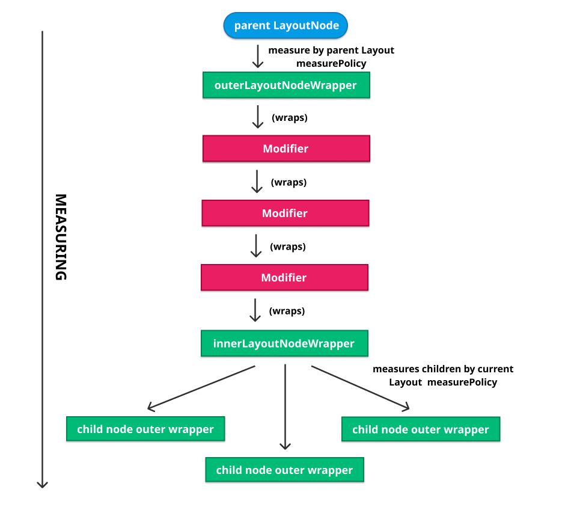
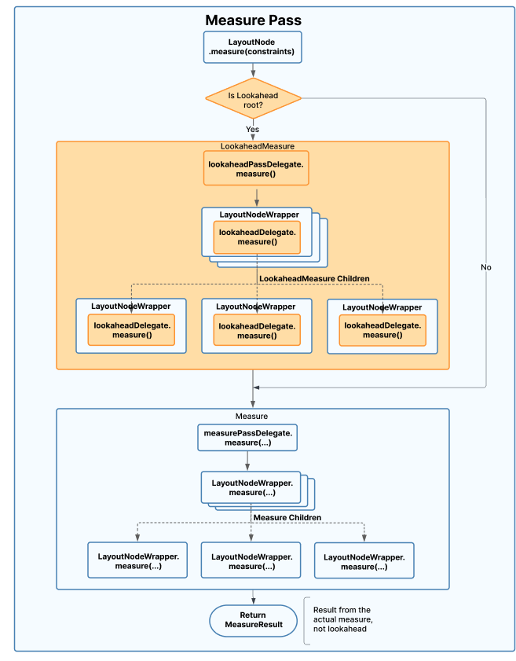

# 4. Compose UI

When we talk about Jetpack Compose we are usually referring to all its parts as a whole: The compiler, the runtime, and maybe Compose UI. In previous chapters, we learned about the Compiler, and how it enables optimizations and features in the runtime. After that, we studied the runtime itself, and discovered how it contains the real machinery behind Compose, where all its power and features reside. Finally, it’s the turn of Compose UI, a client library for the runtime.

A short disclaimer before we start. I picked Compose UI as an example of a client library for the Compose runtime in this book, but note that there are other client libraries like [Compose for Web](https://compose-web.ui.pages.jetbrains.team/), built and maintained by JetBrains, or [Mosaic](https://github.com/JakeWharton/mosaic), a command line UI library by Jake Wharton. These libraries could suit as nicely as an example. Also note that the last chapter of this book is actually an in-depth look on how to write client libraries for Jetpack Compose.

## Integrating UI with the Compose runtime

Compose UI is a **Kotlin multiplatform** framework. It provides building blocks and machinery to emit UI via Composable functions. On top of that, this library also [includes Android and Desktop sourcesets](https://cs.android.com/androidx/platform/frameworks/support/+/androidx-main:compose/ui/ui/src/) that provide integration layers for Android and Desktop.

JetBrains actively maintains the Desktop sourceset, while Google maintains the Android and common ones. Both, Android and Desktop sourcesets rely on the common sourceset. Compose for Web stays out of Compose UI so far, since it is built using the DOM.

When integrating UI with the Compose runtime, the aim is to build a layout tree that the user can experience on screen. This tree is created and later updated by executing Composable functions that emit UI. The node type used for the tree is only known by Compose UI, so the runtime can stay agnostic of it. Even if Compose UI is already a Kotlin multiplatform framework per se, its node types are only supported by Android and Desktop so far. Other libraries like Compose for Web use different node types. For this reason, the node types emitted by a client library must only be known by the client library, and the runtime delegates on it the acts of inserting, removing, moving, or replacing nodes from the tree. We will get back to this later in this chapter.

The processes of initial composition and later recompositions take part in the process of building and updating the layout tree. These processes execute our Composable functions, which makes them schedule changes to insert, remove, move, or replace nodes from the tree. This creates a list of changes that is traversed later on using the `Applier` to detect the changes that affect the structure of the tree, and map those to actual changes to the tree, so the end user can experience them. If we are in the initial process of composition, these changes will insert all nodes and therefore build up our layout tree. If we are in a recomposition, they will update it. Recomposition will be triggered when the input data for our Composable functions changes (i.e: their parameters or mutable state read from them).

In previous chapters went over all this briefly. This is the perfect chapter to expand on the topic.

## Mapping scheduled changes to actual changes to the tree

When Composable functions execute during the processes of composition or recomposition, they emit their changes. On top of this, a side table called `Composition` is used (we will capitalize this one from now on, to differentiate it from the process of composition). This table contains relevant data to map from Composable function execution (scheduled changes) to actual changes to the node tree.

In an application using Compose UI we can have as many Compositions as the number of node trees we need to represent. This might sound a bit surprising at this point, since so far on this book we have never mentioned that Compositions can be multiple. But they actually are! Let’s learn more about this, and while we do it, we will rapidly understand how the layout tree is built, and what node types are used.

## Composition from the point of view of Compose UI

If we take the Android integration as an example, the more frequent entry point from the Compose UI library into the runtime takes place when we call `setContent`, maybe for one of our screens.

```kotlin
 1 class MainActivity : ComponentActivity() {
 2   override fun onCreate(savedInstanceState: Bundle?) {
 3     super.onCreate(savedInstanceState)
 4     setContent {
 5       MaterialTheme {
 6         Text(&quot;Hello Compose!&quot;)
 7       }
 8     }
 9   }
10 }
```
*MainActivity.kt*

But a screen (E.g: Activity/Fragment in Android) is not the only place where we can find a `setContent` call. It can also happen in the middle of our `View` hierarchy, for example, via `ComposeView` (e.g: in a hybrid Android app):

```kotlin
1 ComposeView(requireContext()).apply {
2   setContent {
3     MaterialTheme {
4       Text(&quot;Hello Compose!&quot;)
5     }
6   }
7 }
```
*ComposeView.setContent*

In this example, we are creating the view programmatically, but it could also be part of any layout hierarchy defined via XML within our app.

**The `setContent` function creates a new root Composition**, and then it reuses it as possible. I’m calling these “root” Compositions, since each one hosts an independent Composable tree. Those compositions are not connected to each other in any way. Each Composition will be as simple or as complex as the UI it represents.

With this mindset, we could imagine multiple node trees in our app, each one linked to a different Composition. Let’s imagine an Android app with 3 Fragments (image below). Fragments 1 and 3 call `setContent` to hook their Composable trees, while Fragment 2 declares multiple `ComposeView`s on its layout, (and calls `setContent` on them). In this scenario, our app would have 5 root Compositions, all of them completely independent.


*Multiple root Compositions*

To create any of those layout hierarchies, the associated `Composer` will run the composition process. When doing so, all the Composable functions within the corresponding `setContent` call will execute and emit their changes. In the case of Compose UI, those will be changes to insert, move, or replace UI nodes, and they will be emitted by the usual UI building blocks. I.e: `Box`, `Column`, `LazyColumn`…etc. Even if those Composables usually belong to different libraries (`foundation`, `material`), all of them are ultimately defined as `Layout`s (`compose-ui`), which means they emit the same node type: A `LayoutNode`.

The `LayoutNode` was already introduced in the previous chapter. It is the representation of a UI block, and for that reason, it is the node type most frequently used for a root Composition in Compose UI.

Any `Layout` Composable emits a `LayoutNode` node into the Composition, and it does it via a `ReusableComposeNode` (Note that `ComposeUiNode` is a contract implemented by `LayoutNode`):

```kotlin
 1 @Composable inline fun Layout(
 2     content: @Composable () -&gt; Unit,
 3     modifier: Modifier = Modifier,
 4     measurePolicy: MeasurePolicy
 5 ) {
 6   val density = LocalDensity.current
 7   val layoutDirection = LocalLayoutDirection.current
 8   val viewConfiguration = LocalViewConfiguration.current
 9     
10   // Emits a LayoutNode!
11   ReusableComposeNode&lt;ComposeUiNode, Applier&lt;Any&gt;&gt;(
12     factory = { LayoutNode() },
13     update = {
14       set(measurePolicy, { this.measurePolicy = it })
15       set(density, { this.density = it })
16       set(layoutDirection, { this.layoutDirection = it })
17       set(viewConfiguration, { this.viewConfiguration = it })
18     },
19     skippableUpdate = materializerOf(modifier),
20     content = content
21   )
22 }
```
*Layout.kt*

This will emit a change to insert or update a reusable node into the composition. And this will happen for any UI building blocks we use.

Reusable nodes are an optimization in the Compose runtime. When the `key` for a node changes, reusable nodes allow the Composer to recompose the node content (update it in place during recomposition) instead of discarding it and creating a new one. To allow this, the Composition acts like it is creating new content but the slot table is traversed like if it is recomposing. This optimization is only possible for nodes that can be completely described by the `set` and `update` operations in the emit call, or in other words, nodes that contain no hidden internal state. This is true for `LayoutNode`, but not for `AndroidView` for example. For that reason, `AndroidView` uses a standard `ComposeNode` instead of a reusable one.

`ReusableComposeNode` will create the node (via the `factory` function), initialize it (`update` lambda), and create a replaceable group to wrap all its content. A unique key will be assigned to this group so it can be identified later. Any nodes emitted as a result of calling the `content` lambda within the replaceable group will effectively become children of this node.

The `set` calls within the `update` block schedule their trailing lambdas to be executed only when the node is first created or the value for the corresponding property has changed since last time it was remembered.

That is how `LayoutNode`s are fed to each one of the multiple Compositions that our application might have. And this might lead us to think that any Composition contains `LayoutNode`s only. But that is wrong! There are other types of Compositions and other types of nodes we need to think of when learning about how to feed the runtime in Compose UI.

## Subcomposition from the point of view of Compose UI

Compositions not only exist at a root level. A Composition can also be created in a deeper level of our Composable tree, and get linked to its parent Composition. This is what Compose refers to as **Subcomposition**. Something we learned in the previous lesson is that Compositions can be connected as a tree. That is, each Composition has a reference to its parent `CompositionContext`, which stands for its parent Composition (except for the root one, whose parent is the `Recomposer` itself). This is how the runtime ensures that `CompositionLocal`s and invalidations can be resolved / propagated down the tree as if we had a single Composition.

In Compose UI, there are two main reasons to create a Subcomposition:

- Deferring the initial composition process until some information is known.
- Changing the type of the node produced by a subtree.

Let’s address both of them.

### Deferring initial composition process

We have an example of this in `SubcomposeLayout`, which is an analogue of `Layout` that creates and runs an independent composition during the layout phase. This allows child Composables to depend on any values calculated in it. `SubcomposeLayout` is used by `BoxWithConstraints` for example, which exposes the incoming parent constraints in the block so it can adapt its content based on them. In the following example extracted from the official docs, `BoxWithConstraints` is used to decide between two different composables depending on the available `maxHeight`.

```kotlin
 1 BoxWithConstraints {
 2   val rectangleHeight = 100.dp
 3   if (maxHeight &lt; rectangleHeight * 2) {
 4     Box(Modifier.size(50.dp, rectangleHeight).background(Color.Blue))
 5   } else {
 6     Column {
 7       Box(Modifier.size(50.dp, rectangleHeight).background(Color.Blue))
 8       Box(Modifier.size(50.dp, rectangleHeight).background(Color.Gray))
 9     }
10   }
11 }
```
*BoxWithConstraints Sample*

The creator of a Subcomposition can control when the initial composition process happens, and `SubcomposeLayout` decides to do it during the layout phase, as opposed to when the root is composed.

Subcomposition allows to recompose independently of the parent Composition. In `SubcomposeLayout` for example, whenever a layout occurs, the parameters passed to its lambda might vary, and in that case it will trigger a recomposition. In the other hand, if a state that is read from a subcomposition changes, a recomposition will be scheduled for the parent Composition once the initial composition is performed.

In terms of nodes emitted, `SubcomposeLayout` also emits a `LayoutNode`, so the node type used for the subtree will be the same than the one used by the parent Composition. This leads to the following question: Is it possible to support different node types within a single Composition?

Well, it is technically possible, as long as the corresponding `Applier` allows it. It boils down to what is meant by the node type. If the node type used is a common parent for multiple subtypes, then different node types could be supported. Even though, that could make the `Applier` logic more cumbersome. The truth is that the `Applier` implementations available in Compose UI are fixed to a single node type.

That said, Subcomposition can actually enable **support for a completely different node type in a subtree**. Which is the second use case for Subcomposition that we listed above.

### Changing the node type in a subtree

Compose UI has a good example for this one: Composables that create and display vector graphics (e.g: `rememberVectorPainter`).

Vector Composables are a nice case study, since they also create their own Subcomposition to model the vector graphic as a tree. When composed, a Vector Composable emits a different node type to feed its Subcomposition: `VNode`. This is a recursive type that models standalone Paths or groups of Paths.

```kotlin
1 @Composable
2 fun MenuButton(onMenuClick: () -&gt; Unit) {
3   Icon(
4     painter = rememberVectorPainter(image = Icons.Rounded.Menu),
5     contentDescription = &quot;Menu button&quot;,
6     modifier = Modifier.clickable { onMenuClick() }
7   )
8 }
```
*Vector painter example*

Something interesting to reflect on here is that we normally paint these vectors using a `VectorPainter` within an `Image`, an `Icon`, or some similar Composable to display it, as we see in the snippet above. That means the enclosing Composable is a `Layout`, hence it emits a `LayoutNode` into its associated Composition. But at the same time, the `VectorPainter` creates its own Subcomposition for the vector, and links it to the former Composition, which will become its parent. Here is a graphical example:


*Composition and Subcomposition*

This configuration enables the vector subtree (Subcomposition) to use a different node type: `VNode`.

Vectors are modeled via Subcomposition because it is usually convenient to access some of the `CompositionLocal`s available in the parent Composition from within the vector Composable call (e.g: `rememberVectorPainter`). Things like theme colors or density can be good examples.

Subcompositions created for vectors are disposed whenever their corresponding `VectorPainter` leaves the parent Composition, which will happen whenever its enclosing Composable also does. We will learn more about the Composable lifecycle in an upcoming chapter, but keep in mind that any Composable enters and leaves the Composition at some point.

And with this, we have a more complete picture of how the tree looks like in an average Compose UI app (Android or Desktop), where we usually have root Compositions and Subcompositions. Time to understand the other side of the integration with the platform: Materializing the changes to experience them on screen.

## Reflecting changes in the UI

We have learned how UI nodes are emitted and fed to the runtime by running the processes of initial composition and later recompositions. At that point, the runtime takes it over and performs its work, as we learned in chapter 3. But this is only one side of the story, isn’t it? There also needs to exist some integration to reflect all those emitted changes in the actual UI, so the user can experience them. That process is what is often called “materialization” of the node tree, and it is also a responsibility of the client library, in this case Compose UI. We also introduced this concept in the previous chapter, so let’s use this chance to explore it in more detail.

## Different types of Appliers

Earlier in this book we described an `Applier` as an abstraction that the runtime relies on for ultimately materializing any changes from the tree. This inverts the dependencies to allow the runtime to stay completely agnostic of what platform the library is consumed from. This layer of abstraction allows client libraries like Compose UI to hook their own `Applier` implementations, and with them, **pick their own node type/s**, that will be used for integration with the platform. Here we have a simple diagram showcasing this:


*compose architecture*

*The top two boxes (Applier and AbstractApplier) are part of the Compose runtime. The bottom ones list some Applier implementations and are provided by Compose UI.*

The `AbstractApplier` is a base implementation provided by the Compose runtime for sharing logic between the different appliers. It stores the **visited** nodes in a `Stack`, and it maintains a reference to the current node visited, so it knows what node it should be performing operations on. Whenever a new node is visited down the tree, the `Composer` notifies the `Applier` by calling `applier#down(node: N)`. That pushes the node to the stack, and the `Applier` can run any required operations on it. Whenever the visitor needs to move back to the parent, the `Composer` calls `applier#up()`, and that pops the last node visited from the stack.

Let’s undestand this with a fairly simple example. Let’s imagine we have the following Composable tree to materialize:

```kotlin
 1 Column {
 2   Row {
 3     Text(&quot;Some text&quot;)
 4     if (condition) {
 5       Text(&quot;Some conditional text&quot;)
 6     }
 7   }
 8   if (condition) {
 9     Text(&quot;Some more conditional text&quot;)
10   }
11 }
```
*AbstractApplier example*

Whenever `condition` changes, the `Applier` will:

- Receive a `down` call for `Column`.
- Then another `down` call to get into the `Row`.
- Then a delete (or insert, depending on `condition`) for the optional child `Text`.
- After that, an `up` call will follow to get back to the parent (`Column`).
- Finally, a delete (or insert) for the second conditional text.

The stack and the `down` and `up` operations are pulled into the `AbstractApplier` so child appliers can share the same navigation logic regardless of the node types they work with. This provides a parent to child relation between the nodes, so it technically removes the need for specific node types to maintain this relation for navigating the tree. Even though, specific node types are still free to implement their own parent to child relation if they happen to need it for more specific reasons particular to the client library.

This is actually the case of `LayoutNode`, since not all its operations are performed during the composition. For example, if a node needs to be redrawn for any reason, Compose UI iterates through the parents to find the node that created the layer that the node draws to, in order to call invalidate on it. All that happens out of the composition, so Compose UI requires a means to traverse the tree up and down at will.

This is an interesting moment for a flashback to Chapter 3. In that chapter we described how the `Applier` can build the node tree **top-down** or **bottom-up**. We also described how there are performance implications for each approach, and how those implications depend on the number of nodes that need to be notified every time a new node is inserted. If you feel a bit lost now, don’t worry. I totally recommend you to go back to the **“Performance when building the node tree”** section from Chapter 2 for a minute, and give it a quick re-read. I wanted to recap on this because there are actual examples of both strategies to build up the node tree in Compose UI. Those are put into practice by the two types of `Applier`s used by the library.

Compose UI provides two implementations of the `AbstractApplier` to integrate the Android platform with the Jetpack Compose runtime:

- `UiApplier`: For rendering most of the Android UI. This one fixes the node type to `LayoutNode`, so it will materialize all the `Layout`s in our tree.
- `VectorApplier`: For rendering vector graphics. It fixes the node type to `VNode` in order to represent and materialize vector graphics.

As you can see, those are the two node types we have introduced earlier in this chapter.

These are the only two implementations provided for Android so far, but the number of implementations available for a platform is not necessarily fixed. More could be added to Compose UI in the future, if there is a need to represent different node trees than the ones existing today.

Depending on the type of the node visited, a different `Applier` implementation will be used. E.g: If we have a root Composition fed with `LayoutNode`s, and a Subcomposition fed with `VNode`s, both appliers will be used to materialize the complete UI tree.

Let’s give a rapid look to the strategies used by both appliers to build up the tree.

The `UiApplier` inserts nodes bottom-up. This is to avoid duplicate notifications when a new node enters the tree. Let me rescue the bottom-up insertion strategy diagram from Chapter 2 to make it clear:


*tree3*

A bottom-up building of the tree starts by inserting `A` and `C` into `B`, then inserting the `B` tree into `R` to complete the tree. That means **it only notifies the direct parent every time a new node is inserted**. This is particularly interesting for Android UIs (and therefore the `UiApplier`) where we normally have a lot of nesting (especially in Compose UIs where overdraw is not a problem) and therefore a lot of ancestors to notify.

In the other hand, the `VectorApplier` is an example of building the tree top-down. If we wanted to build the sample tree from above using a top-down strategy, we would first insert `B` into `R`, then insert `A` into `B`, and finally insert `C` into `B`. I.e:


*tree2*

In this strategy, each time we insert a new node we need to notify all its ancestors. But in the context of vector graphics, there is no need to propagate notifications to any nodes at all, so either strategy would be equally performant and therefore completely valid. There is not a strong reason to pick top-down over bottom-up. Whenever a new child gets inserted into a `VNode`, the listener for that node is notified, but the children or parents are not.

Since we already have a good sense of the two different implementations of `Applier` that the Compose UI library uses, it is time to understand how both of them ultimately materialize a change in the UI.

## Materializing a new LayoutNode

Here we have a simplification of the `UiApplier` used by Compose UI:

```kotlin
 1 internal class UiApplier(
 2     root: LayoutNode
 3 ) : AbstractApplier&lt;LayoutNode&gt;(root) {
 4 
 5   override fun insertTopDown(index: Int, instance: LayoutNode) {
 6     // Ignored. (The tree is built bottom-up with this one).
 7   }
 8 
 9   override fun insertBottomUp(index: Int, instance: LayoutNode) {
10     current.insertAt(index, instance)
11   }
12 
13   override fun remove(index: Int, count: Int) {
14     current.removeAt(index, count)
15   }
16 
17   override fun move(from: Int, to: Int, count: Int) {
18     current.move(from, to, count)
19   }
20 
21   override fun onClear() {
22     root.removeAll()
23   }
24   ...
25 }
```
*UiApplier.android.kt*

In this implementation we clearly see how the node type is fixed to be `LayoutNode`, and how all operations to `insert`, `remove`, or `move` nodes from the tree are delegated to the current node visited. That makes sense, since the `LayoutNode` knows how to materialize itself so the runtime can stay agnostic of that.

The `LayoutNode` is a pure Kotlin class with no Android dependencies, since it only models a UI node, and it is meant to be used by multiple platforms (Android, Desktop). It maintains a list of its children, and provides operations to insert, remove, or move (reorder) child nodes. `LayoutNode`s are connected as a tree, so each `LayoutNode` has a reference to its parent, and all of them are connected to the same `Owner`. This requirement is imposed to every new node attached. This is a diagram we already shared earlier in the book that shows the hierarchy.


*LayoutNode tree*

The `Owner` is an abstraction, so each platform can implement it differently. It is expected to be the integration point with the platform. In Android, it is a `View` (`AndroidComposeView`), so it is the underlying connection between our Composable tree (`LayoutNode`s) and the Android `View` system. Whenever a node is attached, detached, reodered, remeasured, or updated anyhow, an invalidation can be triggered via the `Owner` using the good old Android `View` APIs, so the latest changes will be reflected on screen in the next drawing pass. That is basically how the magic happens.

Let’s dive into a simplification of the `LayoutNode#insertAt` operation in order to understand how a new node gets inserted and therefore materialized. –Note that this is intentionally omitting some details, since implementation details might vary over time.–

```kotlin
 1 internal fun insertAt(index: Int, instance: LayoutNode) {
 2   check(instance._foldedParent == null) {
 3     &quot;Cannot insert, it already has a parent!&quot;
 4   }
 5   check(instance.owner == null) {
 6     &quot;Cannot insert, it already has an owner!&quot;
 7   }
 8 
 9   instance._foldedParent = this
10   _foldedChildren.add(index, instance)
11   onZSortedChildrenInvalidated()
12 
13   instance.outerLayoutNodeWrapper.wrappedBy = innerLayoutNodeWrapper
14 
15   val owner = this.owner
16   if (owner != null) {
17     instance.attach(owner)
18   }
19 }
```
*LayoutNode#insertAt.kt*

After a couple of safety checks to ensure that the node is not already in the tree neither attached, the current node is set as the parent of the new one getting inserted. Then, the new node is added to the list of children maintained by its new parent. On top of this, the list of sorted children in the Z index gets invalidated. This is a parallel list that maintains all the children sorted by their Z index, so they can be drawn in order (lower Z index first). Invalidating the list makes it get sorted again. This becomes necessary after inserting a new node, since Z index is not only determined by the order of `placeable.place()` calls in the layout (the order on what they are placed), but can also be set to an arbitrary value via a modifier. I.e: `Modifier.zIndex()`. (This is equivalent to how legacy `View`s are displayed on top of other `View`s when they are placed **after** those in a layout, and how we can also set their Z index to an arbitrary value).

The next thing we see is an assignment involving some sort of “outer” and “inner” `LayoutNodeWrapper`s.

```kotlin
1 instance.outerLayoutNodeWrapper.wrappedBy = innerLayoutNodeWrapper
```

This is related to how a node, its modifiers, and its children are measured and drawn, and it will be described in detail in a standalone section about measuring later in this chapter, since it involves some complexity. We will get back to it soon!

Finally, it is time to attach the node, which means assigning it the same `Owner` than its new parent. Here is a simplification of the `attach` call, which is called over the node getting inserted (`instance.attach(owner)`):

```kotlin
 1 internal fun attach(owner: Owner) {
 2   check(_foldedParent == null || _foldedParent?.owner == owner) {
 3     &quot;Attaching to a different owner than the parent&#39;s owner&quot;
 4   }
 5   val parent = this.parent // [this] is the node being attached
 6   
 7   this.owner = owner
 8   
 9   if (outerSemantics != null) {
10     owner.onSemanticsChange()
11   }
12   owner.onAttach(this)
13   _foldedChildren.forEach { child -&gt;
14     child.attach(owner)
15   }
16 
17   requestRemeasure()
18   parent?.requestRemeasure()
19 }
```
*LayoutNode#attach.kt*

Here we find the guard that enforces all child nodes to get assigned the same `Owner` than their parent. Since the attach function is called recursively on the children, the complete subtree hanging from this node will ultimately get attached to the same `Owner`. That is to enforce all the invalidations required by any nodes from the same Composable tree to be piped through the same `View`, so it can handle all the coordination. After the guards, the owner is assigned.

At this point, if the node getting attached includes any semantics metadata, the `Owner` is notified. That can happen when a node is inserted, or when a node is removed. It can also happen if a value from the node gets updated, or if a semantic modifier is added or removed without the actual node being added or removed. In Android, the `Owner` has a delegate for accessibility that will forward the notifications to, so it can take care of the change, update the semantic trees, and do the wiring with the Android SDK accessibility APIs. We will explore the guts of Compose semantics in a later section.

The Semantic Tree is a parallel tree that describes the UI in a way that is understood by accessibility services and the testing framework so they can inspect it. There are two semantic trees maintained in parallel, but we will describe those in detail in an upcoming section.

After this, remeasuring is proactively requested for the new node and its parent. This is a very important step in the process as I explained earlier, since it effectively materializes the node: Any remeasuring request is piped via the `Owner`, so it uses the `View` primitives to call `invalidate` or even `requestLayout` when needed. This will effectively make the node finally show up on screen.

## Closing the circle

To close the full circle, the `Owner` gets attached to the `View` hierarchy as soon as the `setContent` call takes place in an `Activity`, `Fragment`, or `ComposeView`. That was the only part missing so far.

Let’s recap on all this process with a simple example. Imagine we have the following tree, where `Activity#setContent` is called, so an `AndroidComposeView` is created and attached to the `View` hierarchy. And where we already have a couple `LayoutNode`s in place: A root node (LayoutNode(A)), and a child (LayoutNode(B)).


*Materialization 1*

Now, let’s imagine that the `Applier` calls `current.insertAt(index, instance)` to insert (materialize) a new node `LayoutNode(C)`. This will attach the new node, which will request a remeasure for itself and its new parent, via the `Owner`.


*Materialization 2*

When this happens, `AndroidComposeView#invalidate` will get called in most cases. It does not matter if both nodes (current, and parent) invalidate the same `View` (`Owner`) at the same time, since invalidation is like flagging the `View` as dirty. You can do it multiple times between two frames, but the `View` will get redrawn only once in any case (during the next drawing phase). At that moment, `AndroidComposeView#dispatchDraw` will get called, and that is where Compose UI does the actual remeasure and layout of all the requested nodes. If during such remeasure the root node’s size changes, `AndroidComposeView#requestLayout()` is called in order to re-trigger `onMeasure` and be able to affect the sizes of all the `View`s siblings.

After measuring and layout, the `dispatchDraw` call will end up calling the `draw` function in the root `LayoutNode`, which knows how to draw itself to the Canvas and also triggers draw for all its children.

If a request for remeasuring a node takes place while the node is already measuring, it will be ignored. The same will happen if the node has a remeasure scheduled already.

Nodes are always measured first, then layout, and finally drawn. That is the order of things.

This is how a new node is inserted / materialized so the user can experience it on screen.

## Materializing a change to remove nodes

Removing one or multiple child nodes looks very similar. The `UiApplier` calls `current.removeAt(index, count)` to delegate removing any amount of children to the current node itself. Then, the current node (parent) iterates over all the children to remove, starting from the last one. For each one, it removes the child from the current node’s list of children, triggers reordering of the Z index children list, and detaches the child and all its children subsequently from the tree. To do that, it resets their `owner` reference to `null` and requests a remeasure for the parent, since it will be affected by the removal.

The same way it did when attaching a new node, the `Owner` is notified in case semantics change as a result of removing the node/s.

## Materializing a change to move nodes

Or in other words, reordering the children. When the `UiApplier` calls `current.move(from, to, count)` to move one or multiple children, it also iterates over them and calls `removeAt` (explained above) for each node to be moved. Then it adds the node again but in its new position. Finally, it requests a remeasuring for the current node (the parent).

## Materializing a change to clear all the nodes

This is the same than removing multiple nodes. It iterates over all the children (starting from the last one) and detaches every child, which requests a remeasure from the parent.

## Measuring in Compose UI

We already know how and when a remeasure is requested. Time to understand how measuring actually works.

Any `LayoutNode`s can request a remeasure via the `Owner`, for example when a child is attached, detached, or moved. At that point, the view (`Owner`) is flagged as “dirty” (`invalidate`), and the node gets added to a **list of nodes to remeasure and relayout**. In the next drawing pass, `AndroidComposeView#dispatchDraw` will get called (as it would happen for any invalidated `ViewGroup`), and the `AndroidComposeView` will iterate over the list and use a delegate to perform those actions.

For each node scheduled for a remeasure and relayout, 3 steps are taken (in this order):

1.  Checks if the node needs a remeasure and performs it in that case.
2.  After measuring, it checks if the node needs a relayout and performs it in that case.
3.  Finally, it checks if there are any postponed measure requests for any nodes, and schedules a remeasure for those. I.e: adds those to the list of nodes to remeasure and relayout in the next pass, which takes us back to step 1. Remeasure requests get postponed when they take place while measuring is already happening.

For measuring each node (1), it will delegate it to the outer `LayoutNodeWrapper`. Remember? We said we’d cover the inner and outer wrappers of a `LayoutNode` in detail, so here we are. But before we do that, a little infix: If the size of the node changes as a result of measuring, and the node has a parent, it will request a remeasure or a relayout for the parent, as required.

Let’s go for the wrappers now, so we learn how a measuring pass takes place.

Going back to the `LayoutNode#insertAt` function for a second (the one called by the `UiApplier` for inserting a new node), we detected an assignment related to the outer and inner `LayoutNodeWrapper`s:

```kotlin
1 internal fun insertAt(index: Int, instance: LayoutNode) {
2   ...
3   instance.outerLayoutNodeWrapper.wrappedBy = innerLayoutNodeWrapper
4   ...
5 }
```
*LayoutNode#insertAt.kt*

Each `LayoutNode` has an outer and an inner `LayoutNodeWrapper`. The outer one takes care of measuring and drawing the current node, and the inner one takes care of doing the same for its children.

This is great, but sadly also incomplete. Truth is, a node can have modifiers applied, and modifiers can also **affect measuring**, so they also need to be accounted for when measuring the node. For example: `Modifier.padding` directly affects the measure of the node’s children. On top of this, modifiers can even affect the size of other modifiers chained after them. E.g: `Modifier.padding(8.dp).background(Color.Red)`, where only the space left after applying the padding will be colored. All this means that there is a need to keep the measured size of the modifier somewhere. **But Modifier is a stateless thing**, hence a wrapper is needed to keep its state. For this reason, `LayoutNode` does not only have outer and inner wrappers, but it also has a wrapper for each one of the modifiers applied to it. And all the wrappers (outer, modifiers, and inner) are chained so they are always resolved and applied in order.

The wrapper for a modifier includes its measured size, but also other hooks that can also be affected by measuring, like the ones to perform drawing (for modifiers like `Modifier.drawBehind()`), or the ones related to hit testing touches.

Here is how all the wrappers are linked together:


*Modifier resolution for measuring*

1.  A parent `LayoutNode` uses its `measurePolicy` (defined in the `Layout` composable, more on this later) to measure the outer wrapper of all its children.
2.  The outer wrapper of each children wraps the first modifier in the chain.
3.  That one wraps the second.
4.  Which wraps the third.
5.  Which wraps the inner wrapper (assuming we have 3 modifiers in this node).
6.  Which gets us back to step 1: The inner wrapper uses the current node’s `measurePolicy` to measure the outer wrapper of each children.

This ensures that measuring is done in order and modifiers are also accounted for. Note that this wrapping is only done for `LayoutModifier`s starting from Compose 1.2, since other types of modifiers are wrapped into easier abstractions. But regardless of the abstraction used, the approach remains the same.

When it comes to drawing, it works in the same way, but in the last step, the inner wrapper simply iterates over the list of children ordered by Z index, and calls draw on each one of them.

Now, let’s get back to the `LayoutNodeWrapper` assignment from the `insertAt` function:

```kotlin
1 instance.outerLayoutNodeWrapper.wrappedBy = innerLayoutNodeWrapper
```

See how the outer wrapper of the node getting inserted is wrapped by the inner wrapper of the current node (its new parent). That is represented by both the first and last steps in the diagram we shared above.

When attaching a new node, all `LayoutNodeWrapper`s are notified. Since they are stateful, they have a lifecycle, so they are notified about any attach and detach just in case they need to initialize and dispose anything. One example of this is focus modifiers, which send focus events when attaching them.

Whenever remeasure is requested for a node, the action is delegated to its outer `LayoutNodeWrapper`, which makes use of the parent’s measure policy for measuring it. After this, it follows the chain to remeasure each one of its modifiers, to finally end up in the inner `LayoutNodeWrapper ` for remeasuring the children by using the current node’s measure policy.

While measuring a node, any mutable state reads within the measure lambda (measure policy) are recorded. That will make the lambda reexecute itself whenever the mentioned state varies. After all, the measuring policy is passed from the outside, and it is free to rely on Compose State. Automatically reading snaphsot state is something we will expand a lot in the next chapter.

After measuring, the previous measured size is compared to the current one, in order to request a remeasure for the parent in case it changed.

Time to learn something about measuring policies.

## Measuring policies

When a node needs to be measured, the corresponding `LayoutNodeWrapper` relies on the measuring policy provided when emitting the node. That is:

```kotlin
 1 @Composable inline fun Layout(
 2   content: @Composable () -&gt; Unit,
 3   modifier: Modifier = Modifier,
 4   measurePolicy: MeasurePolicy
 5 ) {
 6   ...
 7   ReusableComposeNode&lt;ComposeUiNode, Applier&lt;Any&gt;&gt;(
 8     factory = { LayoutNode() },
 9     update = {
10       set(measurePolicy, { this.measurePolicy = it })
11       ...
12     },
13     skippableUpdate = materializerOf(modifier),
14     content = content
15   )
16 }
```
*Layout.kt*

But note how the policy is actually passed from the outside. The `LayoutNode` always remains agnostic of the measuring policies used to measure itself and its children. Compose UI expects any implementations of `Layout` to provide their own measuring policy, since it varies for each use case.

Each time the measuring policy for a `LayoutNode` changes, a remeasuring is requested.

If you have created any custom layouts in Jetpack Compose before, this might be starting to sound a bit familiar. Measuring policies are the lambda we pass to a custom `Layout` when we create it. If you don’t have experience with it, I definitely recommend giving a read to [the official Jetpack Compose docs about this topic](https://developer.android.com/jetpack/compose/layouts/custom).

One of the most simple policies is probably the one set by the `Spacer` Composable:

```kotlin
 1 @Composable
 2 fun Spacer(modifier: Modifier) {
 3   Layout({}, modifier) { _, constraints -&gt;
 4     with(constraints) {
 5       val width = if (hasFixedWidth) maxWidth else 0
 6       val height = if (hasFixedHeight) maxHeight else 0
 7       layout(width, height) {}
 8     }
 9   }
10 }
```
*Spacer.kt*

The trailing lambda defines the policy. It is the actual implementation of the `MeasurePolicy#measure` function, which works with a list of measurables for the layout children (none in this case, the paramater is ignored), and the constraints that each child should respect. The constraints are used to determine the width and height of the layout. When they are fixed (they are set to an exact width or height), the `Spacer` basically sets them (`maxWidth == minWidth` and `maxHeight == minHeight` in this case). Otherwise it defaults both dimensions to 0. This effectively means that the `Spacer` will always need to get some size constraints imposed, via the parent or a modifier. This makes sense, since a `Spacer` does not contain any children, so it cannot adapt to its wrapped content.

Another (likely more complete) example of a measuring policy can be found in the `Box` Composable:

```kotlin
 1 @Composable
 2 inline fun Box(
 3   modifier: Modifier = Modifier,
 4   contentAlignment: Alignment = Alignment.TopStart,
 5   propagateMinConstraints: Boolean = false,
 6   content: @Composable BoxScope.() -&gt; Unit
 7 ) {
 8   val measurePolicy = rememberBoxMeasurePolicy(contentAlignment, propagateMinConstra\
 9 ints)
10   Layout(
11     content = { BoxScopeInstance.content() },
12     measurePolicy = measurePolicy,
13     modifier = modifier
14   )
15 }
```
*Box.kt*

This policy depends on the alignment set for the box (defaults to `TopStart`, so it will align children from top to bottom and from left to right), and if the parent min constraints need to be imposed to the content. There are lots of components defined on top of `Box`, or including it in their layouts, like `Crossfade`, `Switch`, `Surface`, `FloatingActionButton`, `IconButton`, `AlertDialog`… and many more. We can’t mention all of them, but for this reason the option to propagate the minimum constraints stays open so each component can decide. Let’s dive into the measuring policy.

Bear in mind that this is all implementation details, so might change over time. Even though, it can work as a didactic example. The policy starts like this:

```kotlin
1 MeasurePolicy { measurables, constraints -&gt;
2   if (measurables.isEmpty()) {
3     return@MeasurePolicy layout(
4       constraints.minWidth,
5       constraints.minHeight
6     ) {}
7   }
```
*Box.kt*

Which means that, in case the `Box` has no children at all, it will adapt to the minimum width and height imposed by the parent (or a modifier). After this, it takes the imposed constraints as they are in case the minimum constraints are set to be propagated to the children. Otherwise it removes the minimum width and height limitations so children can decide about that:

```kotlin
1 val contentConstraints = if (propagateMinConstraints) {
2   constraints
3 } else {
4   constraints.copy(minWidth = 0, minHeight = 0)
5 }
```
*Box.kt*

After getting the constraints ready, it checks if there is only one children, and if that is the case it proceeds to measuring and placing it:

```kotlin
 1 if (measurables.size == 1) {
 2   val measurable = measurables[0]
 3   ...
 4   if (!measurable.matchesParentSize) {
 5     placeable = measurable.measure(contentConstraints)
 6     boxWidth = max(constraints.minWidth, placeable.width)
 7     boxHeight = max(constraints.minHeight, placeable.height)
 8   } else {
 9     boxWidth = constraints.minWidth
10     boxHeight = constraints.minHeight
11     placeable = measurable.measure(
12       Constraints.fixed(constraints.minWidth, constraints.minHeight)
13     )
14   }
15   return@MeasurePolicy layout(boxWidth, boxHeight) {
16     placeInBox(placeable, measurable, layoutDirection, boxWidth, boxHeight, alignmen\
17 t)
18   }
19 }
```
*Box.kt*

We find an interesting distinction here. We have two scenarios: sizing the `Box` to wrap its content or sizing it to match its parent.

When the (only) children is not set to match the parent size (e.g: `Modifier.fillMaxSize()`), the `Box` will adapt its size to its wrapped content. To do it, it measures the child first, using the imposed constraints. That returns the size that the child would take if those constraints were imposed. Then the `Box` uses that size to determine its own size. The box `width` will be the maximum value from comparing the `minWidth` from the constraints, and the child width. And the same happens for the height. This effectively means that the box will never get smaller than its single child.

In the other hand, when the `Box` is set to match the parent size, it will set its width and height to exactly the same value than the minimum width and height imposed by the parent constraints.

But this only covers the case when there is a single child. What happens when there are more? The policy also defines that, of course. It starts by measuring all the children that are set to **not** match parent size in order to get the size of the `Box`:

```kotlin
 1 val placeables = arrayOfNulls&lt;Placeable&gt;(measurables.size)
 2 
 3 var hasMatchParentSizeChildren = false
 4 var boxWidth = constraints.minWidth
 5 var boxHeight = constraints.minHeight
 6 measurables.fastForEachIndexed { index, measurable -&gt;
 7   if (!measurable.matchesParentSize) {
 8     val placeable = measurable.measure(contentConstraints)
 9     placeables[index] = placeable
10     boxWidth = max(boxWidth, placeable.width)
11     boxHeight = max(boxHeight, placeable.height)
12   } else {
13     hasMatchParentSizeChildren = true
14   }
15 }
```
*Box.kt*

The first line in this snippet initializes a collection of `placeables` to keep track of all of the measured children, since it will need to place them eventually.

After this, it iterates over all the children in order to calculate the maximum width and height possible between min constraints imposed by the parent, and the width and height that each child would take for those constraints. This effectively makes the `Box` adapt to its children when they exceed the imposed minimum constraints, or otherwise set the minimum constraints as its size. Since this process requires measuring each child, it will also use the chance for adding the resulting placeables to the list. Note that any children than are set to **match the parent size** are ignored during this process, since they will be accounted for measuring the `Box` in the next step.

When measuring children that are set to match the parent size, there is something interesting to highlight: If we have unbounded constraints for the `Box` calculated so far, it will imply setting the minimum constraints (for measuring each child) to 0. That means that each child will decide how narrow it wants to be. This scenario is only possible when the `boxWidth` or `boxHeight` calculated so far are equal to the infinity, which can happen only if the minimum dimensions imposed by the parent in the constraints were unbounded. In case they are not, the already calculated `boxWidth` and `boxHeight` will be used:

```kotlin
 1 if (hasMatchParentSizeChildren) {
 2   // The infinity check is needed for default intrinsic measurements.
 3   val matchParentSizeConstraints = Constraints(
 4     minWidth = if (boxWidth != Constraints.Infinity) boxWidth else 0,
 5     minHeight = if (boxHeight != Constraints.Infinity) boxHeight else 0,
 6     maxWidth = boxWidth,
 7     maxHeight = boxHeight
 8   )
 9   measurables.fastForEachIndexed { index, measurable -&gt;
10     if (measurable.matchesParentSize) {
11       placeables[index] = measurable.measure(matchParentSizeConstraints)
12     }
13   }
14 }
```
*Box.kt*

At the bottom most of the previous snippet we can see how all the children that match parent size are measured using the calculated constraints, and added to the list of `placeables`.

The final action in this measure policy is essentially to create the layout using the calculated width and height, and place all the children inside.

```kotlin
1 layout(boxWidth, boxHeight) {
2   placeables.forEachIndexed { index, placeable -&gt;
3     placeable as Placeable
4     val measurable = measurables[index]
5     placeInBox(placeable, measurable, layoutDirection, boxWidth, boxHeight, alignmen\
6 t)
7   }
8 }
```
*Box.kt*

Cheers! we have reached the end of it. We got a proper measuring policy in place.

There are many more examples of measuring policies in Compose UI. Even if we can’t list and describe all of them, going over this one should have helped to understand how they work in more detail.

## Intrinsic measurements

A `MeasurePolicy` includes some methods to calculate the intrinsic size of a layout. That is, the estimated size of a layout when we don’t have constraints available.

Intrinsic measures come handy whenever we need to know the estimated dimensions of a child before we can actually measure it. One example can be if we want to match the height of a child with the height of its tallest sibling. How could we do this during the measuring phase, if siblings have not been measured yet?

Well, one way to do this could be subcomposition, but sometimes we don’t need to go that far. We might also think about measuring twice, but that is not possible: Compose enforces a single time measure for Composables (for performance reasons). Trying to measure twice will throw.

Intrinsics can be a good compromise solution. Any `LayoutNode` has a measure policy assigned as we’ve already learned, but it also has an intrinsics measure policy that depends on the former. This dependency makes any ancestors depending on the intrinsic measures of the node get their layout recalculated whenever the node’s measure policy changes.

This intrinsics policy assigned to the `LayoutNode` provides methods to calculate:

- `minIntrinsicWidth` for a given height.
- `minIntrinsicHeight` for a given width.
- `maxIntrinsicWidth` for a given height.
- `maxIntrinsicHeight` for a given width.

As you can see, we always need to provide the opposite dimension in order to calculate the one we need. That is because we don’t have any constraints, so the only clue we can give to the library to calculate an appropriate size **to paint the layout content correctly**, is one of the dimensions (so it can calculate the other).

We see this more clearly by reading the official kdocs of each one of those functions:

- The `minIntrinsicWidth` function provides the minimum width a layout can take, given a specific height, such that the content of the layout can be painted correctly.
- The `minIntrinsicHeight` function provides the minimum height this layout can take, given a specific width, such that the content of the layout will be painted correctly.
- The `maxIntrinsicWidth` function provides the minimum width such that increasing it further will not decrease the minimum intrinsic height.
- The `maxIntrinsicHeight` function provides the minimum height such that increasing it further will not decrease the minimum intrinsic width.

We can use `Modifier.width(intrinsicSize: IntrinsicSize)` (or its `height` counterpart) as an example to understand intrinsics. Note that this is a different variant than the usual `Modifier.width(width: Dp)`. While the latter is used to declare an **exact** preferred width for the node, the former is used to declare a preferred width for the node that matches its own min or max intrinsic width. Here is how it is implemented:

```kotlin
1 @Stable
2 fun Modifier.width(intrinsicSize: IntrinsicSize) = when (intrinsicSize) {
3   IntrinsicSize.Min -&gt; this.then(MinIntrinsicWidthModifier)
4   IntrinsicSize.Max -&gt; this.then(MaxIntrinsicWidthModifier)
5 }
```
*Intrinsic.kt*

We can call it like `Modifier.width(IntrinsicSize.Max)`. In that case, it will pick the `MaxIntrinsicWidthModifier`, which overrides the minimum intrinsic width to match the maximum one (i.e: make it exact), and also fixes the content constraints to match the maximum intrinsic width possible for the incoming `maxHeight` constraint. Content constraints are used when measuring with an intrinsics modifier.

```kotlin
 1 private object MaxIntrinsicWidthModifier : IntrinsicSizeModifier {
 2   override fun MeasureScope.calculateContentConstraints(
 3     measurable: Measurable,
 4     constraints: Constraints
 5   ): Constraints {
 6     val width = measurable.maxIntrinsicWidth(constraints.maxHeight)
 7     return Constraints.fixedWidth(width)
 8   }
 9 
10   override fun IntrinsicMeasureScope.minIntrinsicWidth(
11     measurable: IntrinsicMeasurable,
12     height: Int
13   ) = measurable.maxIntrinsicWidth(height)
14 }
```
*Intrinsic.kt*

This is nice, but what we likely need here is to understand its ultimate effect from the end user perspective, for a good mental mapping. How does UI look like, or what is its behavior when we use this modifier? We can have a look to the `DropdownMenu` Composable for this, which relies on `DropdownMenuContent` in order to display the menu items within a `Column`:

```kotlin
 1 @Composable
 2 fun DropdownMenuContent(...) {
 3   ...
 4   Column(
 5     modifier = modifier
 6       .padding(vertical = DropdownMenuVerticalPadding)
 7       .width(IntrinsicSize.Max)
 8       .verticalScroll(rememberScrollState()),
 9     content = content
10   )
11   ...
12 }
```
*DropDownMenuContent composable*

It sets the preferred `Column` width to match the max intrinsic width of all its children (menu items). By doing this, it essentially enforces the dropdown menu to **match the width of its widest child**.


*Dropdown Menu*

Feel free to give a read to the [official intrinsic measurement documentation](https://developer.android.com/jetpack/compose/layouts/intrinsic-measurements) for more examples of how intrinsics are used for real use cases in Android UI.

Let’s do a dive into the layout `Constraints` now, since they became very relevant so far.

## Layout Constraints

Layout `Constraints` can come from a parent `LayoutNode` or a modifier. Layouts or layout modifiers use constraints to measure their children layouts. To choose constraints, a range in pixels is used by providing minimum and maximum values for width and height. The measured layouts (children) must fit within those constraints.

- `minWidth <= chosenWidth <= maxWidth`
- `minHeight <= chosenHeight <= maxHeight`

Most existing layouts either forward down unmodified constraints to their children, or with lose min constraints (set to `0`). One example of the latter is `Box`, as we have learned when reading about measuring policies. We can showcase this with another scenario:

Sometimes a parent node or a modifier wants to ask its children for their preferred size. When that is the case, it can pass down infinite `maxWidth` or `maxHeight` constraints (i.e: `Constraints.Infinity`). When a child is defined to fill all the available space, passing unbounded constraints for that dimension is like a signal to let him decide what size to take. Imagine we have the following `Box`:

```kotlin
1 Box(Modifier.fillMaxHeight()) { 
2   Text(&quot;test&quot;)
3 } 
```
*Box filling max height.*

By default, this `Box` will fill all the available height. But if we put it inside a `LazyColumn` (which measures children with infinite height constraints, since it is scrollable), the `Box` will instead wrap its content and take the height of the `Text`. That is because filling infinity does not make sense. Among the core layout components, it is very common for children to size themselves to wrap their content under these conditions. However, that ultimately depends on how the layout is defined.

`LazyColumn` can also work as a nice case study for learning how to use unbounded `Constraints`. It relies on a more generic layout called `LazyList` which uses subcomposition (`SubcomposeLayout`) for measuring children. Subcomposition is useful when we need to compose items lazily based on the available size. In this case, the screen size, since `LazyList` only composes the items visible on screen. Here is how the constraints for measuring its are created:

```kotlin
1 // The main axis is not restricted
2 val childConstraints = Constraints(
3   maxWidth = if (isVertical) constraints.maxWidth else Constraints.Infinity,
4   maxHeight = if (!isVertical) constraints.maxHeight else Constraints.Infinity
5 )
```
*LazyMeasuredItemProvider.kt*

Each time a child needs to be measured, these constraints are used. First, it will subcompose the item’s content. This takes place during the `LazyList` measuring pass, which is possible thanks to `SubcomposeLayout`. Subcomposing the content results in a list of measurables for the visible children, which are then measured using the created `childConstraints`. At that point, children can basically pick their own height, since the height constraint is unbounded.

In the other hand, sometimes what we want is to set an exact size for all the children. When a parent or a modifier wants to impose an exact size, it enforces `minWidth == maxWidth`, and `minHeight == maxHeight`. That will basically enforce the child to fit in that exact space.

An example of this can be found in the `LazyVerticalGrid` Composable, which efficiently displays a vertical grid with a dynamic number of items. This Composable is very similar to `LazyColumn` or `LazyRow`, since it also composes its content lazily, and only the Composables visible on screen. When the number of cells in the grid is fixed, it actually uses a `LazyColumn`, and for each column it renders an `ItemRow` containing several items (as many as the span count establishes). The `ItemRow` layout measures each one of its children (columns) with fixed width, which is determined by the span count (number of columns), the column size, and the spacing in between the items.

```kotlin
1 val width = span * columnSize + remainderUsed + spacing * (span - 1)
2 measurable.measure(Constraints.fixedWidth(width))
```
*LazyGrid.kt*

This creates the following constraints, so `width` is fixed, and height ranges between `0` and `Infinity` (unbounded):

```kotlin
1 minWidth = width,
2 maxWidth = width,
3 minHeight = 0,
4 maxHeight = Infinity
```
*Constraints.kt*

If you want to explore more examples of diverse uses of `Constraints` I absolutely recommend inspecting the internals of the common layout modifiers for size, or any `Layout`s you feel familiar with from the Compose UI sources. I promise, it is a very didactic exercise to understand measuring.

Constraints are modeled as an `inline` class that represents the 4 available constraints (i.e: `minWidth`, `minHeight`, `maxWidth`, and `maxHeight`) using a single `Long` value and a few bitmasks for reading the different constraints from it.

## LookaheadLayout

It feels very natural to introduce `LookaheadLayout` here, since it is all about measuring and layout in Compose. You might remember [this tweet from Doris Liu](https://twitter.com/doris4lt/status/1531364543305175041) where she introduced it and shared a cool animation showing some examples of shared element transitions:


*LookaheadLayout*

Sadly we cannot experience the animations in a static book, but those elements were animated when switching between two different screen states using the radio buttons from above. Here is how they look after transitioning to the double column style. The black rectangles represent the animation targets for size and position for each one of the shared elements.


*LookaheadLayout*

Let’s go over an example with actual code. Imagine a `SmartBox` Composable that is able to switch between `Row` and `Column` layouts based on a mutable state that toggles on click:

```kotlin
 1 @Composable
 2 fun SmartBox() {
 3   var vertical by remember { mutableStateOf(false) }
 4   
 5   Box(Modifier.clickable { vertical = !vertical }) {
 6     if (vertical) {
 7       Column {
 8         Text(&quot;Text 1&quot;)
 9         Text(&quot;Text 2&quot;)
10       }
11     } else {
12       Row {
13         Text(&quot;Text 1&quot;)
14         Text(&quot;Text 2&quot;)
15       }
16     }
17   }
18 }
```

Ideally, both texts would be **shared elements** between the two states, since they are exactly the same. It would also be great to have an easy way to animate them (they change instantly now). We might also want to use [`movableContentOf`](https://developer.android.com/reference/kotlin/androidx/compose/runtime/package-summary#movableContentOf(kotlin.Function0)) to allow them to be reused and not lose their state during/after the animation.

A more ambitious version of the example from above would be to navigate between two Composable screens in an app based on a mutable state. The following example is a bit naive, since we would probably have more than just two screens in our app, but it will work for what is worth here:

```kotlin
 1 @Composable
 2 fun TvShowApp() {
 3   var listScreen by remember { mutableStateOf(true) }
 4   
 5   Box(Modifier.clickable { listScreen = !listScreen }) {
 6     if (listScreen) {
 7       CharacterList()
 8     } else {
 9       Detail()
10     }
11   }
12 }
```

These two screens could also contain some shared elements, so those are animated when we clicked on a character row within the `CharacterList`. Maybe the character image, or the whole character row. In this scenario, each sub-tree would likely be more complex than a couple texts, since it represents a complete screen. If we wanted to animate the transition, we would need to set some magic numbers as animation targets, only because we happen to know the final position and size of all the shared elements in the destination screen. But this is not great. Ideally, Compose UI should be able to pre-calculate and give us that information beforehand, so we could use it to set our animations targets. Here is where `LookaheadLayout` comes into play.

`LookaheadLayout` is able **pre-calculate the new measure and placement of its direct or indirect children** when they change. This gives each child the ability to observe the pre-calculated values from its measure/layout pass, and use those to reize/reposition itself in order to gradually change over time (which creates the animation effect). In the shared element transition from the example above, each shared element would observe what would be its final size and position in the screen it is transitioning to, and use those values to animate itself. Another example can be a morph animation.

### Yet another way of pre-calculating layouts

If we step back for a second, we could think of `LookaheadLayout` as yet another way of pre-calculating layouts in Jetpack Compose, along with `SubcomposeLayout` (subcomposition) and intrinsics. That said, there are important differences between the three that would be good to clear up front.

- **`SubcomposeLayout`:** Delays composition until measure time, so we can use the available space to determine what nodes/subtrees to build. It is **more about conditional composition than pre-layout**. It is also quite expensive, so I would not recommend using it for layout pre-calculation in any other scenario, since it is much more than a measure/layout pass.
- **Intrinsics:** They are quite more efficient than subcomposition, and work very similarly to `LookaheadLayout` internally. Both approaches invoke the measure lamdbas provided by the user in `LayoutModifier`s or `MeasurePolicy`s with different constraints in the same frame. But in the case of intrinsics, they are more of a **tentative calculation** in order to perform real measuring using the obtained values. Imagine a row with 3 children. In order to make its height match the height of the tallest child, it would need to get the intrinsic measures of all its children, and finally measure itself using the maximum one.
- **`LookaheadLayout`:** Used for precise pre-calculation of size and position of any (direct or indirect) child in order to power automatic animations. On top of measuring, `LookaheadLayout` also does a placement calculation based on the lookahead sizes. `LookaheadLayout` also does a more aggressive caching than intrinsics to **avoid looking ahead unless the tree has changed** (e.g: new layout nodes, modifier change, etc). To achieve this, `LookaheadDelegate` caches the lookahead measurement and placement in order to skip unnecessary re-calculations. Another difference with intrinsics is that there is an implicit guarantee in `LookaheadLayout` that the layout will finally arrive at the state calculated by the lookahead, so it does not permit users to manipulate the lookahead constraints.

### How it works

In practice, `LookaheadLayout` performs a lookahead pass of measure and layout before the “normal” measure/layout pass, so the latter can make use of the values pre-calculated during the former in order to update the node on every frame. This lookahead pass happens only when the tree changes or when layout changes as a result of a `State` change.

When the lookahead pass takes place, **layout animations are bypassed**, so measure and layout are performed as if animations would be finished already. In the future, all the layout animation apis will get updated to be automatically skipped during lookahead passes, by design. This should work for any direct or indirect child of the `LookaheadLayout`.

To expose the pre-calculated data, `LookaheadLayout` executes its `content` lambda in a `LookaheadLayoutScope`, which gives access to a couple modifiers that its children can use:

- `Modifier.intermediateLayout`: Called whenever the layout with the modifier is remeasured. Gives access to the new lookahead (pre-calculated) size of the layout, and it is expected to produce an intermediate layout based on that (target) size.
- `Modifier.onPlaced`: Called on any re-layout of the layout with the modifier. Allows the child to adjust its own placement based on its parent. It provides access to lookahead coordinates for both the `LookaheadLayout` and the modifier itself (child of `LookaheadLayout`), which allows to calculate both the lookahead position and current position relative to the parent. These can be saved and used from `intermediateLayout` when generating the intermediate layout in order to animate the layout position.

These two modifiers run during the normal measure/layout pass, so they can use the pre-calculated info provided in their lambdas to resize/reposition the layout towards the target values. The expectation is that users build custom modifiers on top of these two in order to create custom animations. Here is an example of a custom modifier to animate the constraints used to measure its children based on the lookahead size (extracted from the official sources):

```kotlin
 1 fun Modifier.animateConstraints(lookaheadScope: LookaheadLayoutScope) = 
 2   composed {
 3     var sizeAnimation: Animatable&lt;IntSize, AnimationVector2D&gt;? by remember {
 4       mutableStateOf(null)
 5     }
 6     var targetSize: IntSize? by remember { mutableStateOf(null) }
 7     LaunchedEffect(Unit) {
 8       snapshotFlow { targetSize }.collect { target -&gt;
 9         if (target != null &amp;&amp; target != sizeAnimation?.targetValue) {
10           sizeAnimation?.run {
11             launch { animateTo(target) }
12           } ?: Animatable(target, IntSize.VectorConverter).let {
13             sizeAnimation = it
14           }
15         }
16       }
17     }
18     
19     with(lookaheadScope) {
20       this@composed.intermediateLayout { measurable, _, lookaheadSize -&gt;
21         targetSize = lookaheadSize
22         val (width, height) = sizeAnimation?.value ?: lookaheadSize
23         val animatedConstraints = Constraints.fixed(width, height)
24         
25         val placeable = measurable.measure(animatedConstraints)
26         layout(placeable.width, placeable.height) {
27           placeable.place(0, 0)
28         }
29       }
30     }
31   }
```

- A size animation is created to animate the size values (width/height). The animation will be restarted every time the layout changes (see `snapshotFlow`).
- This animation runs within a `LaunchedEffect` in order to avoid running uncontrolled side effects in the measure/layout phase (when this modifier runs).
- Pre-calculated `lookaheadSize` is available in the `intermediateLayout` lambda and set as the `targetSize` in order to trigger the animation when it changes.
- `lookaheadSize` is used to measure children so they gradually change their size. This is done by creating new fixed constraints that follow the size animation value **on every frame**, which creates the ultimate animation effect over time.

The lambda from `intermediateLayout` is skipped during the lookahead pass, since this modifier is used to produce intermediate states towards the lookahead one.

Once we have the custom modifier to animate constraints, we can use it from any `LookaheadLayout`. Here is an example, also extracted from the official sources:

```kotlin
 1 LookaheadLayout(
 2   content = {
 3     var fullWidth by remember { mutableStateOf(false) }
 4     Row(
 5       (if (fullWidth) Modifier.fillMaxWidth() else Modifier.width(100.dp))
 6         .height(200.dp)
 7         .animateConstraints(this@LookaheadLayout)
 8         .clickable { fullWidth = !fullWidth }) {
 9           Box(
10             Modifier
11               .weight(1f)
12               .fillMaxHeight()
13               .background(Color.Red)
14           )
15           Box(
16             Modifier
17               .weight(2f)
18               .fillMaxHeight()
19               .background(Color.Yellow)
20           )
21         }
22       }
23     ) { measurables, constraints -&gt;
24       val placeables = measurables.map { it.measure(constraints) }
25       val maxWidth: Int = placeables.maxOf { it.width }
26       val maxHeight = placeables.maxOf { it.height }
27 
28       layout(maxWidth, maxHeight) {
29         placeables.forEach {
30           it.place(0, 0)
31         }
32       }
33     }
```

- Mutable state is used to toggle the `Row` between “full width” and “short width”.
- The `Row` layout changes are animated using the `animateConstraints` custom modifier from the previous snippet. Each time the mutable state is toggled, the `Row` width will change and that will trigger a new lookahead pre-calculation (and therefore also the animation).
- Max width and max height among all the children are used to measure the `LookaheadLayout` so all of them can fit inside.
- All the children are placed in 0,0.

And this produces a nice automatic animation any time the layout changes. This has been a good example of a resize animation based on the pre-calculated lookahead size. Now, what about the lookahead position?

As we mentioned earlier, there is also a `Modifier.onPlaced` available in the `LookaheadLayoutScope`. The `onPlaced` modifier exists for adjusting the placement (position) of the child based on its parent. It provides enough data to calculate both the lookahead position and current position of the layout relative to the parent. Then we can save those in variables and use them on subsequent calls to `intermediateLayout`, so we can also re-position the layout accordingly towards the lookahead values.

Here is an example of it, also extracted from the official sources. It animates the local position of the modified layout whenever the layout changes:

```kotlin
 1 fun Modifier.animatePlacementInScope(lookaheadScope: LookaheadLayoutScope) = 
 2   composed {
 3     var offsetAnimation: Animatable&lt;IntOffset, AnimationVector2D&gt;? by remember {
 4       mutableStateOf(null)
 5     }
 6 
 7     var placementOffset: IntOffset by remember { mutableStateOf(IntOffset.Zero) }
 8     var targetOffset: IntOffset? by remember { mutableStateOf(null) }
 9     LaunchedEffect(Unit) {
10       snapshotFlow {
11         targetOffset
12       }.collect { target -&gt;
13         if (target != null &amp;&amp; target != offsetAnimation?.targetValue) {
14           offsetAnimation?.run {
15             launch { animateTo(target) }
16           } ?: Animatable(target, IntOffset.VectorConverter).let {
17             offsetAnimation = it
18           }
19         }
20       }
21     }
22     
23     with(lookaheadScope) {
24       this@composed.onPlaced { lookaheadScopeCoordinates, layoutCoordinates -&gt;
25         // the *target* position of this modifier in local coordinates.
26         targetOffset = lookaheadScopeCoordinates.localLookaheadPositionOf(
27           layoutCoordinates
28         ).round()
29         
30         // the *current* position of this modifier in local coordinates.
31         placementOffset = lookaheadScopeCoordinates.localPositionOf(
32           layoutCoordinates, Offset.Zero
33         ).round()
34       }
35       .intermediateLayout { measurable, constraints, _ -&gt;
36         val placeable = measurable.measure(constraints)
37         layout(placeable.width, placeable.height) {
38           val (x, y) = offsetAnimation?.run { value - placementOffset }
39             ?: (targetOffset!! - placementOffset)
40           placeable.place(x, y)
41         }
42       }
43     }
44   }
```

- An offset animation is used to animate the position. It will animate the offset relative to the parent.
- This animation runs within a `LaunchedEffect` once again to avoid running uncontrolled side effects in the measure/layout phase (when this modifier runs).
- `lookaheadScopeCoordinates` and `layoutCoordinates` are available in the `onPlaced` lambda. The former corresponds to the lookahead coordinates of the `LookaheadLayout` itself, and the latter provides the lookahead coordinates of this child layout. Those values are used to calculate the current and target offsets in local coordinates.
- The calculated offsets are ultimately used from `intermediateLayout` to update the layout position accordingly (see `placeable.place(x, y)`).

Once we have the custom modifier ready, we can use it for any (direct or indirect) children of a `LookaheadLayout`, exactly the same way as we did in the previous examples.

### Internals of Lookaheadlayout

Now that we have a sense on what `LookaheadLayout` is and how it works, we are ready to learn about its internals. And the best way to do it is with some diagrams.

The diagrams we are going to show in this section have been facilitated by [Doris Liu](https://twitter.com/doris4lt) from the Google Jetpack Compose team. They show what happens during the initial measure and layout passes, including lookahead measure and lookahead layout (in orange).

Let’s start with the measure pass.


*Lookahead measure pass*

When a `LayoutNode` needs to be measured for the first time (e.g: it has just been attached) it will check if it is placed at the root of a `LookaheadLayout`, in order to start the lookahead measure pass first (the lookahead pass only runs for the `LookaheadLayout` subtree).

The `LayoutNode` calls `LookaheadPassDelegate#measure()` to start the lookahead measure pass. This delegate takes care of all the incoming lookahead measure/layout requests for the node. This call uses the outer `LayoutNodeWrapper` (normally used to measure the node) to run its lookahead measuring, via its `LookaheadDelegate`.

Looking back to the graphics about measuring in Compose, where we learned about the chain of `LayoutNodeWrapper`s, we will remember that modifiers are also wrapped and chained, so the outer wrapper measures the current node, and wraps the first modifier wrapper, which wraps the second modifier wrapper, and so on. The last modifier in the chain wraps the inner `LayoutNodeWrapper`, which is used to measure children (via their outer wrapper). This is also what happens here, but **lookahead measure** is executed on all the steps via their `LookaheadDelegate`, instead of performing a “normal” measure.

Once the lookahead measure is done for the root node and all its direct or indirect children, or if the node is not at the root of the `LookaheadLayout`, the “normal” measure pass runs.

The process of measuring basically follows what we have described a second ago. The only difference is that now, the `MeasurePassDelegate` is used in all the steps instead of the lookahead one, since it is time to perform **real measuring**.

Let’s give a look to the layout pass now.


*Lookahead layout pass*

The layout pass is not different at all. It is exactly the same we have already described for the measure pass, and the same delegates are used. The only difference is that in this case, `placeAt(...)` is called, in order to place the node and its children (for normal layout pass), or in order to calculate its lookahead position (for lookahead layout pass, in orange).

So far we have focused on nodes that are measured/laid out for the first time. In the other hand, when a `LayoutNode` needs a remeasure/relayout (e.g: its content has changed), the timming is a bit different. The invalidation for measure/layout and lookahead is optimized to reduce invalidation scope as much as possible. That way, `LayoutNode`s that aren’t affected by a change in the tree will not be invalidated. This makes it entirely possible that only a (small) portion of the `LookaheadLayout` subtree gets invalidated due to changes to the tree.

### Some extra bits

When a new `LayoutNode` is attached, it inherits the out-most existing `LookaheadScope` from the tree, so all the direct or indirect children of a `LookaheadLayout` can share the same scope. This is because nested `LookaheadLayout`s are supported. Compose UI also ensures that a single lookahead pass for all of them.

`LookaheadLayout` can be combined with `movableContentOf` and `movableContentWithReceiverOf` in order to keep the state of the Composables while they are animated.

`LookAheadLayout` will be released in Compose 1.3.

## Modeling modifier chains

We have covered modifiers a little bit during this chapter, but they are obviously more than what we have learned. I couldn’t miss the chance to give them a few sections to cover their internals a little bit, since they are a really important piece of Compose UI.

The `Modifier` interface models a collection of immutable elements that decorate or add behavior to UI Composables. `Modifier` is an abstraction that provides combination capabilities to chain any types of modifiers (`then`), folding capabilities for accumulating a value while traversing the chain (`foldIn` and `foldOut`), and some operations to check if `any` or `all` of the modifiers in the chain comply with a given predicate.

Whenever we find a chain of modifiers in a codebase like the following one, what we get is a “linked list” in return, referenced by the head of it: The `Modifier` type itself.

```kotlin
1 Box(
2   modifier.then(indentMod) // Returns Modifier
3     .fillMaxWidth() // Returns Modifier
4     .height(targetThickness) // Returns Modifier
5     .background(color = color) // Returns Modifier
6 )
```
*Chaining modifiers*

Note that chaining modifiers can be explicit or implicit, like in the snippet above, where we have a combination of the two. When `then` is not specified, it is because we are chainning those modifiers via extension functions, which are actually calling `then` internally for us. Both approaches are equivalent. In real projects, extension functions are quite more frequent. Here is an example of a modifier declared via an extension function:

```kotlin
 1 @Stable
 2 fun Modifier.padding(
 3   horizontal: Dp = 0.dp,
 4   vertical: Dp = 0.dp
 5 ) = this.then(
 6   PaddingModifier(
 7     start = horizontal,
 8     top = vertical,
 9     end = horizontal,
10     bottom = vertical,
11     ...
12   )
13 )
```
*Padding.kt*

When `then` is called to chain two modifiers, it results in a `CombinedModifier`, which is how the chaining is modeled. The `CombinedModifier` has a reference to the current modifier (`outer`), and a pointer to the next modifier in the chain (`inner`), which can also be a `CombinedModifier`.

```kotlin
1 class CombinedModifier(
2   private val outer: Modifier,
3   private val inner: Modifier
4 ): Modifier
```
*Modifier.kt*

The nodes are called `outer` and `inner` because the current node wraps the next one in a chain of `CombinedModifier`s:

```kotlin
1 CombinedModifier(a, CombinedModifier(b, CombinedModifier(c, d)))
```
*Chainning modifiers*

That is how modifier chains are modeled. But how are modifiers actually set to the `LayoutNode`? We are about to learn it.

## Setting modifiers to the LayoutNode

Any `LayoutNode` has a `Modifier` (or a chain of them) assigned. When we declare a `Layout`, one of the parameters passed to it by Compose UI is the `update` lambda:

```kotlin
 1 @Composable inline fun Layout(
 2   modifier: Modifier = Modifier,
 3   measurePolicy: MeasurePolicy
 4 ) {
 5   val density = LocalDensity.current
 6   val layoutDirection = LocalLayoutDirection.current
 7   val viewConfiguration = LocalViewConfiguration.current
 8   
 9   val materialized = currentComposer.materialize(modifier)
10   
11   ReusableComposeNode&lt;ComposeUiNode, Applier&lt;Any&gt;&gt;(
12     factory = { LayoutNode() },
13     update = {
14       set(measurePolicy, { this.measurePolicy = it })
15       set(density, { this.density = it })
16       set(layoutDirection, { this.layoutDirection = it })
17       set(viewConfiguration, { this.viewConfiguration = it })
18       set(materialized, { this.modifier = it })
19     },
20   )
21 }
```
*Layout.kt*

The `update` lambda is called as soon as the node is created via the `factory` one (right above it), and it initializes or updates the state of the `LayoutNode`. Here, things like measuring policy, density, layout direction, or view configuration are set. And of course also modifiers. In its final line, we see how a “materialized” modifier chain is set to the `LayoutNode`:

```kotlin
1 set(materialized, { this.modifier = it })
```
*Layout.kt*

So the question now is: what is a “materialized” modifier? A few lines above we can find the place where the modifier gets “materialized” (right before emitting the node):

```kotlin
1 val materialized = currentComposer.materialize(modifier)
```
*Layout.kt*

The `modifier` parameter here could be a single modifier or chain of them. If all the modifiers passed to the `Layout` are “standard”, this function simply returns them unmodified, so they can be set to the `LayoutNode` without any additional processing. So that is how “standard” or “normal” modifiers are set. But wait a minute. “Standard” modifiers? Are there any other existing types of modifiers in Compose UI?

Indeed, there is a second type: The composed modifiers. If we look back to some sections ago, we said that modifiers are stateless, and therefore they need to get wrapped in order to hold their state. Indeed, that is true, **for “standard” modifiers**. But turns out that composed modifiers are actually a special type of modifiers that are **stateful**. This makes sense when a Composition is needed for implementing them. An example of this is when we need to `remember` something from the modifier logic. Or when the modifier needs to read from a `CompositionLocal`. Those things would never be possible without running the modifier lambda in the context of a Composition.

Composed modifiers are **composed for each element they modify**. If a `Layout` gets one or multiple composed modifiers passed as part of their modifier chain, they will need to be composed via their Composable `factory` function first, before getting assigned to the `LayoutNode`:

```kotlin
1 private open class ComposedModifier(
2     inspectorInfo: InspectorInfo.() -&gt; Unit,
3     val factory: @Composable Modifier.() -&gt; Modifier
4 ) : Modifier.Element, InspectorValueInfo(inspectorInfo)
```
*ComposedModifier.kt*

Running the `factory` Composable lambda first is required because `LayoutNode`s don’t know how to work with composed modifiers, so they need to be converted into regular ones before assigning them. The `factory` lambda will get executed in the context of a Composition every time the node is used, and that will unlock access to any Composable functions within the block. The `factory` lambda is what we use to write the composed modifier.

Let’s learn this with an example: The `clickable` modifier. Also note how the `Modifier.composed()` extension function is used to create stateful (composed) modifiers:

```kotlin
 1 fun Modifier.clickable(
 2   interactionSource: MutableInteractionSource,
 3   indication: Indication?,
 4   enabled: Boolean = true,
 5   onClick: () -&gt; Unit
 6   ...
 7 ) = composed(
 8   factory = {
 9     val onClickState = rememberUpdatedState(onClick)
10     val pressedInteraction = remember { mutableStateOf&lt;PressInteraction.Press?&gt;(null\
11 ) }
12     ...
13     val isClickableInScrollableContainer = remember { mutableStateOf(true) }
14     val delayPressInteraction = rememberUpdatedState {
15       isClickableInScrollableContainer.value || isRootInScrollableContainer()
16     }
17     val gesture = Modifier.pointerInput(interactionSource, enabled) {
18       ...
19     }
20     Modifier
21       .then(...adds more extra modifiers)
22       .genericClickableWithoutGesture(
23         gestureModifiers = gesture,
24         ...
25       )
26     },
27     inspectorInfo = ...append info about the modifier for dev tooling
28 )
```
*Clickable.kt*

Since a Composition is required to be able to `remember` state within the block, a composed modifier is used.

Apart from the `clickable` modifier, there are many other examples of composed modifiers. Modifiers like `focusable`, `scroll`, `swipeable`, `border`, `selectable`, `pointerInput`, `draggable`, `toggleable`, and many more. For more examples of this, I recommend inspecting the sources and searching for usages of the `Modifier.composed()` extension function.

Sometimes Compose UI needs to create an ad-hoc `LayoutNode` for some purpose, and it also uses the chance to set modifiers to it. An example of this is the root `LayoutNode` for a given `Owner`, like `AndroidComposeView`:

```kotlin
1 override val root = LayoutNode().also {
2   it.measurePolicy = RootMeasurePolicy
3   it.modifier = Modifier
4     .then(semanticsModifier)
5     .then(_focusManager.modifier)
6     .then(keyInputModifier)
7   it.density = density
8 }
```
*AndroidComposeView.android.kt*

When `AndroidComposeView` hooks its root `LayoutNode`, it uses the chance to set the measure policy for it, its density, and a few modifiers for hooking accessibility through the `View` system. Those set the default configuration for the semantic tree, a manager for handling focus for accessibility, and key input handling, which is also needed for it.

## How LayoutNode ingests new modifiers

Whenever a modifier (or a chain of modifiers) is set to a `LayoutNode`, all the modifiers already set for the current node are saved into a cache. This cache is used to find modifiers that can be reused for the new modifier chain being set. Modifiers will be reused in case they match the modifier instance being set (more about this later).

All modifiers in the cache are initialized as not reusable. Then, the node folds over the new chain of modifiers, starting from its head. This is done via the `Modifier#foldIn` function, one of the `Modifier` folding capabilities. For each modifier, it will check if the cache contains an equivalent one, and if so, it will mark it as reusable. Then, if the cached modifier has a parent, it will crawl up the hierarchy for flagging it and all its ancestors as reusable also. This will complete an initial pre-processing of the cached modifiers, so they are ready for the next step.

After this, the `LayoutNode` proceeds to rebuild its outer `LayoutNodeWrapper`. The outer wrapper wraps the first modifier in the chain, the first modifier wraps the second, and so on. Since we are setting a new chain of modifiers, the outer wrapper needs to be rebuilt.


*Modifier resolution for measuring*

To rebuild the outer wrapper, it folds over the new chain of modifiers again, but in the opposite direction: From the tail to its head. That is done via the `Modifier#foldOut` function. The goal now is to build up (aggregate) the new chain of `LayoutNodeWrapper`s for the new modifiers.

Since we want to start from the tail, the initial value for folding will be the `innerLayoutNodeWrapper` (bottom most of the diagram). Then we can crawl up to go through all the modifiers set in this `LayoutNode`.

For each modifier, it will first check if it can reuse it by checking the cache, and it will do so if that’s the case. If it reuses it, it will chain it and remove it from the cache. In case it cannot reuse it, it will wrap the modifier using an appropiate `LayoutNodeWrapper` type for the specific modifier type, and then chain it. There are multiple wrapper types, and each one has its own capabilities depending on the nature of the modifier.

When the folding reaches the head (i.e: the `outerLayoutNodeWrapper`), the outer wrapper is assigned as the inner wrapper for the `parent` node, as we can see at the top-most of the diagram. And this completes the process of building up the new wrapper chain.

The next step is to detach all the remaining modifiers from the cache, since they will not be reused, and follow up by calling `attach()` on all the new wrappers. Finally, the cache can be cleared, and all the modifiers can be redrawn. To do it, they get invalidated.

The last step is to request a remeasure of the parent in case it is required.

## Drawing the node tree

We have talked a lot about measuring and layout. But only a little bit about drawing. For drawing, the `LayoutNodeWrapper` chain is also followed, so that the current node gets drawn first, then its modifiers (in order), and finally its children. This process repeats itself for every child until the complete node hierarchy is drawn. But let’s step back to go in more detail about it.

In the Android system, the draw pass takes place after measuring and layout. In every drawing tick, the system calls `draw` on our `View` or our `ViewGroup`, and it performs the drawing. In Compose that is not different. When a `LayoutNode` requests a remeasure, it gets flagged as dirty, and in the next drawing pass, the `Owner`, (a `ViewGroup` like `AndroidComposeView`) will remeasure and relayout all the dirty nodes, and then proceed to do the drawing. Drawing takes place in the `dispatchDraw` function, which is where Android `ViewGroup`s draw their children.

Let’s stick with `AndroidComposeView` as an example of an `Owner`. Right before drawing, it invalidates the drawing layers of all the `LayoutNode`s in the hierarchy. Which means they are flagged as needing to be redrawn. That also includes all the modifier wrappers, that can also be used for drawing. Whenever a drawing layer for a node needs to get invalidated, it will first check that it is not drawing already.

The drawing process is kicked off starting from the root `LayoutNode`. This is done via `root.draw(canvas)`, which will be delegated to the node’s `outerLayoutNodeWrapper`.

The `Canvas` used by Compose UI is an abstraction, since **Compose UI is a multiplatform library**. For Android, it delegates all the drawing to the native `Canvas`. On top of this, the Compose `Canvas` offers a more ergonomic api surface than the native one. One key differences between both is that the Compose `Canvas` functions do not accept a `Paint` object anymore, since allocating `Paint` instances is quite expensive in Android, and particularly not recommended during `draw` calls. Instead of doing that, the team decided to rework the api surface so functions create and reuse the same `Paint` implicitly.

Each `LayoutNodeWrapper` has its own drawing layer, and the outer wrapper is not an exception. When drawing is dispatched to the root node via `root.draw(canvas)` the drawing layer for the outer wrapper does the job. There are different scenarios to contemplate here:

1.  If there is a drawing layer associated to the wrapper, it will dispatch drawing on it. That will effectively draw the node, which can be a `LayoutNode`, or a modifier.
2.  If there is not a drawing layer associated to this wrapper, it checks if there are any draw modifiers associated. If so, it draws all of them. (Draw modifiers are attached to the wrapper as a linked list. They are not wrapped by their own separate wrappers as other modifiers do).
3.  If there is not a drawing layer associated to the wrapper neither any draw modifiers, it proceeds to call `draw` over the next wrapper in the chain, to continue with the process of drawing the complete `LayoutNode` hierarchy.

Step 1 is where drawing the node takes place. For this matter, Compose UI provides two types of drawing layers for a `LayoutNode`:

- `RenderNodeLayer`: For drawing `RenderNode`s. This is the default for rendering Jetpack Compose UI nodes. `RenderNode`s are a tool for more efficient hardware driven drawing. They allow to draw once, then redraw multiple times very efficiently.
- `ViewLayer`: This one is a `View` based implementation. It is only used as a fallback when `RenderNode`s can’t be used directly. This implementation is more “hacky” than the `RenderNodeLayer`, since it treats `View`s as `RenderNode`s, and to do that it requires some piping. But `View`s are much more than `RenderNode`s, indeed.

Both implementations are hardware accelerated, since both end up relying in `RenderNode`s, directly or indirectly. Both could be used as valid implementations for `Modifier.graphicsLayer`, for example.

Drawing layers are created whenever a new node is attached, and the decision on what type of layer to use relies on the `Owner`. In the case of `AndroidComposeView`, it will always prioritize `RenderNodeLayer`s if the platform version supports it, and fallback to `ViewLayer`s otherwise.

Different Android versions provide different APIs for `RenderNode`s, so the `RenderNodeLayer` relies on an abstraction provided by Compose UI that delegates drawing to the corresponding `RenderNode` system implementation at the time of executing.

In the other hand, `ViewLayer` relies on `View`s to do the drawing. Any `ViewLayer` has a container `View` associated that will use to trigger the drawing. This container is usually the `Owner`, a `ViewGroup`. When a `ViewLayer` is created, it assigns itself **as a child of its container**. This is only possible because `ViewLayer` is actually implemented as a `View`, which is the actual trick here. When the layer needs to draw, it will call its container `ViewGroup#drawChild` function, so drawing the child (layer) will just reuse the `View` drawing machinery. As we stated earlier, this is more hacky than simply using `RenderNode`s directly, since it involves `View`s to make it work.

Before drawing, a `ViewLayer` has the chance to enable “elevation mode”, in case it has some elevation assigned. “Elevation mode” is supported by the Android `Canvas`, and it allows rendering shadows, and rearranging layers with different elevations based on those. Once “elevation mode” is enabled, the layer can proceed to draw, and after that, it will disable it.

Once all the wrappers in the chain are drawn, `AndroidComposeView#dispatchDraw` notifies all the layers flagged as dirty to update their display lists, which updates the drawing on the current canvas. Layers are flagged as dirty when they get invalidated. Since we invalidated all layers at the beginning of the `dispatchDraw` function, this will enforce all layers for all the nodes in the hierarchy to update.

The previous operations to update the display list can result in the invalidation of the same layers. In those cases, those layers will be flagged as dirty at this point, so they can be updated in the next pass.

Sometimes we read snapshot state when drawing a `LayoutNode` into a layer. Whenever this state changes, we’d likely need to redraw the node for coherence. The root has a layer modifier that observes state changes in all the children nodes in order to invalidate their drawing layers accordingly. That is part of the measure policy set for the root node:

```kotlin
1 override val root = LayoutNode().also {
2   it.measurePolicy = RootMeasurePolicy
3   it.modifier = Modifier
4     .then(semanticsModifier)
5     .then(_focusManager.modifier)
6     .then(keyInputModifier)
7   it.density = density
8 }
```
*AndroidComposeView.android.kt*

This `RootMeasurePolicy` measures and places children attached to the root node. For doing so, it calls `placeable.placeRelativeWithLayer(0, 0)`, which places the measured child in coordinates (0, 0), and **introduces a graphic layer**. This graphic layer is configured to automatically observe and react to any snapshot state changes.

## Semantics in Jetpack Compose

Probably the best way to start this chapter is with a brief summary about semantics. In Jetpack Compose, Composition is a tree that describes our UI. Paralelly, there is another tree that describes UI in an alternative way that the accessibility services and the testing framework can understand. The nodes on this tree provide relevant metadata about their semantic meaning.

In previous sections we learned that the `Owner` of a `LayoutNode` hierarchy has an accessibility delegate to pipe semantics through the Android SDK. Then, every time a node is attached, detached, or its semantics are updated, the semantic trees are notified via the `Owner`.

When the `Owner` is created (for `AndroidComposeView` that is whenever `setContent` is called), it creates an ad-hoc root `LayoutNode` with some default modifiers set:

```kotlin
1 override val root = LayoutNode().also {
2   it.measurePolicy = RootMeasurePolicy
3   it.modifier = Modifier
4     .then(semanticsModifier)
5     .then(_focusManager.modifier)
6     .then(keyInputModifier)
7   it.density = density
8 }
```
*AndroidComposeView.android.kt*

These modifiers are relevant for accessibility and semantics. The semantics modifier adds the core semantics with default configuration to the root node in order to start building up the semantics tree. On top of it, the focus manager modifier sets the root modifier for handling focus across the Composable hierarchy. This manager takes care of setting and moving focus across our Composables as required. Finally, the key input modifier handles keyboard input and pipes any `KeyDown` events to the focus manager, so focus can also be handled using a keyboard. The latter two modifiers are very important for accessibility also.

For adding semantics to other nodes different than the root, we do it via the `Modifier.semantics` function. Every semantics modifier we set to a `Layout` contains an `id`, and some semantics configuration:

```kotlin
 1 fun Modifier.semantics(
 2   mergeDescendants: Boolean = false,
 3   properties: (SemanticsPropertyReceiver.() -&gt; Unit)
 4 ): Modifier = composed(
 5   inspectorInfo = debugInspectorInfo {
 6     name = &quot;semantics&quot;
 7     this.properties[&quot;mergeDescendants&quot;] = mergeDescendants
 8     this.properties[&quot;properties&quot;] = properties
 9   }
10 ) {
11   val id = remember { SemanticsModifierCore.generateSemanticsId() }
12   SemanticsModifierCore(id, mergeDescendants, clearAndSetSemantics = false, properti\
13 es)
14 }
```
*SemanticsModifier.kt*

Here, we can see how some debug inspector information is implicitly created for providing some details about this node to the Compose tools, so that they can show it while inspecting the Composable tree.

An id is automatically generated and remembered. These ids are unique across `LayoutNode` hierarchies (shared statically), and generated sequentially. Each new generated id is bigger than the previous one. That means that a new Composition might start generating ids from the very beginning, or sequentially after the latest id generated by any other Composition previously created.

Finally, the modifier is created using those elements and the provided configuration parameters.

Right now, the `semantics` modifier is implemented as a **composed** modifier, since it needs access to the Composition context in order to use `remember` for the generated id in the block. That said, this implementation will change soon, since there is an ongoing refactor that will move the id to be generated when creating the corresponding `LayoutNode` instead, so `remember` will be needed anymore, and therefore the need for a Composition context will be removed.

This implementation of the semantics modifier is getting a refactor

When `AndroidComposeView` assigns the default semantics modifier to the root node, it creates it the same way:

```kotlin
1 private val semanticsModifier = SemanticsModifierCore(
2   id = SemanticsModifierCore.generateSemanticsId(),
3   mergeDescendants = false,
4   clearAndSetSemantics = false,
5   properties = {}
6 )
```
*AndroidComposeView.android.kt*

When we use Composables provided by the `material` or `foundation` libraries, it is very likely that those already hook their semantics implicitly. This is nice and welcome, but it will not happen when we work in our own custom layouts. For this reason, it is important that every time we write a new `Layout` in Jetpack Compose, we also provide its semantics. Accessibility and testing **must be a priority**.

## Notifying about semantic changes

Something we have said a couple times already is how any semantic changes are notified to the Android SDK via the `Owner`. Let’s learn a bit more about this.

The AndroidX Core library added an `AccessibilityDelegateCompat` for normalizing working with accessibility services across system versions. The `Owner` of a `LayoutNode` hierarchy uses an implementation of this delegate to handle accessibility changes. This implementation makes use of the system accessibility services that it can retrieve via the Android `Context` obtained from the `Owner`.

When a semantics change is notified through the `Owner`, an action to check for semantic changes on the semantic tree is posted to the main looper via a native `Handler`. This action does the following things in this order:

1.  Compares the old and new semantic trees looking for structural changes. That is: children added or removed. When structural changes are detected, the delegate uses a conflated `Channel` to notify about those. That is because the code that notifies the system accessibility services is a `suspend` function **running in a coroutine**. This task is looping over the entire lifetime of the Compose instance, consuming recent layout changes and sending events to the accessibility framework in batches (every 100ms). The appropriate way to produce events for this task to consume is a `Channel`.
2.  Compares the old and new semantic trees looking for changes in the semantic properties. When semantic properties change, it notifies the accessibility services using the native machinery (`ViewParent#requestSendAccessibilityEvent`).
3.  Updates the list of previous semantic nodes with all the current semantic nodes.

## Merged and unmerged semantic trees

Jetpack Compose provides two semantic trees: **Merged and unmerged**. Sometimes we need to merge a set of Composables semantically, since it has better semantic meaning for an end user to experience them as a group than separately. Imagine that accessibility tools like TalkBack read each single minor Composable within each single row in a very big list of items. It would yield a highly exhausting and very useless user experience. We would likely prefer it to read each row alltogether.

Merging is done via the `mergeDescendants` property we can read in the snippet from above. This property allows us to decide when a semantics node (i.e: for a Composable or a modifier) needs to merge its descendants into it. This is actually done for many foundation and material Composables and modifiers out of the box. The merged tree will perform the merging based on the `mergeDescendants` we can set the nodes. The unmerged one, will not do it. It will keep those nodes separate. Tools decide what tree they want to consume.

Here is how merging takes place internally:

Semantic properties have a merge policy assigned. Let’s use `contentDescription` as an example:

```kotlin
1 MyButton(
2   modifier = Modifier.semantics { contentDescription = &quot;Add to favorites&quot; }
3 )
```
*MyButton.kt*

Semantic properties are defined via extension properties over the `SemanticsPropertyReceiver`, which is the scope used for `semantics` blocks that allows us to set any properties within the block.

```kotlin
1 interface SemanticsPropertyReceiver {
2     operator fun &lt;T&gt; set(key: SemanticsPropertyKey&lt;T&gt;, value: T)
3 }
```
*SemanticProperties.kt*

For setting a semantic property, you need two things: A semantic key, and a value. Semantic keys are defined in a type safe way, and require a property name, and a merge policy to be created:

```kotlin
1 val ContentDescription = SemanticsPropertyKey&lt;List&lt;String&gt;&gt;(
2   name = &quot;ContentDescription&quot;,
3   mergePolicy = { parentValue, childValue -&gt;
4     parentValue?.toMutableList()?.also { it.addAll(childValue) } ?: childValue
5   }
6 )
```
*SemanticProperties.kt*

The merge policy lambda is where the property decides how to merge its descendants. In this case, the `ContentDescription` adds all descendant ContentDescription values to a list, but could do whatever it wanted. The default merge policy for semantic properties in Compose is actually no merging at all. It keeps the parent value if available for a node, and discards the child.

Note that this book is focused on internals only, so its purpose is not to list all the available configuration options or APIs for semantics. For more details about Jetpack Compose semantics from the API surface and end user perspective, I definitely recommend reading the [really detailed official documentation](https://developer.android.com/jetpack/compose/semantics).