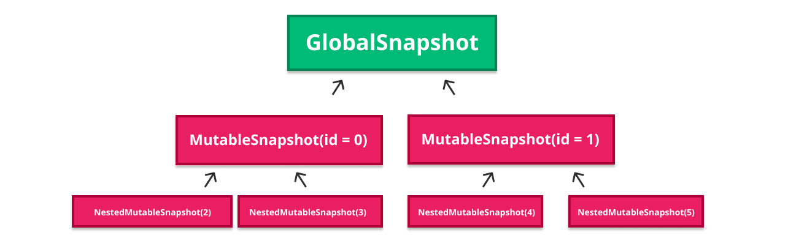
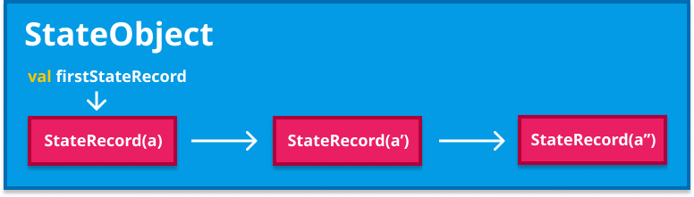

# 5. State snapshot system

Jetpack Compose has a particular way to represent state and propagate state changes which drives the ultimate reactive experience: The state snapshot system. This reactive model enables our code to be more powerful and concise, since it allows components to recompose automatically based on their inputs and only when required, avoiding all the boilerplate we’d need if we had to notify those changes manually (as we have been doing with the Android View system in the past).

Let’s start this chapter by introducing the term “snapshot state”.

## What snapshot state is

Snapshot state refers to **isolated state that can be remembered and observed for changes**. Snapshot state is what we get when calling functions like `mutableStateOf`, `mutableStateListOf`, `mutableStateMapOf`, `derivedStateOf`, `produceState`, `collectAsState`, or any of the like. All those calls return some type of `State`, and devs frequently refer to it as snapshot state.

Snaphsot state is named like that since it is part of the state snapshot system defined by the Jetpack Compose runtime. This system models and coordinates state changes and change propagation. It is written in a decoupled way, so it could theoretically be used by other libraries that want to rely on observable state.

Regarding change propagation, one of the things we learned in chapter 2 was that all Composable declarations and expressions are wrapped by the Jetpack Compose compiler to **automatically track any snapshot state reads within their bodies**. That is how snapshot state is (automatically) observed. The goal is that every time the state the Composable reads varies, the runtime can invalidate the Composable’s `RecomposeScope`, so it is executed again in next recomposition (recomposed).

This is infrastructure code provided by Compose that is therefore not needed in any client codebases. Clients of the runtime like Compose UI can be completely agnostical of how invalidation and state propagation is done, or how recomposition is triggered, and only focus on providing the building blocks that work with that state: The Composable functions.

But snapshot state is not only about automatically notifying changes to trigger recomposition. The word snapshot is part of the name for a very important reason: **state isolation**. That stands for the level of isolation we apply in the context of concurrency.

Imagine handling mutable state across threads. It can rapidly become a mess. Strict coordination and synchronization is required to ensure the state integrity, since it can be read and/or modified from different threads at the same time. This opens the door to collisions, hard to detect bugs, and race conditions.

Traditionally, programming languages have dealt with this in different ways, one of them being immutability. Immutable data can never be modified after created, which makes it completely safe in concurrent scenarios. Another valid approach can be the actor system. This system focuses on **state isolation** across threads. Actors keep their own copy of the state, and communication / coordination is achieved via messages. There needs to exist some coordination to keep the global program state coherent in case this state is mutable. The Compose snapshot system is not based on the actor system, but it is actually closer to this approach.

Jetpack Compose leverages mutable state, so Composable functions can automatically react to state updates. The library wouldn’t make sense with immutable state only. This means that it needs to solve the problem of shared state in concurrent scenarios, since composition can be possible in multiple threads (remember chapter 1). The Compose approach to this is the state snapshot system, and it is based on state isolation and later change propagation to allow **working with mutable state safely across threads**.

The snapshot state system is modeled using a [concurrency control system](https://en.wikipedia.org/wiki/Concurrency_control), since it needs to **coordinate state across threads** in a safe manner. Shared mutable state in concurrent environments is not an easy deal, and it is a generic problem agnostic of the actual use case for the library. We are diving into concurrency control systems in detail and how Compose makes use of them in the following section.

Before completing this introduction, it can be useful to peek into the `State` interface, which any snapshot state object implements. Here is how it looks in code:

```kotlin
1 @Stable
2 interface State&lt;out T&gt; {
3   val value: T
4 }
```
*SnapshotState.kt*

This contract is flagged as `@Stable`, since Jetpack Compose provides and uses stable implementations only (by design). Recapping a bit, this means that any implementation of this interface **must** ensure that:

- The result of `equals` between two `State`s is coherent: it always returns the same result when comparing the same two instances.
- When a public property of the type changes (`value`), composition is notified.
- All its public property types are also stable (`value`).

These properties really represent what snapshot state is. In the following sections we will learn how every time a snapshot state object is written (modified), Composition is notified, as one of the mentioned rules require.

Make sure to give a read to [this post by Zach Klipp](https://dev.to/zachklipp/a-historical-introduction-to-the-compose-reactive-state-model-19j8) introducing some of these ideas. I highly recommend that post.

Let’s learn a bit about concurrency control systems now. It will help us a lot to easily understand why the Jetpack Compose state snapshot system is modeled the way it is.

## Concurrency control systems

The state snapshot system is implemented following a concurrency control system, so let’s introduce this concept first.

In computer science, “concurrency control” is about ensuring correct results for concurrent operations, which means coordination and sinchronization. Concurrency control is represented by a series of rules that ensure the correctness of the system as a whole. But this coordination always comes with a cost. Coordination usually impacts performance, so the key challenge is to design an approach that is as efficient as possible without significant drops in performance.

One example of concurrency control is the transaction system present in most of the database management systems (DBMS) today. Concurrency control in this context ensures that any database transactions performed in concurrent environments are done in a safe manner without violating the data integrity of the database. The aim is to maintain correctness. The term “safety” here covers things like ensuring that transactions are atomic, that they can be reverted safely, that no effect of a comitted transaction is ever lost, and that no effect of an aborted transaction remains in the database. It can be a complex problem to solve.

Concurrency control is not only frequent in DBMS but also in other scenarios like programming languages, where it is used to implement transactional memory, for instance. That is actually the use case for the state snapshot system. Transactional memory attempts to simplify concurrent programming by allowing a group of load and store operations to execute in an atomic way. Actually, in the Compose state snapshot system, state writes are applied **as a single atomic operation** when state changes from a snapshot are propagated to other snapshots. Grouping operations like this simplifies coordination between concurrent reads and writes of shared data in parallel systems / processes. On top of this, atomic changes can be easily aborted, reverted, or reproduced. –I.e: having history of reproducible changes to potentially reproduce any version of the program state.–

There are different categories of concurrency control systems:

- Optimistic: Do not block any reads or writes and be optimistic about those being safe, then abort a transaction to prevent the violation if it will break the required rules when comitted. An aborted transaction is immediately re-executed which implies an overhead. This one can be a good strategy when the average amount of aborted transactions is not too high.
- Pessimistic: Block an operation from a transaction if it violates the rules, until the possibility of violation disappears.
- Semi-optimistic: This is a mix of the other two, a hybrid solution. Block operations only in some situations and be optimistic (then abort on commit) for others.

Performance for each category can differ based on factors like the average transaction completion rates (throughput), level of parallelism required, and other factors like the possibility of deadlocks. Non-optimistic categories are considerably more prone to deadlocks, which are often resolved by aborting a stalled transaction (hence release the others) and restarting it as soon as possible.

Jetpack Compose is **optimistic**. State update collisions are only reported when propagating the changes (in the end), and then they are tried to be merged automatically or discarded (changes aborted) otherwise. More on this later.

The Jetpack Compose approach to concurrency control systems is simpler to the ones we can find on DBMS for example. It is only used to maintain correctness. Other features that can be found in database transactions like being recoverable, durable, distributed or replicated are not true for the Compose state snapshot system. (They don’t have the “D” part of “[ACID](https://en.wikipedia.org/wiki/ACID)”). Even though, Compose snapshots are in-memory, in-process only. They are atomic, consistent, and isolated.

In conjunction with the different categories of concurrency control listed (optimistic, pessimistic, semi-optimistic), there are some types that can also be used, one of them being the **Multiversion concurrency control (MVCC)**: That is the one Jetpack Compose uses to implement the state snapshot system. This system increases concurrency and performance by **generating a new version of a database object each time it is written. It also allows reading the serveral last relevant versions of the object**.

Let’s describe this in depth and also explain its purpose.

## Multiversion concurrency control (MCC or MVCC)

The Compose global state is shared across Compositions, which also means **threads**. Composable functions should be able to run concurrently (the door for parallel recomposition is always open). If they execute in parallel, they can read or modify snapshot state concurrently, so state isolation is going to be needed.

One of the main properties of concurrency control is actually **isolation**. This property ensures correctness in scenarios of concurrent access to data. The simplest way to achieve isolation is to block all readers until writers are done, but that can be awful in terms of performance. MVCC (and therefore Compose) does better than that.

To achieve isolation, MVCC keeps **multiple copies** of the data (snapshots), so each thread can work with an isolated snapshot of the state at a given instant. We can understand those as different **versions** of the state (“multiversion”). Modifications done by a thread remain invisible to other threads until all the local changes are completed and propagated.

In a concurrency control system this technique is called “snapshot isolation”, and it is defined as the isolation level used to determine which version each “transaction” (snapshot in this use case) sees.

MVCC also levereages immutability, so whenever data is written a new copy of the data is created, instead of modifying the original one. This leads to having **multiple versions of the same data stored in memory**, like a history of all the changes over the object. In Compose these are called “state records”, and we are going over those in detail in a few sections.

Another particularity of MVCC is that it creates **point-in-time consistent views** of the state. This is usually a property of backup files, and means that all references to objects on a given backup stay coherent. In MVCC, this is often ensured via a transaction ID, so any read can reference the corresponding ID to determine what version of the state to use. That is actually how it works in Jetpack Compose. **Each snapshot is assigned its own ID**. Snapshot ids are monotonically increasing value, so it makes snapshots naturally ordered. Since snapshots are differentiated by their IDs, reads and writes are isolated from each other without the need for locking.

Now that we have an idea of why a concurrency control system is needed, and how Multiversion concurrency control works, it is a great time to dive into the internals of the state snapshot system.

If you want to dive deeper into concurrency control systems or MVCC, I highly recommend reading more about [Concurrency control](https://en.wikipedia.org/wiki/Concurrency_control) and [Multiversion concurrency control](https://en.wikipedia.org/wiki/Multiversion_concurrency_control).

## The Snapshot

A snapshot can be taken at any point in time. It reflects the current state of the program (all the snapshot state objects) at a given instant (when the snapshot is taken). Multiple snapshots can be taken, and all of them will receive **their own isolated copy of the program state**. That is, a copy of the current state of all the snapshot state objects at that point in time. (Objects implementing the `State` interface).

This approach makes state safe for modification, since updating a state object in one of the snapshots will not affect another copies of the same state object in others. Snapshots are isolated from each other. In a concurrent scenario with multiple threads, each thread would point to a different snapshot and therefore a different copy of the state.

The Jetpack Compose runtime provides the `Snapshot` class to model the **current** state of the program. Any code that wants to take a Snapshot just needs to call the static method for it: `val snapshot = Snapshot.takeSnapshot()`. This will take a snapshot of the current value of all the state objects, and those values will be preserved until `snapshot.dispose()` is called. That will determine the lifespan of the snapshot.

Snapshots have a lifecycle. Whenever we are done using a snapshot, it needs to be disposed. If we don’t call `snapshot.dispose()` we will be leaking all the resources associated with the snapshot, along with its retained state. A snapshot is considered **active** between the created and disposed states.

When a snapshot is taken it is given an ID so all the state on it can be easily differentiated from other potential versions of the same state retained by other snapshots. That allows to **version** the program state, or in other words, keep the program state **coherent according to a version** (multiversion concurrency control).

The best way to understand how `Snapshot`s work is by code. I’m going to extract a snippet directly from [this really didactic and detailed post by Zach Klipp](https://dev.to/zachklipp/introduction-to-the-compose-snapshot-system-19cn) for this matter:

```kotlin
 1 fun main() {
 2   val dog = Dog()
 3   dog.name.value = &quot;Spot&quot;
 4   val snapshot = Snapshot.takeSnapshot()
 5   dog.name.value = &quot;Fido&quot;
 6 
 7   println(dog.name.value)
 8   snapshot.enter { println(dog.name.value) }
 9   println(dog.name.value)
10 }
11 
12 // Output:
13 Fido
14 Spot
15 Fido
```
*SnapshotSample.kt*

The `enter` function, also commonly referred to as “entering the snapshot”, **runs a lambda in the context of the snapshot**, so the snapshot becomes its source of truth for any state: All the state read from the lambda will get its values from the snapshot. This mechanism allows Compose and any other client libraries to run any piece of logic that works with state in the context of a given snapshot. This happens locally in the thread, and until the call to `enter` returns. Any other threads remain completely unaffected.

In the example above we can see how the dog name is “Fido” after updating it, but if we read it from the context of the snapshot (`enter` call), it returns “Spot”, which is **the value it had when the snapshot was taken**.

Note that inside `enter` it is possible to read and write state, depending on the type of the snapshot we are using (read-only vs mutable). We will go over mutable snapshots later.

The snapshot you create via `Snapshot.takeSnapshot()` is a read-only one. Any state it holds cannot be modified. If we try to write to any state object in the snapshot, an exception will be thrown.

But not everything will be reading state, we might also need to update it (write). Compose provides a specific implementation of the `Snapshot` contract that allows mutating the state it holds: `MutableSnapshot`. On top of that, there are also other additional implementations available. Here we have a collapsed view of all the different types:

```kotlin
1 sealed class Snapshot(...) {
2   class ReadonlySnapshot(...) : Snapshot() {...}
3   class NestedReadonlySnapshot(...) : Snapshot() {...}
4   open class MutableSnapshot(...) : Snapshot() {...}
5   class NestedMutableSnapshot(...) : MutableSnapshot() {...}
6   class GlobalSnapshot(...) : MutableSnapshot() {...}
7   class TransparentObserverMutableSnapshot(...) : MutableSnapshot() {...}
8 }
```
*Snapshot.kt*

Let’s go over the different types very briefly:

- `ReadonlySnapshot`: Snapshot state objects held by it cannot be modified, only read.
- `MutableSnapshot`: Snapshot state objects held by it can be read and modified.
- `NestedReadonlySnapshot` and `NestedMutableSnapshot`: Child read-only and mutable snapshots, since snapshots form a tree. A snapshot can have any number of nested snapshots. More on this later.
- `GlobalSnapshot`: Mutable snapshot that holds the global (shared) program state. It is effectively the ultimate root of all snapshots.
- `TransparentObserverMutableSnapshot`: This one is a special case. It does not apply any state isolation, and exists only to notify read and write observers whenever a state object is read / written. All state records on it are automatically flagged as invalid, so they are not be visible/readable by any other snapshot. The ID of this type of snapshot is always the one of its parent, so any records created for it are actually associated with the parent instead. It is “transparent” in the sense that all operations performed on it are as if they were performed in the parent snapshot.

## The snapshot tree

As we explained above, **snapshots form a tree**. Among the different snapshot types we can find `NestedReadonlySnapshot` and `NestedMutableSnapshot` for this reason. Any snapshot can contain any number of nested snapshots. The root of the tree is the `GlobalSnapshot`, holding the global state.


*Snapshot tree*

Nested snapshots are like independent copies of the snapshot that can be disposed independently. That **allows to dipose it while keeping the parent snapshot active**. They are frequent in Compose when we are dealing with **subcomposition**, for instance.

Short flashback to chapter 2. we described that subcompositions are compositions created inline (within the parent composition) with the only intention to support **independent invalidation**. Compositions and subcompositions are also connected as a tree.

Some examples of subcomposition where a nested snapshot is created are when a lazy list item or a `BoxWithConstraints` are composed. We can also find subcomposition in `SubcomposeLayout`, or the `VectorPainter` for example (see examples from chapter 2).

When subcomposition is needed, a nested snapshot is created to store and isolate its state, so the snapshot can be disposed when subcomposition is gone, while keeping the parent composition and parent snapshot alive. If any changes take place to the nested snapshot, those are propagated to the parent.

All the snapshot types provide a function to take a nested snapshot and attach it to the parent. I.e: `Snapshot#takeNestedSnapshot()`, or `MutableSnapshot#takeNestedMutableSnapshot()`.

A child read-only snapshot can be produced from any snapshot type. A mutable snapshot can only be produced from another mutable snapshot (or from the global snapshot which can be thought of as a mutable snapshot).

## Snapshots and threading

It is important to think of snapshots as separate structures that live outside of the scope of any thread. A thread can indeed have a current snapshot, but snapshots **are not necessarily bound to a thread**. A thread can enter and leave a snapshot arbitrarily, and a child snapshot can be entered by a separate thread. Actually, parallel work is one of the intended use cases for snapshots. Several child threads can be spawned, each with their own snapshot.

Once we define mutable snapshots, we’ll also learn how child snapshots must notify their changes to the parent to keep coherence. Changes on all threads will be isolated from each other, and colliding updates by different threads will be detected and addressed (more on this later). Nested snapshots allow such a break-down of work to be recursive. All this potentially unlocks features like parallel composition.

It is always possible to retrieve the current snapshot for a thread via `Snapshot.current`. That will return the current thread snapshot if there is one, or the global snapshot (holding the global state) in other case.

## Observing reads and writes

The Compose runtime has the ability to trigger recomposition when state that is observed is written. It would be nice to understand how that machinery, that we already described in previous chapters, is connected to the state snapshot system. Let’s go for it, but let’s start by learning how to observe reads first.

Whenever take a snapshot (i.e: `Snapshot.takeSnapshot()`), what we get in return is a `ReadonlySnapshot`. Since the state objects from this snapshot cannot be modified, only read, all the state in the snapshot will be preserved until it gets diposed. The `takeSnapshot` function allows us to pass a `readObserver` (as an optional parameter). This observer will be notified every time any state object is read from the snapshot **within the `enter` call**:

```kotlin
1 // simple observer to track the total number of reads
2 val snapshot = Snapshot.takeSnapshot { reads++ }
3 // ...
4 snapshot.enter { /* some state reads */ }
5 // ...
```
*ReadOnlySnapshot.kt*

One example of this can be the `snapshotFlow` function: `fun <T> snapshotFlow(block: () -> T): Flow<T>`. This function converts `State<T>` objects into a `Flow`. When collected, it runs its block and emits the result of the `State` objects read in it. When one of the `State` objects read mutates, the `Flow` emits the new value to its collector. To achieve this behavior, it needs to record all the state reads so it can reexecute the block whenever any of those state objects change. To keep track of the reads, it takes a read-only snapshot and passes a read observer so it can store them in a `Set`:

```kotlin
1 fun &lt;T&gt; snapshotFlow(block: () -&gt; T): Flow&lt;T&gt; {
2   // ...
3   snapshot.takeSnapshot { readSet.add(it) }
4   // ...
5   // Do something with the Set
6 }
```
*SnapshotFlow.kt*

Read-only snasphots not only notify their read `readObserver` when some state is read, but also their parent’s `readObserver`. A read on a nested snapshot must be visible to all the parents and their observers, so all the observers on the snapshot tree are notified accordingly.

Let’s go for observing writes now.

Observers are also possible for writes (state updates), so `writeObserver` can only be passed when creating a **mutable** snapshot. A mutable snapshot is a snapshot that allows to modify the state it holds. We can take one by calling `Snapshot.takeMutableSnapshot()`. Here, we are allowed to pass optional read and write observers to get notified about any reads and/or writes.

A good example of observing reads and writes can be the `Recomposer`, which is able to track any reads and writes into the Composition, to automatically trigger recomposition when required. Here it is:

```kotlin
 1 private fun readObserverOf(composition: ControlledComposition): (Any) -&gt; Unit {
 2   return { value -&gt; composition.recordReadOf(value) } // recording reads
 3 }
 4 
 5 private fun writeObserverOf(
 6   composition: ControlledComposition,
 7   modifiedValues: IdentityArraySet&lt;Any&gt;?
 8 ): (Any) -&gt; Unit {
 9   return { value -&gt;
10     composition.recordWriteOf(value) // recording writes
11     modifiedValues?.add(value)
12   }
13 }
14     
15 private inline fun &lt;T&gt; composing(
16   composition: ControlledComposition,
17   modifiedValues: IdentityArraySet&lt;Any&gt;?,
18   block: () -&gt; T
19 ): T {
20   val snapshot = Snapshot.takeMutableSnapshot(
21     readObserverOf(composition),
22     writeObserverOf(composition, modifiedValues)
23   )
24   try {
25     return snapshot.enter(block)
26   } finally {
27     applyAndCheck(snapshot)
28   }
29 }
```
*Recomposer.kt*

The `composing` function is called both when creating the initial Composition and for every recomposition. This logic relies on a `MutableSnapshot` that allows state to be not only read but also written, and any reads or writes in the `block` are tracked by (notified to) the Composition. (See the `enter` call).

The `block` passed to it will essentially be the code that runs the composition or recomposition itself, and therefore executes all Composable functions on the tree to calculate the list of changes. Since that happens inside the `enter` function, that will make any reads or writes automatically tracked.

Every time a snapshot state write is tracked into the composition, the corresponding `RecomposeScope`s reading the very same snapshot state will be invalidated and recomposition will trigger.

The `applyAndCheck(snapshot)` call in the end propagates any changes happening during the composition to other snapshots and the global state.

This is how observers look in code, they are simple functions:

```kotlin
1 readObserver: ((Any) -&gt; Unit)?
2 writeObserver: ((Any) -&gt; Unit)?
```
*ReadAndWriteObservers.kt*

There is some utility function to start observing reads and writes in the current thread. That is `Snapshot.observe(readObserver, writeObserver, block)`. This function is used by `derivedStateOf` to react to all object reads from the provided block, for instance. This is the only place where the `TransparentObserverMutableSnapshot` is used (one of the `Snapshot` types available). A parent (root) snapshot of this type is created with the only purpose of notifying reads to observers, as explained in previous sections. This type was added by the team to avoid having to have a list of callbacks in the snapshot for a special case.

## MutableSnapshots

We have talked much about state updates (writes), but we didn’t really go in detail about mutable snapshots yet. Let’s do it now without further ado.

`MutableSnapshot` is the snapshot type used when working with mutable snapshot state where we need to track writes to automatically trigger recomposition.

In a mutable snapshot, any state object will have the same value as it had when the snapshot was taken, **unless it is locally changed in the snapshot**. All changes made in a `MutableSnapshot` are **isolated** from the changes done by other snapshots. Changes propagate from bottom to top on the tree. A child nested mutable snapshot needs to apply its changes first, and then propagate those to the parent or to the global snapshot in case it is the root of the tree. That is done by calling `NestedMutableSnapshot#apply` (or `MutableSnapshot#apply` if it is not nested).

Propagating from bottom to top ensures that changes will reach the global state only when the root snapshot is applied, which can only happen after all the nested snapshots have been already applied.

The following paragraph is extracted directly from the Jetpack Compose runtime kdocs:

*Composition uses mutable snapshots to allow changes made in Composable functions to be temporarily isolated from the global state and is later applied to the global state when the composition is applied. If MutableSnapshot.apply fails applying this snapshot, the snapshot and the changes calculated during composition are disposed and a new composition is scheduled to be calculated again.*

So, when applying the Composition (rapid flashback: we apply changes via the `Applier` as the last step in the composition), any changes in mutable snapshots are applied and notified to their parents, or ultimately the global snapshot (program state). If there is a failure when applying these changes, a new composition is scheduled.

A mutable snapshot also has a lifecycle. It always ends by calling `apply` and/or `dispose`. That is required both to propagate state modifications to other snapshots, and to avoid leaks.

Changes propagated via `apply` are applied **atomically**, meaning that the global state or the parent snapshot (in case its nested) will see all those changes **as a single atomic change**. That will clean the history of state changes a bit so it is easier to identify, reproduce, abort, or revert. Remember this is what Transactional memory is about, as we described when learning about Concurrency control systems.

If a mutable snapshot is disposed but never applied, all its pending state changes are discarded.

Here is a practical example of how `apply` works in client code:

```kotlin
 1 class Address {
 2   var streetname: MutableState&lt;String&gt; = mutableStateOf(&quot;&quot;)
 3 }
 4 
 5 fun main() {
 6   val address = Address()
 7   address.streetname.value = &quot;Some street&quot;
 8 
 9   val snapshot = Snapshot.takeMutableSnapshot()
10   println(address.streetname.value)
11   snapshot.enter {
12     address.streetname.value = &quot;Another street&quot;
13     println(address.streetname.value)
14   }
15   println(address.streetname.value)
16   snapshot.apply()
17   println(address.streetname.value)
18 }
19 
20 // This prints the following:
21 
22 // Some street
23 // Another street
24 // Some street
25 // Another street
```
*ApplyMutableSnapshotSample.kt*

When we print from within the `enter` call, the value is “Another street”, so the modification is visible. That is because we are running in the context of the snapshot. But if we print right after the `enter` call (outside), the value seems reverted to the original one. That is because changes in a `MutableSnapshot` are isolated from any other snapshots. After calling `apply`, changes are propagated, and then we can see how printing the `streetname` again finally prints the modified value.

Note that only state updates done within the `enter` call will be tracked and propagated.

There is also the alternative syntax: `Snapshot.withMutableSnapshot` to shortcut this pattern. It will ensure that `apply` is called in the end.

```kotlin
 1 fun main() {
 2   val address = Address()
 3   address.streetname.value = &quot;Some street&quot;
 4   
 5   Snapshot.withMutableSnapshot {
 6     println(address.streetname.value)
 7     address.streetname.value = &quot;Another street&quot;
 8     println(address.streetname.value)
 9   }
10   println(address.streetname.value)
11 }
```

The way `apply` is called in the end might remind us of how a list of changes is also recorded and applied later by the Composer –see chapter 3–. It is the same concept once again. Whenever we need to make sense of a list of changes on a tree all together, there is a need to record/defer those, so we can apply (trigger) them in the correct order and impose coherence at that moment. That is the only time when the program knows about all the changes, or in other words, when it has the big picture.

It is also possible to register apply observers to oberve the ultimate modification changes. That is done via `Snapshot.registerApplyObserver`.

## GlobalSnapshot and nested snapshots

The `GlobalSnapshot` is a type of mutable snapshot that happens to hold the global state. It will get updates coming from other snapshots following the bottom to top order described above.

A `GlobalSnapshot` cannot be nested. There is only one `GlobalSnapshot` and it is effectively the ultimate root of all snapshots. It holds the current gobal (shared) state. For this reason, a global snapshot can’t be applied (it has no `apply` call).

To apply changes in the global snapshot, it must be “advanced”. That is done by calling `Snapshot.advanceGlobalSnapshot()`, which clears the previous global snapshot and creates a new one, that accepts all the valid state from the previous one. Apply observers are also notified in this case, since those changes are effectively “applied”, even if the mechanism is different. The same way, it is also not possible to call `dispose()` on it. Disposing a global snapshot is also done by advancing it.

In Jetpack Compose, the global snapshot is created during initialization of the snapshot system. In JVM this happens when `SnapshotKt.class` is initialized by Java or the Android runtime.

After this, the global snapshot manager is started when creating the `Composer`, and then each composition (including initial composition and any further recompositions) creates its own nested mutable snapshot and attaches it to the tree, so it can store and isolate all the state for the composition. Compositions will also use this chance to register read and write observers to track reads and writes into the Composition. Remember the `composing` function:

```kotlin
 1 // Called for the initial composition and also for every recomposition.
 2 private inline fun &lt;T&gt; composing(
 3   composition: ControlledComposition,
 4   modifiedValues: IdentityArraySet&lt;Any&gt;?,
 5   block: () -&gt; T
 6 ): T {
 7   val snapshot = Snapshot.takeMutableSnapshot(
 8     readObserverOf(composition),
 9     writeObserverOf(composition, modifiedValues)
10   )
11   try {
12     return snapshot.enter(block)
13   } finally {
14     applyAndCheck(snapshot)
15   }
16 }
```
*Recomposer.kt*

Finally, any subcomposition can create its own nested snapshot and attach it to the tree, to support invalidation while keeping the parent active. That would give us a complete picture of how a snapshot tree can look.

Another interesting detail to share is that, when the `Composer` is created, right when creating the `Composition`, a call to `GlobalSnapshotManager.ensureStarted()` is done. That is part of the integration with the platform (Compose UI), and it will start observing all writes to the global state and schedule periodic dispatch of the snapshot apply notifications in the `AndroidUiDispatcher.Main` context.

## StateObjects and StateRecords

Multiversion concurrency control ensures that every time state is written, a new version of it is created (copy-on-write). The Jetpack Compose state snapshot system complies with this, so it is possible to end up with multiple versions of the same snapshot state object stored.

This design is important for performance to three ways. First, the cost of creating a snapshot is O(1), not O(N) (where N would be the number of state objects). Second, the cost of comitting a snapshot is O(N), where N is the number of objects mutated in the snapshot. Third, snapshots do not have a list of snapshot data anywhere (only a transitory list of modified objects) so state objects can be collected by the garbage collector freely without the Snapshot system having to be notified.

Internally, a snapshot state object is modeled as a `StateObject`, and each one of the multiple versions stored for that object is a `StateRecord`. Every record holds the data for a single version of the state. The version (record) that each snapshot sees corresponds to the most up to date valid version available **when the snapshot was taken**. (The valid one with the highest snapshot ID).


*StateObject and StateRecords*

But what makes a state record valid?

Well, “valid” is always relative to a particular snapshot. Records are associated with the ID of the snapshot in which the record was created. A state record is considered valid **for a snapshot** if its recorded ID is less than or equal to the snapshot id (that is, created in the current or a previous snapshot), and not part of the snapshot’s `invalid` set, or specifically flagged as invalid. Any valid records from a previous snapshot are automatically copied to the new one.

Which leads to the question: what makes a record be part of the mentioned `invalid` set or explicitly flagged as invalid?

- Records created **after** the current snapshot are considered invalid, since the snapshot they were created for was taken **after** this snapshot.
- Records created for a snapshot that was already open at the time this snapshot was created are added to the `invalid` set, so they are also considered invalid.
- Records created in a snapshot that was disposed before it was applied are explicitly flagged as invalid, also.

An invalid record is a record that is not visible by any snaphot, thus it cannot be read. When a snapshot state is read from a Composable function, that record will not be taken into account to return its most up to date valid state.

Back to the state objects. Here is a brief example of how they are modeled in the state snapshot system:

```kotlin
 1 interface StateObject {
 2   val firstStateRecord: StateRecord
 3   
 4   fun prependStateRecord(value: StateRecord)
 5   
 6   fun mergeRecords(
 7     previous: StateRecord,
 8     current: StateRecord,
 9     applied: StateRecord
10   ): StateRecord? = null
11 }
```
*Snapshot.kt*

Any mutable snapshot state object created by any means will implement this interface. Some examples are the state returned by the `mutableStateOf`, `mutableStateListOf`, or `derivedStateOf` runtime functions, among others.

Let’s dive into the `mutableStateOf(value)` function as an exercise.

```kotlin
1 fun &lt;T&gt; mutableStateOf(
2     value: T,
3     policy: SnapshotMutationPolicy&lt;T&gt; = structuralEqualityPolicy()
4 ): MutableState&lt;T&gt; = createSnapshotMutableState(value, policy)
```
*SnapshotState.kt*

This call returns an instance of `SnapshotMutableState`, which is essentially an observable mutable state, or in other words, a state that can be updated and will automatically notify observers about it. This class is a `StateObject`, and for that reason it maintains a linked list of records storing different versions of the state (`value` in this case). Each time the state is read, the list of records is traversed to find and return **the most recent valid one**.


*mutableStateOf*

If we look back at the `StateObject` definition, we can see how it has a pointer to the first element of the linked list of records, and each record points to the next one. It also allows to preprend a new record to the list (making it become the new `firstStateRecord`).

Another function part of the `StateObject` definition is the `mergeRecords` one. If you remember, we previously mentioned that the system can merge conflicts automatically when possible. That is what this function is for. The merging strategy is simple and will be covered in detail later.

Let’s inspect `StateRecord`s a bit now.

```kotlin
1 abstract class StateRecord {
2   internal var snapshotId: Int = currentSnapshot().id // associated with
3   
4   internal var next: StateRecord? = null // points to the next one
5   
6   abstract fun assign(value: StateRecord)
7   
8   abstract fun create(): StateRecord
9 }
```
*Snapshot.kt*

Here we can see how each record is associated a snpashot ID. That will be the ID of the snapshot in which the record was created. That is what will determine if the record is valid for a given snapshot following the requirements described above.

We said that whenever an object is read, the list of `StateRecord`s for a given snapshot state (`StateObject`) is traversed, looking for the most recent valid one (with the highest snapshot ID). The same way, when a snapshot is taken, the most recent valid state of every snapshot state object is captured, and that will be the state used for all the lifespan of the new snapshot. (Unless it is a mutable snapshot and the state is mutated locally).

The `StateRecord` also has functions to assign it a value from another record, and to initially create it.

`StateRecord` is also a contract (interface). The different implementations available are defined by each existing type of `StateObject`. That is because records store relevant information for the state object, which differs for each type (per use case).

Following the example of the `mutableStateOf`, we learned that it returns a `SnapshotMutableState`, which is a `StateObject`. It will maintain a linked list of records of a very specific type: `StateStateRecord`. That record is just a wrapper over a `value` of type `T`, since that is all the information we need to store per record in this case.


*mutableStateOf*

Another good example can be the case of `mutableStateListOf`. It creates a `SnapshotStateList`, which is another implementation of `StateObject`. This state models a mutable list that can be observed (implements the `MutableList` Kotlin collection contract), so its records will have the type `StateListStateRecord`, defined by itself. This record uses a `PersistentList` ([see Kotlin immutable collections](https://github.com/Kotlin/kotlinx.collections.immutable)) to hold a version of the state list.


*mutableStateOf*

## Reading and writing state

Or in other words, reading and writing state records.

“When an object is read, the list of `StateRecord`s for a given snapshot state (`StateObject`) is traversed, looking for the most recent valid one (with the highest snapshot ID).” Let’s see how that looks in code.

```kotlin
1 @Composable
2 fun TextField(...) {
3   // ...
4   var textFieldValueState by remember { mutableStateOf(TextFieldValue(text = value))\
5  }
6   // ...
7 }
```
*TextField.kt*

This is the `TextField` composable from the `compose.material` library. It remembers a mutable state for the text value, so every time the value is updated the composable recomposes to show the new character on screen.

Let’s keep the call to `remember` aside, since it is not relevant for what is worth for this explanation. Here is the `mutableStateOf` function used to create the snapshot state:

```kotlin
1 fun &lt;T&gt; mutableStateOf(
2     value: T,
3     policy: SnapshotMutationPolicy&lt;T&gt; = structuralEqualityPolicy()
4 ): MutableState&lt;T&gt; = createSnapshotMutableState(value, policy)
```
*SnapshotState.kt*

This ultimately creates a `SnapshotMutableState` state object that gets the `value: T` and a `SnapshotMutationPolicy<T>` as arguments. It will wrap (store in memory) the value and use the mutation policy whenever it needs to be updated, to check if the new value passed is different than the current one or not. Here is how that value property is defined in the class:

```kotlin
 1 internal open class SnapshotMutableStateImpl&lt;T&gt;(
 2     value: T,
 3     override val policy: SnapshotMutationPolicy&lt;T&gt;
 4 ) : StateObject, SnapshotMutableState&lt;T&gt; {
 5 
 6   override var value: T
 7     get() = next.readable(this).value
 8     set(value) = next.withCurrent {
 9       if (!policy.equivalent(it.value, value)) {
10         next.overwritable(this, it) { this.value = value }
11       }
12     }
13     
14   private var next: StateStateRecord&lt;T&gt; = StateStateRecord(value)
15     
16   // ...
17 }
```
*SnapshotState.kt*

Whenever we use the getter to access the inner value from our `TextField` Composable (i.e: `textFieldValueState.value`), it will take the reference to the `next` state record (first one on the linked list) to start the iteration by calling `readable`. The `readable` function does the iteration to find the current (most fresh) valid readable state for the current snapshot. It also notifies any registered read observers. For every new item iterated it will check if it’s valid, following the conditions for valid defined in the previous section. The current snapshot will be the current thread snapshot or the global snapshot if the current thread is not associated to any.

So that is how snapshot state is read for `mutableStateOf`. It will be similar for other mutable snapshot state implementations available like the one returned by `mutableStateListOf`.

For writing the state, we can look at the property setter. Let’s add it here again:

```kotlin
1 set(value) = next.withCurrent {
2   if (!policy.equivalent(it.value, value)) {
3     next.overwritable(this, it) { this.value = value }
4   }
5 }
```
*SnapshotState.kt*

The `withCurrent` function calls `readable` under the hood so it can run the provided block passing the current most fresh valid readable state record to it as a parameter.

After that, it checks if the new value is equivalent to the current one or not using the provided `SnapshotMutationPolicy `, and if they are not, it starts the writing process. The function `overwritable` does this job.

I am intentionally not diving into deeper implementation details since those might easily vary in the future, but I’ll explain it briefly: It runs the block using a **writable** state record, and proposes a candidate record that in this case will be the current most fresh valid one. If it is valid for the current snapshot it will use it to do the writing, otherwise it will create a new record and prepend it to the list to make it be the new initial one. The block does the actual modification over it.

Finally, it notifies any registered write observers.

## Removing or reusing obsolete records

Multiversion concurrency control introduces an interesting challenge, due to the fact that we can have multiple versions of the same state stored (records): **Removing versions that become obsolete** and will never be read. We’ll explain how Compose solves this problem in a second, but let’s introduce the concept of “open snapshots” first. It will be handy.

Any new snapshot taken is added to a set of open snapshots, and will be there until it is proactively closed. While a snapshot stays open, all its state records are considered invalid for other snapshots (not readable). Closing a snapshot means all its records become automatically valid (readable) to any new snapshots created.

Once we know this, let’s learn how Compose recycles obsolete records:

1.  It tracks the lowest open snapshot. Compose keeps track of a set of open snapshot ids. Those ids are monotonically generated and constantly increasing.
2.  If a record is valid but not visible in the lowest open snapshot, then it can be safely reused as it will never be selected by any other snapshot.

Reusing obscured records leads to there typically being only 1 or 2 records in a mutable state object, which improves performance quite a bit. As snapshots are applied the record that is obscured will be reused for the next snapshot. If a snapshot is disposed before apply then all the records are flagged as invalid (discarded) meaning they can be reused immediately.

## Change propagation

Before explaining how changes in mutable snapshots are propagated, it might be useful to recap on what “closing” and “advancing” a snapshot means, so we can grasp both terms.

Closing a snapshot effectively removes its ID from the set of open snapshot IDs, and the consequence of this is that all its state records (records associated with its ID) become visible/readable by any new snapshots created. That makes closing a snapshot an effective way to propagate state changes.

When closing a snapshot, many times we want to replace it by a new one created right away. That is called “advancing” a snasphot. The new snapshot created gets a new ID generated by incrementing the previous one. This ID is then added to the set of open snapshot IDs.

As we have learned, the global snapshot is never applied but always advanced, making all its changes visible to the new global snapshot created. Mutable snapshots can also be advanced when their nested snaphots apply their changes.

Now that we understand this well, we are ready to learn how changes in mutable snapshots are propagated.

When calling `snapshot.apply()` on a **mutable** snapshot, all the local changes made to state objects within its scope are propagated to the parent (in case it is a nested mutable snapshot), or to the global state.

Calling `apply` and/or `dispose` delimits the lifespan of the snapshot. A mutable snapshot that is applied can also be disposed after. However, calling `apply` after `dispose` will throw, since those changes are already discarded.

Per what we have described, to get all the local changes propagated (visible to new snapshots taken), it should be enough to simply **remove the snapshot from the active snapshot set**. Whenever a snapshot is created, a copy of the current open snapshots are passed in as the set of invalid snapshots (that is, no snapshot that has not already been applied should be visible to the new snapshot). Simply removing the snapshot id from the set of open snapshots is enough for every new snapshot to treat the recrods created during this snapshot as valid, and therefore they can be returned when their corresponding state object is read.

But this should only be done after determining that there are no state collisions (colliding writes), since those would need to be addressed first.

When snapshots are applied, changes made by the applying snapshot are **added together with changes of other snapshots**. A state object has a single linked list of records where all the changes are aggregated. This opens the door to write collisions, since multiple snaphots might try to apply changes over the same state objects. When a mutable snapshot wants to apply (notify / propagate) its local changes, it tries to detect potential write collisions and **merge those as possible**. Merging is covered in detail in the next section.

We have two scenarios to cover here:

**No pending local changes**

If there are no pending local changes in the snapshot:

- The mutable snapshot gets proactively closed (removes it from the set of open snapshot ids, making all its state records automatically visible/readable by new snapshots taken).
- The global snapshot is “advanced” (same as closed but also replaced by a new global snapshot created).
- Uses the chance to check if there were any state changes in the global snapshot also, so the mutable snapshot can notify any potential apply observers about those changes in that case.

**With pending local changes:**

When there are pending changes:

- Detects collisions and calculates the merged records using an optimistic approach (remember concurrency control categories). Collisions are tried to be merged automatically or discarded otherwise.
- For every pending local change it checks if it is different than the current value. If it is not, it ignores the change and keeps the current value.
- If it’s an actual change (different), it checks the already calculated optimistic merges to decide whether to keep the previous, the current, or the applied record. It can actually create a merge of all of them.
- In case it had to perform a merge of the records, it’ll create a new record (immutability) and assign the snapshot id to it (associate it with the mutable snapshot), then prepend it to the linked list of records, making it effectively be the first one on the list.

In case there’s any failure when applying the changes, it will fallback to the same process done when there are no pending local changes. That is closing the mutable snapshot to make its records visible to any new ones, advancing the global snapshot (close and replace it by a new one), so it includes all the changes in the mutable snapshot just closed, and notifies any apply observers about any global state changes detected.

For nested mutable snapshots the process varies a bit, since those do not propagate their changes to the global snapshot but to their parent. For that reason, they add all its modified state objects to the modified set of the parent. Since all those changes need to be visible by the parent, the nested mutable snapshot removes its own id from the parent set of invalid snapshots.

## Merging write conflicts

To do the merges, the mutable snapshot iterates over its list of modified states (local changes), and for every change it does the following:

- Obtains the current value (state record) in the parent snapshot or the global state.
- Obtains the previous value before applying the change.
- Obtains the state the object would have after applying the change.
- Tries to automatically merge the three of them. This is delegated into the state object, which relies on a provided **merging policy** (see `StateObject` definition some sections ago).

Truth is none of the available policies in the runtime support proper merging at the moment, so colliding updates will result in a runtime exception notifying the user about the problem. To avoid falling into this scenario, Compose guarantees that collisions are not possible by using unique keys to access state objects (state object remembered in a composable function often have unique access property). Given `mutableStateOf` uses a `StructuralEqualityPolicy` for merges, it compares two versions of the object via a deep equals (`==`), so all properties are compared, including the unique object key, making it impossible for two objects to collide.

Auto merge of conflicting changes was added as a potential optimization that Compose does not make use of yet, but other libraries could.

A custom `SnapshotMutationPolicy` can be provided by implementing this interface. An example (extracted from the Compose docs) can be a policy that treats `MutableState<Int>` as a counter. This policy assumes that changing the state value to the same is not considered a change, hence any changes to a mutable state with a `counterPolicy` can never cause an apply conflict.

```kotlin
1 fun counterPolicy(): SnapshotMutationPolicy&lt;Int&gt; = object : SnapshotMutationPolicy&lt;I\
2 nt&gt; {
3   override fun equivalent(a: Int, b: Int): Boolean = a == b
4   override fun merge(previous: Int, current: Int, applied: Int) =
5     current + (applied - previous)
6 }
```
*CounterPolicy.kt*

Two values are considered equivalent when they are the same, and therefore the current value will be kept. Note how merging is obtained adding the difference between the new applied value and the previous one, so the current value always reflects the total amount stored.

This paragraph is extracted from the official docs also, as it is very explanatory: *As the name of the policy implies, it can be useful when counting things, such as tracking the amount of a resource consumed or produced while in a snapshot. For example, if snapshot A produces 10 things and snapshot B produces 20 things, the result of applying both A and B should be that 30 things were produced.*

```kotlin
 1 val state = mutableStateOf(0, counterPolicy())
 2 val snapshot1 = Snapshot.takeMutableSnapshot()
 3 val snapshot2 = Snapshot.takeMutableSnapshot()
 4 try {
 5   snapshot1.enter { state.value += 10 }
 6   snapshot2.enter { state.value += 20 }
 7   snapshot1.apply().check()
 8   snapshot2.apply().check()
 9 } finally {
10   snapshot1.dispose()
11   snapshot2.dispose()
12 }
13 
14 // State is now 30 as the changes made in the snapshots are added together.
```
*CounterPolicy2.kt*

We have a single mutable state using the counter policy for comparison, and a couple of snapshots that try to modify it and apply the changes. This would be the perfect scenario for collisions, but given our counter policy, any collisions are completely avoided.

This is only a simple example of how to provide a custom `SnapshotMutationPolicy` that avoid conflicts, so we can get the point. Another implementation where collisions wouldn’t be possible could be one for sets that can only add elements, not remove. Other useful types (such as ropes) can similarly be turned into conflict-free data-types given certain constraints on how they work and what the expected result is.

We could also provide custom policies that accept collisions but resolve them by merging the data using the `merge` function.