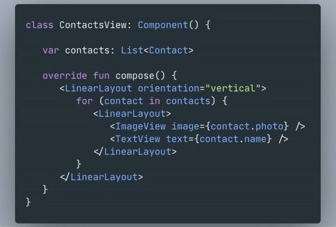
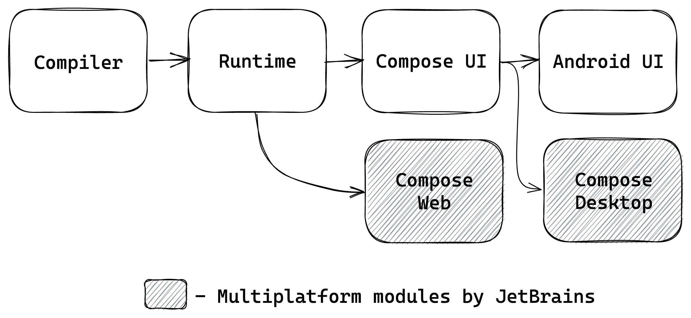

# 7. Продвинутые сценарии использования Compose Runtime

До сих пор книга говорила о Compose в контексте Android, с которого приходит большинство разработчиков. Применения Compose, однако, выходят далеко за рамки Android и пользовательских интерфейсов. В этой главе разобраны такие продвинутые сценарии с практическими примерами.

## Compose Runtime и Compose UI

Прежде чем углубляться во внутренности, важно разделить [Compose UI и Compose runtime](https://jakewharton.com/a-jetpack-compose-by-any-other-name/). **Compose UI** — новый UI-тулкит для Android с деревом `LayoutNode`, которые затем рисуют содержимое на канвасе. **Compose runtime** даёт базовую механику и примитивы, связанные с состоянием и composition.

Компилятор Compose теперь поддерживает весь спектр платформ Kotlin, поэтому runtime можно использовать для управления UI или любыми другими древовидными иерархиями почти везде (где запускается Kotlin). Обратите внимание на «другие древовидные иерархии»: в runtime почти ничего не привязано напрямую к UI (или Android). Runtime создавался и оптимизировался под UI, но остаётся достаточно универсальным для построения деревьев любого рода. В этом он близок к React JS: изначально — UI в вебе, но применяется и в [синтезаторах, 3D-рендерерах](https://github.com/chentsulin/awesome-react-renderer). Большинство кастомных рендереров переиспользуют ядро React, подставляя свои строительные блоки вместо DOM браузера.

Разработчики Compose вдохновлялись React. Даже ранние прототипы — [XML прямо в Kotlin](https://twitter.com/AndroidDev/status/1363207926580711430) — напоминают подход «HTML в JS» из React. Многие сторонние решения на React можно повторить на Compose и запускать в Kotlin multiplatform.


*Ранний прототип Compose*

Ещё до выхода Android-версии Compose из беты JetBrains начала использовать Compose для Kotlin multiplatform: на момент написания ведутся версии для JVM (десктоп) и для JS (браузер), в планах — iOS. Все эти варианты переиспользуют разные части Compose:

- Compose for Desktop максимально близок к Android, переиспользуя слой отрисовки Compose UI благодаря портированным обёрткам Skia. Система событий расширена под мышь и клавиатуру.
- Compose for iOS (в разработке) тоже использует Skia и большую часть портируемой с JVM логики.
- Compose for Web опирается на DOM браузера для отображения, переиспользуя только компилятор и runtime. Компоненты строятся поверх HTML/CSS — система сильно отличается от Compose UI, но runtime и компилятор используются почти так же. С приближением поддержки Kotlin WASM набирает обороты и Skia-вариант для веба.


*Модульная структура Compose в multiplatform*

И снова к коду!

## (Повторное) знакомство с Composition

`Composition` задаёт контекст для всех composable-функций: «кэш» на базе `SlotTable` и интерфейс создания кастомных деревьев через `Applier`. `Recomposer` управляет `Composition` и запускает recomposition при изменении чего-то релевантного (например, state). Как указано в [документации](https://cs.android.com/androidx/platform/frameworks/support/+/56f60341d82bf284b8250cf8054b08ae2a91a787:compose/runtime/runtime/src/commonMain/kotlin/androidx/compose/runtime/Composition.kt), `Composition` обычно создаётся фреймворком, но в этой главе мы будем создавать её сами.


*Структура Composition*

Фабричный метод:

```kotlin
1 fun Composition(
2     applier: Applier&lt;*&gt;,
3     parent: CompositionContext
4 ): Composition = ...
```
*Composition.kt*

- Родительский `context` доступен внутри любой composable через `rememberCompositionContext()`. Также `Recomposer` реализует `CompositionContext` и [доступен](https://cs.android.com/androidx/platform/frameworks/support/+/56f60341d82bf284b8250cf8054b08ae2a91a787:compose/ui/ui/src/androidMain/kotlin/androidx/compose/ui/platform/WindowRecomposer.android.kt) на Android или создаётся отдельно под свои нужды.
- Второй параметр — `Applier`, определяющий, как создавать и связывать дерево, производимое `Composition`. В предыдущих главах он уже разбирался; ниже будут примеры реализации.

Интересный факт: можно передать `Applier`, который ничего не делает, если нужны только свойства composable-функций (преобразования потоков данных, обработчики событий по изменению state) — см. [Molecule](https://github.com/cashapp/molecule) от Cash App. Достаточно `Applier<Nothing>` и не использовать `ComposeNode`!

Дальше глава посвящена использованию **Compose runtime** без **Compose UI**: сначала пример из библиотеки Compose UI — кастомное дерево для векторной графики (кратко упоминалось ранее). Затем переключимся на Kotlin/JS и сделаем игрушечную библиотеку управления DOM браузера на Compose.

## Composition векторной графики

Векторная отрисовка в Compose реализована через абстракцию `Painter`, по смыслу близкую к `Drawable` в классическом Android:

```kotlin
 1 Image(
 2   painter = rememberVectorPainter { width, height -&gt;
 3     Group(
 4       scaleX = 0.75f,
 5       scaleY = 0.75f
 6     ) {
 7         val pathData = PathData { ... }
 8         Path(pathData = pathData)
 9     }
10   }
11 )
```
*VectorExample.kt*

Функции внутри блока `rememberVectorPainter` (`Group`, `Path`) — тоже composable, но другого рода: они создают не `LayoutNode`, а элементы, специфичные для вектора. Из них собирается дерево вектора, которое затем рисуется на канвасе.


<figcaption>Compose UI и composition в <code>VectorPainter</code>.</figcaption>

`Group` и `Path` живут в отдельной **composition** от остального UI. Эта composition принадлежит `VectorPainter` и допускает только элементы описания векторного изображения; обычные UI-composable внутри блока запрещены.

Проверка выполняется в runtime, поэтому компилятор не помешает использовать внутри блока `Image` или `Box` — писать таких painter’ов пока потенциально небезопасно; в будущем планируют улучшить проверки на этапе компиляции.

Правила про state, эффекты и всё, что касается **runtime**, из предыдущих глав переносятся и на векторную composition (например, transition API для анимации изменений вектора вместе с UI). Подробнее: [VectorGraphicsDemo.kt](https://cs.android.com/androidx/platform/frameworks/support/+/56f60341d82bf284b8250cf8054b08ae2a91a787:compose/ui/ui/integration-tests/ui-demos/src/main/java/androidx/compose/ui/demos/VectorGraphicsDemo.kt) и [AnimatedVectorGraphicsDemo.kt](https://cs.android.com/androidx/platform/frameworks/support/+/56f60341d82bf284b8250cf8054b08ae2a91a787:compose/animation/animation/integration-tests/animation-demos/src/main/java/androidx/compose/animation/demos/vectorgraphics/AnimatedVectorGraphicsDemo.kt).

## Построение дерева векторного изображения

Вектор строится из элементов проще, чем `LayoutNode`:

```kotlin
 1 sealed class VNode {
 2   abstract fun DrawScope.draw()
 3 }
 4 
 5 // the root node
 6 internal class VectorComponent : VNode() {
 7   val root = GroupComponent()
 8 
 9   override fun DrawScope.draw() {
10     // set up viewport size and cache drawing
11   }
12 }
13 
14 internal class PathComponent : VNode() {
15   var pathData: List&lt;PathNode&gt;
16   // more properties
17 
18   override fun DrawScope.draw() {
19     // draw path
20   }
21 }
22 
23 internal class GroupComponent : VNode() {
24   private val children = mutableListOf&lt;VNode&gt;()
25   // more properties
26 
27   override fun DrawScope.draw() {
28     // draw children with transform
29   }
30 }
```
*VNode.kt*

Узлы задают структуру, похожую на классические vector drawable в XML: **GroupComponent** объединяет дочерние узлы и применяет к ним общее преобразование; **PathComponent** — лист (без детей), рисует `pathData`. `fun DrawScope.draw()` используется для отрисовки содержимого узла и детей; сигнатура совпадает с интерфейсом `Painter`, с которым позже интегрируется корень дерева.

Тот же `VectorPainter` используется для XML-ресурсов vector drawable из классического Android: парсер строит аналогичную структуру и превращает её в цепочку вызовов `@Composable`.

Узлы объявлены как internal; создаются только через соответствующие `@Composable`:

```kotlin
 1 @Composable
 2 fun Group(
 3     scaleX: Float = DefaultScaleX,
 4     scaleY: Float = DefaultScaleY,
 5     ...
 6     content: @Composable () -&gt; Unit
 7 ) {
 8     ComposeNode&lt;GroupComponent, VectorApplier&gt;(
 9         factory = { GroupComponent() },
10         update = {
11             set(scaleX) { this.scaleX = it }
12             set(scaleY) { this.scaleY = it }
13             ...
14         },
15         content = content
16     )
17 }
18 
19 @Composable
20 fun Path(
21     pathData: List&lt;PathNode&gt;,
22     ...
23 ) {
24     ComposeNode&lt;PathComponent, VectorApplier&gt;(
25         factory = { PathComponent() },
26         update = {
27             set(pathData) { this.pathData = it }
28             ...
29         }
30     )
31 }
```
*VectorComposables.kt*

Вызовы `ComposeNode` вносят узлы в composition и строят дерево. Параметр **factory** задаёт создание узла; **update** — инкрементальное обновление свойств уже созданного экземпляра (внутри — мемоизация через `set`/`update`). **content** добавляет дочерние узлы к текущему; выполняется после обновления узла. У `ComposeNode` есть перегрузка без `content` для листьев (например, `Path`).

Для связи узлов используется `Applier`. Узлы `VNode` объединяются через `VectorApplier`:

```kotlin
 1 class VectorApplier(root: VNode) : AbstractApplier&lt;VNode&gt;(root) {
 2   override fun insertTopDown(index: Int, instance: VNode) {
 3     current.asGroup().insertAt(index, instance)
 4   }
 5 
 6   override fun insertBottomUp(index: Int, instance: VNode) {
 7     // Ignored as the tree is built top-down.
 8   }
 9 
10   override fun remove(index: Int, count: Int) {
 11     current.asGroup().remove(index, count)
 12   }
 13 
 14   override fun move(from: Int, to: Int, count: Int) {
 15     current.asGroup().move(from, to, count)
 16   }
 17 
 18   override fun onClear() {
 19     root.asGroup().let { it.remove(0, it.numChildren) }
 20   }
 21 
 22   // VectorApplier only works with [GroupComponent], as it cannot add
 23   // children to [PathComponent] by design
 24   private fun VNode.asGroup(): GroupComponent {
 25     return when (this) {
 26       is GroupComponent -&gt; this
 27       else -&gt; error(&quot;Cannot only insert VNode into Group&quot;)
 28     }
 29   }
 30 }
```
*VectorApplier.kt*

Методы `Applier` часто сводятся к операциям над списком (insert/move/remove). `AbstractApplier` даёт удобные расширения для `MutableList`. В `VectorApplier` эти операции реализованы прямо в `GroupComponent`. У `Applier` два варианта вставки: **topDown** (сначала узел, потом дети) и **bottomUp** (сначала дети, потом узел в дерево) — выбор связан с производительностью на разных платформах. Подробнее: [документация Applier](https://cs.android.com/androidx/platform/frameworks/support/+/androidx-main:compose/runtime/runtime/src/commonMain/kotlin/androidx/compose/runtime/Applier.kt;l=67).

## Интеграция векторной composition в Compose UI

Остаётся интегрировать векторную composition с `Painter`:

```kotlin
 1 class VectorPainter internal constructor() : Painter() {
 2   ...
 3 
 4   // 1. Called in the context of UI composition
 5   @Composable
 6   internal fun RenderVector(
 7     content: @Composable (...) -&gt; Unit
 8   ) {
 9     // 2. The parent context is captured with [rememberCompositionContext] 
10     // to propagate its values, e.g. CompositionLocals.
11     val composition = composeVector(
12       rememberCompositionContext(),
13       content
14     )
15     
16     // 3. Whenever the UI &quot;forgets&quot; the VectorPainter, 
17     // the vector composition is disposed with [DisposableEffect] below.
18     DisposableEffect(composition) {
19       onDispose {
20         composition.dispose()
21       }
22     }
23   }
24 
25   private fun composeVector(
26     parent: CompositionContext,
27     composable: @Composable (...) -&gt; Unit
28   ): Composition {
29     ...
30     // See implementation below
31   }
32 }
```
*VectorPainter.kt*

Связь composition UI и векторной: (1) `RenderVector` принимает composable-описание вектора. (2) Родительский контекст берётся из UI-composition через `rememberCompositionContext`, чтобы оба дерева были связаны с одним `Recomposer` и общими значениями (например, `CompositionLocal` для плотности). (3) Composition нужно освобождать, когда `RenderVector` выходит из области видимости — за это отвечает `DisposableEffect`.

Заполнение composition содержимым и отрисовка:

```kotlin
 1 class VectorPainter : Painter() {
 2   // The root component for the vector tree
 3   private val vector = VectorComponent()
 4   // 1. Composition with vector elements.
 5   private var composition: Composition? = null
 6 
 7   @Composable
 8   internal fun RenderVector(
 9     content: @Composable (...) -&gt; Unit
 10   ) {
 11     ...
 12     // See full implementation above
 13   }
 14 
 15   private fun composeVector(
 16     parent: CompositionContext,
 17     composable: @Composable (...) -&gt; Unit
 18   ): Composition {
 19     // 2. Creates composition or reuses an existing one
 20     val composition = 
 21       if (this.composition == null || this.composition.isDisposed) {
 22         Composition(
 23           VectorApplier(vector.root),
 24           parent
 25         )
 26       } else {
 27         this.composition
 28       }
 29       this.composition = composition
 30 
 31     // 3. Sets the vector content to the updated composable value 
 32     composition.setContent {
 33       // Vector composables can be called inside this block only
 34       composable(vector.viewportWidth, vector.viewportHeight)
 35     }
 36 
 37     return composition
 38   }
 39 
 40   // Painter interface integration, is called every time the system
 41   // needs to draw the vector image on screen
 42   override fun DrawScope.onDraw() {
 43     with(vector) {
 44         draw()
 45     }
 46   }
 47 }
```
*VectorPainter.kt*

(1) Painter хранит свою composition, так как `ComposeNode` требует совпадения applier с переданным в composition, а UI использует applier, несовместимый с векторными узлами. (2) Composition создаётся или переиспользуется при инициализации или выходе из области видимости. (3) Содержимое задаётся через `setContent`, как в `ComposeView`; при новом `content` в `RenderVector` вызывается снова `setContent`. Содержимое добавляет детей к корневому узлу, который затем используется для отрисовки в `Painter`.

На этом интеграция завершена: `VectorPainter` рисует `@Composable`-содержимое на экране, а composable внутри painter’а имеют доступ к state и composition locals из UI-composition.

Дальше — создание отдельной Compose-системы по тем же принципам… на Kotlin/JS.

## Управление DOM с помощью Compose

Мультиплатформенная поддержка Compose ещё молода: вне JVM доступны в основном runtime и компилятор. Этого достаточно, чтобы создавать composition и что-то в ней запускать.

Компилятор Compose из зависимостей Google поддерживает все платформы Kotlin; runtime по умолчанию распространяется только для Android. JetBrains публикует [свою (почти совместимую) версию Compose](https://github.com/JetBrains/compose-jb/releases) с мультиплатформенными артефактами в том числе для JS.

Первый шаг — определить дерево, с которым будет работать Compose. В браузере уже есть «видовая» система на HTML/CSS. Элементами можно управлять из JS через DOM ([Document Object Model](https://developer.mozilla.org/en-US/docs/Web/API/Document_Object_Model/Introduction)), API которого доступен и в стандартной библиотеке Kotlin/JS.

Пример HTML:

```kotlin
1 &lt;div&gt;
2   &lt;ul&gt;
3     &lt;li&gt;Item 1&lt;/li&gt;
4     &lt;li&gt;Item 2&lt;/li&gt;
5     &lt;li&gt;Item 3&lt;/li&gt;
6   &lt;/ul&gt;
7 &lt;/div&gt;
```
*sample.html*

В браузере это дерево. DOM — древовидная структура из элементов, в Kotlin/JS представленных как `org.w3c.dom.Node`:

- HTML-элементы (подтипы `org.w3c.dom.HTMLElement`) — теги (`li`, `div` и т.д.), создаются через `document.createElement(<tagName>)`.
- Текст между тегами — `org.w3c.dom.Text`, создаётся через `document.createTextElement(<value>)`.


*Представление HTML-дерева в браузере*


*Представление дерева для JS*

Эти элементы станут основой дерева, управляемого Compose (аналогично `VNode` для вектора):

```kotlin
 1 @Composable
 2 fun Tag(tag: String, content: @Composable () -&gt; Unit) {
 3   ComposeNode&lt;HTMLElement, DomApplier&gt;(
 4     factory = { document.createElement(tag) as HTMLElement },
 5     update = {},
 6     content = content
 7   )
 8 }
 9 
10 @Composable
11 fun Text(value: String) {
12   ReusableComposeNode&lt;Text, DomApplier&gt;(
13     factory = { document.createTextElement(&quot;&quot;) },
14     update = {
15       set(value) { this.data = it }
16     }
17   )
18 }
```
*HtmlTags.kt*

Теги нельзя менять «на месте» (например, `<audio>` и `<div>` — разные представления в браузере), поэтому при смене имени тега узел нужно пересоздавать. Compose этого не делает автоматически; в один и тот же composable не стоит передавать разные имена тегов. Проще всего обернуть каждый тип узла в свой composable (`Div`, `Ul` и т.д.) — получатся разные compile-time группы, и Compose будет заменять элементы целиком. Для `Text` узлы одинаковы по структуре, поэтому используется `ReusableComposeNode`: экземпляр переиспользуется между группами; текст задаётся в `update`.

Для сборки дерева нужен `Applier` для DOM-элементов. Логика похожа на `VectorApplier`, отличаются только методы добавления/удаления детей. Подробнее: [DomApplier в Compose for Web](https://github.com/JetBrains/compose-jb/blob/6d97c6d0555f056d2616f417c4d130e0c2147e32/web/core/src/jsMain/kotlin/org/jetbrains/compose/web/DomApplier.kt#L63-L91).

## Отдельная composition в браузере

Чтобы собирать наши composable в UI, нужна активная composition. В Compose UI всё уже настраивается в `ComposeView`; в браузере composition создаётся вручную. Те же принципы применимы и на других платформах — описанные компоненты есть в «общем» Kotlin-коде.

```kotlin
 1 fun renderComposable(root: HTMLElement, content: @Composable () -&gt; Unit) {
 2   GlobalSnapshotManager.ensureStarted()
 3 
 4   val recomposerContext = DefaultMonotonicFrameClock + Dispatchers.Main
 5   val recomposer = Recomposer(recomposerContext)
 6 
 7   val composition = ControlledComposition(
 8     applier = DomApplier(root),
 9     parent = recomposer
 10   )
 11 
 12   composition.setContent(content)
 13 
 14   CoroutineScope(recomposerContext).launch(start = UNDISPATCHED) {
 15     recomposer.runRecomposeAndApplyChanges()
 16   }
 17 }
```
*renderComposable.kt*

`renderComposable` скрывает детали запуска composition и позволяет отрисовывать composable в DOM-элемент. Внутри: инициализация `Recomposer` с нужными clock и coroutine context:

- Сначала инициализируется система снимков (state). `GlobalSnapshotManager` намеренно не входит в runtime; при необходимости его можно скопировать из [исходников Android](https://cs.android.com/androidx/platform/frameworks/support/+/androidx-main:compose/ui/ui/src/androidMain/kotlin/androidx/compose/ui/platform/GlobalSnapshotManager.android.kt).
- Контекст для `Recomposer` в JS: по умолчанию `MonotonicClock` на `requestAnimationFrame` (в реализации JetBrains), `Dispatchers.Main` — единственный поток JS. В этом контексте потом выполняются recomposition.
- Composition создаётся так же, как в векторном примере, но родителем выступает recomposer (у верхней composition родитель всегда recomposer).
- Содержимое задаётся через `setContent`. Все обновления должны происходить внутри переданного composable; повторный вызов `renderComposable` пересоздаёт всё с нуля.
- Запуск цикла recomposition — корутина с `Recomposer.runRecomposeAndApplyChanges`. На Android этот процесс привязан к жизненному циклу activity/view, остановка — через `recomposer.cancel()`. Здесь жизненный цикл привязан к странице, отмена не нужна.

Пример статического контента:

```kotlin
1 fun main() {
2   renderComposable(document.body!!) {
3     // equivalent of &lt;button&gt;Click me!&lt;/button&gt;
4     Tag(&quot;button&quot;) {
5       Text(&quot;Click me!&quot;)
6     }
7   }
8 }
```
*HtmlSample1.kt*

Статический контент можно сделать и проще; Compose здесь нужен для интерактивности. Обычно нужно реагировать на клик; в DOM это делается обработчиками клика, как у View в Android. В Compose UI многие обработчики задаются через расширения `Modifier`, но они завязаны на `LayoutNode`, поэтому для этой игрушечной веб-библиотеки недоступны. Поведение `Modifier` можно перенести и адаптировать под узлы — остаётся упражнением для читателя.

```kotlin
 1 @Composable
 2 fun Tag(
 3   tag: String,
 4   // this callback is invoked on click events
 5   onClick: () -&gt; Unit = {},
 6   content: @Composable () -&gt; Unit
 7 ) {
 8   ComposeNode&lt;HTMLElement, DomApplier&gt;(
 9     factory = { createTagElement(tag) },
 10     update = {
 11       // when listener changes, the listener on the DOM node is re-set
 12       set(onClick) { 
 13         this.onclick = { _ -&gt; onClick() }
 14       }
 15     },
 16     content = content
 17   )
 18 }
```
*HtmlTags.kt*

Тег может принимать колбэк клика и пробрасывать его в свойство `onclick` у `HTMLElement`. Счётчик по клику:

```kotlin
 1 fun main() {
 2   renderComposable(document.body!!) {
 3     // Counter state is updated on click
 4     var counterState by remember { mutableStateOf(0) }
 5 
 6     Tag(&quot;h1&quot;) {
 7       Text(&quot;Counter value: $counterState&quot;)
 8     }
 9 
 10     Tag(&quot;button&quot;, onClick = { counterState++ }) {
 11       Text(&quot;Increment!&quot;)
 12     }
 13   }
 14 }
```
*HtmlSampleCounter.kt*

Дальше библиотеку можно расширять: CSS, события, элементы. Команда JetBrains экспериментирует с более продвинутой версией Compose for Web на тех же принципах, но с большими возможностями. Можно попробовать [техдемо](https://compose-web.ui.pages.jetbrains.team/) в проектах на Kotlin/JS.

## Заключение

В этой главе мы рассмотрели, как базовые концепции Compose применяются вне Compose UI. Кастомные composition встречаются реже, но это полезный инструмент, если вы уже работаете в экосистеме Kotlin/Compose.

Composition векторной графики — пример встраивания кастомного composable-дерева в Compose UI. По тем же принципам можно делать другие кастомные элементы с доступом к state, анимациям и composition locals из UI-composition.

Отдельные composition возможны на всех платформах Kotlin. Мы показали это на игрушечной библиотеке управления DOM в браузере на базе Compose runtime и Kotlin/JS. Аналогично Compose runtime уже используется для управления деревьями UI вне Android (например, [Mosaic](https://github.com/JakeWharton/mosaic) — CLI от Jake Wharton).

Рекомендуется экспериментировать с собственными идеями на Compose и делиться обратной связью с командой Compose в канале \#compose в Kotlin Slack. Их основной фокус по-прежнему Compose UI, но им интересно узнавать о других сценариях использования Compose.
